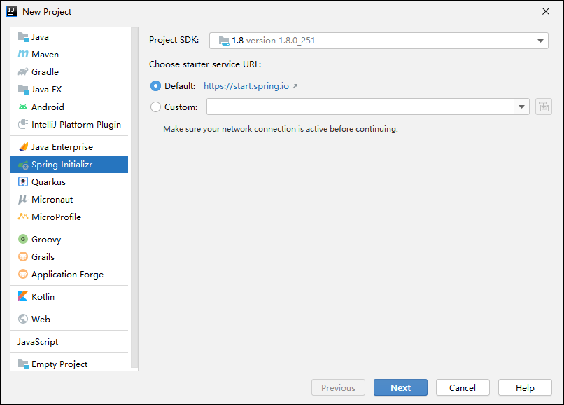
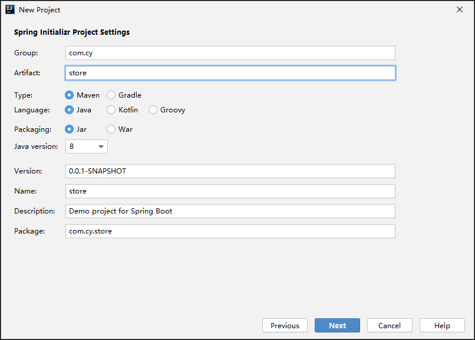
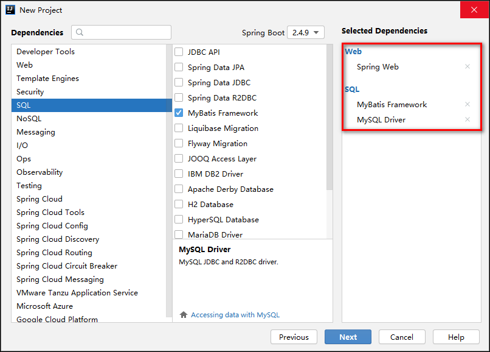
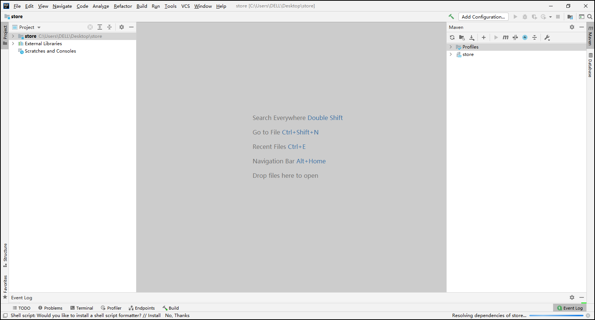
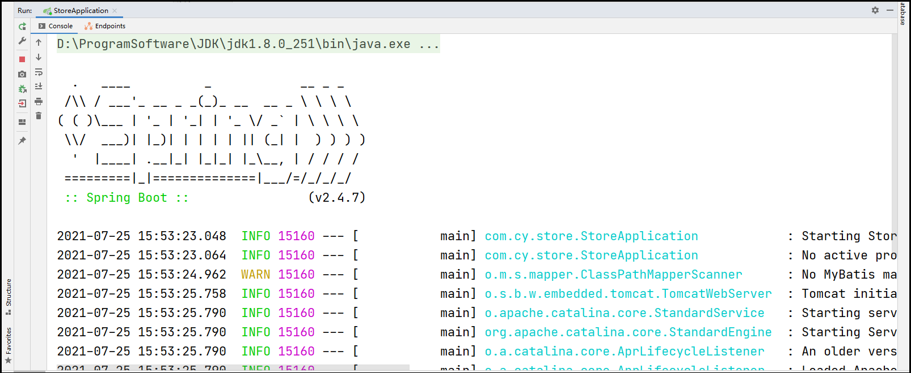
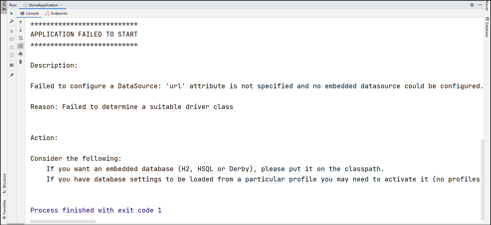

## 系统概述与环境搭建

### 1 系统开发及运行环境

电脑商城系统开发所需的环境及相关软件进行介绍。

1.操作系统：Windows 10

2.Java开发包：JDK 8

3.项目管理工具：Maven 3.6.3

4.项目开发工具：IntelliJ IDEA 2020.3.2 x64

5.数据库：MariaDB-10.3.7-winx64

6.浏览器：Google Chrome

7.服务器架构：Spring Boot 2.4.7 + MyBatis 2.1.4 + AJAX

### 2 项目分析

1.在开发某个项目之前，应先分析这个项目中可能涉及哪些种类的数据。本项目中涉及的数据：用户、商品、商品类别、收藏、订单、购物车、收货地址。

2.关于数据，还应该要确定这些数据的开发顺序。设计开发顺序的原则是：先开发基础、简单或熟悉的数据。以上需要处理的数据的开发流程是：用户-收货地址-商品类别-商品-收藏-购物车-订单。

3.在开发每种数据的相关功能时，先分析该数据涉及哪些功能。在本项目中以用户数据为例，需要开发的功能有：登录、注册、修改密码、修改资料、上传头像。

4.然后，在确定这些功能的开发顺序。原则上，应先做基础功能，并遵循增查删改的顺序来开发。则用户相关功能的开发顺序应该是：注册-登录-修改密码-修改个人资料-上传头像。

5.在实际开发中，应先创建该项目的数据库，当每次处理一种新的数据时，应先创建该数据在数据库中的数据表，然后在项目中创建该数据表对应的实体类。

6.在开发某个具体的功能时，应遵循开发顺序：持久层-业务层-控制器-前端页面。

### 3 创建数据库

1.首先确保计算机上安装了MariaDB-10.3.7-winx64数据库，将来在数据库中创建与项目相关的表。

2.创建电脑商城项目对应的后台数据库系统store。

```mysql
CREATE DATABASE store character SET utf8;
```

### 4 创建Spring Initializr项目

本质上Spring Initializr是一个Web应用程序，它提供了一个基本的项目结构，能够帮助开发者快速构建一个基础的Spring Boot项目。在创建Spring Initializr类型的项目时需在计算机连网的状态下进行创建。

<span style="color:red;">1.首先确保计算机上安装了JDK、IDEA、MariaDB等开发需要使用的软件，并在IDEA中配置了Maven 3.6.3项目管理工具。</span>

2.在IDEA欢迎界面，点击【New Project】按钮创建项目，左侧选择【Spring Initializr】选项进行Spring Boot项目快速构建。



3.将Group设置为com.cy，Artifact设置为store，其余选项使用默认值。单击【Next】进入Spring Boot场景依赖选择界面。



4.给项目添加Spring Web、MyBatis Framework、MySQL Driver的依赖。点击【Next】按钮完成项目创建。



5.首次创建完Spring Initializr项目时，解析项目依赖需消耗一定时间（Resolving dependencies of store...）。



### 5 配置并运行项目

#### 5.1 运行项目

找到项目的入口类（被@SpringBootApplication注解修饰），然后运行启动类；启动过程如果控制台输出Spring图形则表示启动成功。

```java
package com.cy.store;
import org.springframework.boot.SpringApplication;
import org.springframework.boot.autoconfigure.SpringBootApplication;

@SpringBootApplication
public class StoreApplication {
    public static void main(String[] args) {
        SpringApplication.run(StoreApplication.class, args);
    }
}
```



#### 5.2 配置项目

1.如果启动项目时提示：“配置数据源失败:'url'属性未指定，无法配置内嵌的数据源”。有如下的错误提示。  

```java
Failed to configure a DataSource: 'url' attribute is not specified and no embedded datasource could be configured.
```



2.解决以上操作提示的方法：在resources文件夹下的application.properties文件中添加数据源的配置。

```properties
spring.datasource.url=jdbc:mysql://localhost:3306/store?useUnicode=true&characterEncoding=utf-8&serverTimezone=Asia/Shanghai
spring.datasource.username=root
spring.datasource.password=123456
```

3.为了便于查询JSON数据，隐藏没有值的属性，减少流量的消耗，服务器不应该向客户端响应为NULL的属性。可以在属性或类之前添加@JsonInclude(value=Include.NON_NULL)，也可以在application.properties中添加全局的配置。

```properties
# 服务器向客户端不响应为null的属性
spring.jackson.default-property-inclusion=NON_NULL
```

4.SpringBoot项目的默认访问名称是“/”，如果需要修改可以手动在配置文件中指定SpringBoot 2.x访问项目路径的项目名。不建议修改。

```properties
server.servlet.context-path=/store
```

5.重新启动项目，则不在提示配置数据源失败的问题。