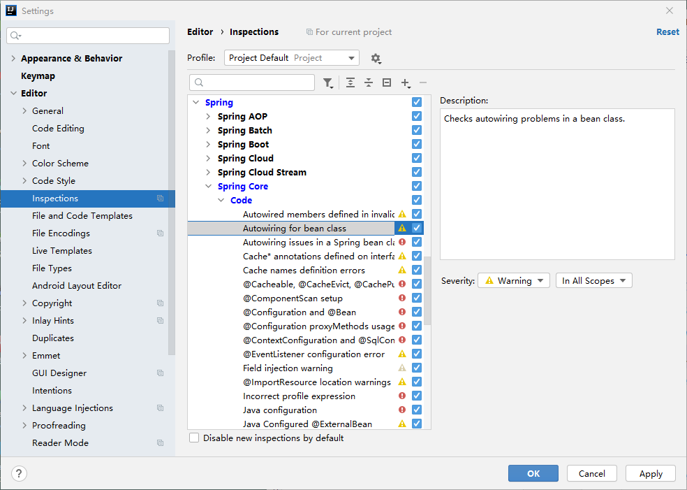
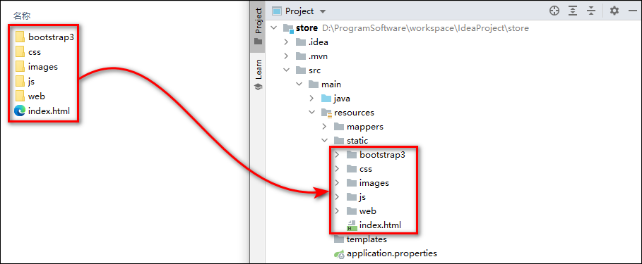
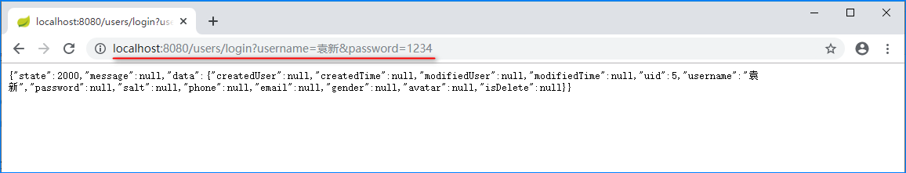

## 用户注册

### 1 用户-创建数据表

1.使用use命令先选中store数据库。

```mysql
USE store;
```

2.在store数据库中创建t_user用户数据表。

```mysql
CREATE TABLE t_user (
	uid INT AUTO_INCREMENT COMMENT '用户id',
	username VARCHAR(20) NOT NULL UNIQUE COMMENT '用户名',
	password CHAR(32) NOT NULL COMMENT '密码',
	salt CHAR(36) COMMENT '盐值',
	phone VARCHAR(20) COMMENT '电话号码',
	email VARCHAR(30) COMMENT '电子邮箱',
	gender INT COMMENT '性别:0-女，1-男',
	avatar VARCHAR(50) COMMENT '头像',
	is_delete INT COMMENT '是否删除：0-未删除，1-已删除',
	created_user VARCHAR(20) COMMENT '日志-创建人',
	created_time DATETIME COMMENT '日志-创建时间',
	modified_user VARCHAR(20) COMMENT '日志-最后修改执行人',
	modified_time DATETIME COMMENT '日志-最后修改时间',
	PRIMARY KEY (uid)
) ENGINE=InnoDB DEFAULT CHARSET=utf8;
```

### 2 用户-创建实体类

1.项目中许多实体类都会有日志相关的四个属性，所以在创建实体类之前，应先创建这些实体类的基类，将4个日志属性声明在基类中。在com.cy.store.entity包下创建BaseEntity类，作为实体类的基类。

```java
package com.cy.store.entity;
import java.io.Serializable;
import java.util.Date;

/** 实体类的基类 */
public class BaseEntity implements Serializable {
    private String createdUser;
    private Date createdTime;
    private String modifiedUser;
    private Date modifiedTime;

    // Generate: Getter and Setter、toString()
}

```

> 因为这个基类的作用就是用于被其它实体类继承的，所以应声明为抽象类。

2.创建com.cy.store.entity.User用户数据的实体类，继承自BaseEntity类，在类中声明与数据表中对应的属性。

```java
package com.cy.store.entity;
import java.io.Serializable;
import java.util.Objects;

/** 用户数据的实体类 */
public class User extends BaseEntity implements Serializable {
    private Integer uid;
    private String username;
    private String password;
    private String salt;
    private String phone;
    private String email;
    private Integer gender;
    private String avatar;
    private Integer isDelete;

	// Generate: Getter and Setter、Generate hashCode() and equals()、toString()
}
```

### 3 用户-注册-持久层

#### 3.1 准备工作

1.在src/test/java下的com.cy.store.StoreApplicationTests测试类中编写并执行“获取数据库连接”的单元测试，以检查数据库连接的配置是否正确。

```java
@Autowired
private DataSource dataSource;

@Test
public void getConnection() throws Exception {
	System.out.println(dataSource.getConnection());
}
```

2.执行src/test/java下的com.cy.toreApplicationTests测试类中的contextLoads()测试方法，以检查测试环境是否正常。

#### 3.2 规划需要执行的SQL语句

1.用户注册的本质是向用户表中插入数据，需要执行的SQL语句大致是：

```mysql
INSERT INTO t_user (除了uid以外的字段列表) VALUES (匹配的值列表)
```

2.由于数据表中用户名字段被设计为UNIQUE，在执行插入数据之前，还应该检查该用户名是否已经被注册，因此需要有“根据用户名查询用户数据”的功能。需要执行的SQL语句大致是：

```mysql
SELECT * FROM t_user WHERE username=?
```

#### 3.3 接口与抽象方法

1.创建com.cy.store.mapper.UserMapper接口，并在接口中添加抽象方法。

```java
package com.cy.mapper;
import com.cy.store.entity.User;

/** 处理用户数据操作的持久层接口 */
public interface UserMapper {
    /**
     * 插入用户数据
     * @param user 用户数据
     * @return 受影响的行数
     */
    Integer insert(User user);

    /**
     * 根据用户名查询用户数据
     * @param username 用户名
     * @return 匹配的用户数据，如果没有匹配的数据，则返回null
     */
    User findByUsername(String username);
}
```

2.由于这是项目中第一次创建持久层接口，还应在StoreApplication启动类之前添加@MapperScan("com.cy.store.mapper")注解，以配置接口文件的位置。

> MyBatis与Spring整合后需要实现实体和数据表的映射关系。实现实体和数据表的映射关系可以在Mapper接口上添加@Mapper注解。但建议以后直接在SpringBoot启动类中加@MapperScan("mapper包") 注解，这样会比较方便，不需要对每个Mapper都添加@Mapper注解。

```java
@SpringBootApplication
@MapperScan("com.cy.store.mapper")
public class StoreApplication {

	public static void main(String[] args) {
		SpringApplication.run(StoreApplication.class, args);
	}
}
```

#### 3.4 配置SQL映射

1.在src/main/resources下创建mapper文件夹，并在该文件夹下创建UserMapper.xml映射文件，进行以上两个抽象方法的映射配置。

```xml
<?xml version="1.0" encoding="UTF-8" ?>
<!DOCTYPE mapper
        PUBLIC "-//mybatis.org//DTD Mapper 3.0//EN"
        "http://mybatis.org/dtd/mybatis-3-mapper.dtd">
<mapper namespace="com.cy.store.mapper">
    <resultMap id="UserEntityMap" type="com.cy.store.entity.User">
        <id column="uid" property="uid"/>
        <result column="is_delete" property="isDelete"/>
        <result column="created_user" property="createdUser"/>
        <result column="created_time" property="createdTime"/>
        <result column="modified_user" property="modifiedUser"/>
        <result column="modified_time" property="modifiedTime"/>
    </resultMap>

    <!-- 插入用户数据：Integer insert(User user) -->
    <insert id="insert" useGeneratedKeys="true" keyProperty="uid">
        INSERT INTO
            t_user (username, password, salt, phone, email, gender, avatar, is_delete, created_user, created_time, modified_user, modified_time)
        VALUES
        (#{username}, #{password}, #{salt}, #{phone}, #{email}, #{gender}, #{avatar}, #{isDelete}, #{createdUser}, #{createdTime}, #{modifiedUser}, #{modifiedTime})
    </insert>

    <!-- 根据用户名查询用户数据：User findByUsername(String username) -->
    <select id="findByUsername" resultMap="UserEntityMap">
        SELECT
            *
        FROM
            t_user
        WHERE
            username = #{username}
    </select>
</mapper>
```

2.由于这是项目中第一次使用SQL映射，所以需要在application.properties中添加mybatis.mapper-locations属性的配置，以指定XML文件的位置。

```properties
mybatis.mapper-locations=classpath:mapper/*.xml
```

3.完成后及时执行单元测试，检查以上开发的功能是否可正确运行。在src/test/java下创建com.cy.store.mapper.UserMapperTests单元测试类，在测试类的声明之前添加@RunWith(SpringRunner.class)和@SpringBootTest注解，并在测试类中声明持久层对象，通过自动装配来注入值。

> @RunWith(SpringRunner.class)注解是一个测试启动器，可以加载SpringBoot测试注解。

```java
package com.cy.store.mapper;
import org.junit.runner.RunWith;
import org.springframework.beans.factory.annotation.Autowired;
import org.springframework.boot.test.context.SpringBootTest;
import org.springframework.test.context.junit4.SpringRunner;

// @RunWith(SpringRunner.class)注解是一个测试启动器，可以加载Springboot测试注解
@RunWith(SpringRunner.class)
@SpringBootTest
public class UserMapperTests {
    @Autowired
    private UserMapper userMapper;

}
```

4.如果在第四步自动装配userMapper时，报“Could not autowire. No beans of 'UserMapper' type found”错，无法进行自动装配。解决方案是，将Autowiring for bean class选项下的Severity设置为Warning即可。



5.然后编写两个测试方法，对以上完成的两个功能进行单元测试。

> 单元测试方法必须为public修饰，方法的返回值类型必须为void，方法不能有参数列表，并且方法被@Test注解修饰。

```java
@Test
public void insert() {
    User user = new User();
    user.setUsername("user01");
    user.setPassword("123456");
    Integer rows = userMapper.insert(user);
    System.out.println("rows=" + rows);
}

@Test
public void findByUsername() {
    String username = "user01";
    User result = userMapper.findByUsername(username);
    System.out.println(result);
}
```

> 如果出现org.apache.ibatis.binding.BindingException: Invalid bound statement (not found)异常可能原因：
>
> 1.在resources文件加下创建的mapper文件夹类型没有正确选择（eclipse选择Folder，idea选择Directory）。
>
> 2.映射文件的mapper标签的namespace属性没有正确映射到dao层接口，或者application.properties中的属性mybatis.mapper-locations没有正确配置xml映射文件。

### 4 用户-注册-业务层

#### 4.1 业务的定位

1.业务：一套完整的数据处理过程，通常表现为用户认为的一个功能，但是在开发时对应多项数据操作。在项目中，通过业务控制每个“功能”（例如注册、登录等）的处理流程和相关逻辑。

2.流程：先做什么，再做什么。例如：注册时，需要先判断用户名是否被占用，再决定是否完成注册。

3.逻辑：能干什么，不能干什么。例如：注册时，如果用户名被占用，则不允许注册；反之，则允许注册。

4.业务的主要作用是保障数据安全和数据的完整性、有效性。

#### 4.2 规划异常

**1.关于异常**

1.请列举你认识的不少于十种异常：

```
Throwable
	Error
		OutOfMemoryError(OOM)
	Exception
		SQLException
		IOException
			FileNotFoundException
		RuntimeException
			NullPointerException
			ArithmeticException
			ClassCastException
			IndexOutOfBoundsException
				ArrayIndexOutOfBoundsException
				StringIndexOutOfBoundsException
```

2.异常的处理方式和处理原则：

异常的处理方式有：捕获处理(try...catch...finally)，声明抛出(throw/throws)。如果当前方法适合处理，则捕获处理；如果当前方法不适合处理，则声明抛出。

**2.异常规划**

1.为了便于统一管理自定义异常，应先创建com.cy.store.service.ex.ServiceException自定义异常的基类异常，继承自RuntimeException类，并从父类生成子类的五个构造方法。

```java
package com.cy.store.service.ex;

/** 业务异常的基类 */
public class ServiceException extends RuntimeException {
	// Override Methods...  
}
```

2.当用户进行注册时，可能会因为用户名被占用而导致无法正常注册，此时需要抛出用户名被占用的异常，因此可以设计一个用户名重复的com.cy.store.service.ex.UsernameDuplicateException异常类，继承自ServiceException类，并从父类生成子类的五个构造方法。

```java
package com.cy.store.service.ex;

/** 用户名重复的异常 */
public class UsernameDuplicateException extends ServiceException {
    // Override Methods...
}
```

3.在用户进行注册时，会执行数据库的INSERT操作，该操作也是有可能失败的。则创建cn.tedu.store.service.ex.InsertException`异常类，继承自ServiceException类，并从父类生成子类的5个构造方法。

```java
package com.cy.store.service.ex;

/** 插入数据的异常 */
public class InsertException extends ServiceException {
    // Override Methods...
}
```

4.所有的自定义异常，都应是RuntimeException的子孙类异常。项目中目前异常的继承结构是见下。

```java
RuntimeException
	-- ServiceException
		-- UsernameDuplicateException
		-- InsertException
```

#### 4.3 接口与抽象方法

1.先创建com.cy.store.service.IUserService业务层接口，并在接口中添加抽象方法。

```java
package com.cy.store.service;
import com.cy.store.entity.User;

/** 处理用户数据的业务层接口 */
public interface IUserService {
    /**
     * 用户注册
     * @param user 用户数据
     */
    void reg(User user);
}
```

2.创建业务层接口目的是为了解耦。关于业务层的抽象方法的设计原则。

	1.仅以操作成功为前提来设计返回值类型，不考虑操作失败的情况；
	2.方法名称可以自定义，通常与用户操作的功能相关；
	3.方法的参数列表根据执行的具体业务功能来确定，需要哪些数据就设计哪些数据。通常情况下，参数需要足以调用持久层对应的相关功能；同时还要满足参数是客户端可以传递给控制器的；
	4.方法中使用抛出异常的方式来表示操作失败。

#### 4.4 实现抽象方法

1.创建com.cy.store.service.impl.UserServiceImpl业务层实现类，并实现IUserService接口。在类之前添加@Service注解，并在类中添加持久层UserMapper对象。

```java
package com.cy.store.service.impl;
import com.cy.store.entity.User;
import com.cy.store.mapper.UserMapper;
import com.cy.store.service.IUserService;
import org.springframework.beans.factory.annotation.Autowired;
import org.springframework.stereotype.Service;

/** 处理用户数据的业务层实现类 */
@Service
public class UserServiceImpl implements IUserService {
    @Autowired
    private UserMapper userMapper;

    @Override
    public void reg(User user) {
        // TODO
    }
}
```

2.UserServiceImpl类需要重写IUserService接口中的抽象方法，实现步骤大致是：

```java
@Override
public void reg(User user) {
	// 根据参数user对象获取注册的用户名
	// 调用持久层的User findByUsername(String username)方法，根据用户名查询用户数据
	// 判断查询结果是否不为null
	// 是：表示用户名已被占用，则抛出UsernameDuplicateException异常
	
	// 创建当前时间对象
	// 补全数据：加密后的密码
	// 补全数据：盐值
	// 补全数据：isDelete(0)
	// 补全数据：4项日志属性

	// 表示用户名没有被占用，则允许注册
	// 调用持久层Integer insert(User user)方法，执行注册并获取返回值(受影响的行数)
	// 判断受影响的行数是否不为1
	// 是：插入数据时出现某种错误，则抛出InsertException异常
	
}
```

3.reg()方法的具体实现过程。

```java
@Service
public class UserServiceImpl implements IUserService {
	@Autowired
	private UserMapper userMapper;
	
	@Override
	public void reg(User user) {
		// 根据参数user对象获取注册的用户名
		String username = user.getUsername();
		// 调用持久层的User findByUsername(String username)方法，根据用户名查询用户数据
		User result = userMapper.findByUsername(username);
		// 判断查询结果是否不为null
		if (result != null) {
			// 是：表示用户名已被占用，则抛出UsernameDuplicateException异常
			throw new UsernameDuplicateException("尝试注册的用户名[" + username + "]已经被占用");
		}
		
		// 创建当前时间对象
		Date now = new Date();
		// 补全数据：加密后的密码
		String salt = UUID.randomUUID().toString().toUpperCase();
		String md5Password = getMd5Password(user.getPassword(), salt);
		user.setPassword(md5Password);
		// 补全数据：盐值
		user.setSalt(salt);
		// 补全数据：isDelete(0)
		user.setIsDelete(0);
		// 补全数据：4项日志属性
		user.setCreatedUser(username);
		user.setCreatedTime(now);
		user.setModifiedUser(username);
		user.setModifiedTime(now);
		
		// 表示用户名没有被占用，则允许注册
		// 调用持久层Integer insert(User user)方法，执行注册并获取返回值(受影响的行数)
		Integer rows = userMapper.insert(user);
		// 判断受影响的行数是否不为1
		if (rows != 1) {
			// 是：插入数据时出现某种错误，则抛出InsertException异常
			throw new InsertException("添加用户数据出现未知错误，请联系系统管理员");
		}
	}

	/**
	 * 执行密码加密
	 * @param password 原始密码
	 * @param salt 盐值
	 * @return 加密后的密文
	 */
	private String getMd5Password(String password, String salt) {
		/*
		 * 加密规则：
		 * 1、无视原始密码的强度
		 * 2、使用UUID作为盐值，在原始密码的左右两侧拼接
		 * 3、循环加密3次
		 */
		for (int i = 0; i < 3; i++) {
			password = DigestUtils.md5DigestAsHex((salt + password + salt).getBytes()).toUpperCase();
		}
		return password;
	}
}
```

4.完成后在src/test/java下创建com.cy.store.service.UserServiceTests测试类，编写并执行用户注册业务层的单元测试。

```java
@RunWith(SpringRunner.class)
@SpringBootTest
public class UserServiceTests {
	@Autowired
	private IUserService iUserService;
	
	@Test
	public void reg() {
		try {
			User user = new User();
			user.setUsername("lower");
			user.setPassword("123456");
			user.setGender(1);
			user.setPhone("17858802974");
			user.setEmail("lower@tedu.cn");
			user.setAvatar("xxxx");
			iUserService.reg(user);
			System.out.println("注册成功！");
		} catch (ServiceException e) {
			System.out.println("注册失败！" + e.getClass().getSimpleName());
            System.out.println(e.getMessage());
		}
	}
}
```

#### 4.5 密码加密介绍

密码加密可以有效的防止数据泄密后带来的账号安全问题。通常，程序员不需要考虑加密过程中使用的算法，因为已经存在非常多成熟的加密算法可以直接使用。但是所有的加密算法都不适用于对密码进行加密，因为加密算法都是可以进行逆向运算的。即：如果能够获取加密过程中所有的参数，就可以根据密文得到原文。

对密码进行加密时，需使用消息摘要算法。消息摘要算法的特点是：

	1.原文相同时，使用相同的摘要算法得到的摘要数据一定相同；
	2.使用相同的摘要算法进行运算，无论原文的长度是多少，得到的摘要数据长度是固定的；
	3.如果摘要数据相同，则原文几乎相同，但也可能不同，可能性极低。

不同的原文，在一定的概率上能够得到相同的摘要数据，发生这种现象时称为碰撞。

以MD5算法为例，运算得到的结果是128位的二进制数。在密码的应用领域中，通常会限制密码长度的最小值和最大值，可是密码的种类是有限的，发生碰撞在概率上可以认为是不存在的。

常见的摘要算法有SHA(Secure Hash Argorithm)家族和MD(Message Digest)系列的算法。

关于MD5算法的破解主要来自两方面。一个是王小云教授的破解，学术上的破解其实是研究消息摘要算法的碰撞，也就是更快的找到两个不同的原文却对应相同的摘要，并不是假想中的“根据密文逆向运算得到原文”。另一个是所谓的“在线破解”，是使用数据库记录大量的原文与摘要的对应关系，当尝试“破解”时本质上是查询这个数据库，根据摘要查询原文。

为进一步保障密码安全，需满足以下加密规则：

	1.要求用户使用安全强度更高的原始密码；
	2.加盐；
	3.多重加密；
	4.综合以上所有应用方式。

### 5 用户-注册-控制器

#### 5.1 创建响应结果类

创建com.cy.store.util.JsonResult响应结果类型。

```java
package com.cy.store.util;
import java.io.Serializable;

/**
 * 响应结果类
 * @param <E> 响应数据的类型
 */
public class JsonResult<E> implements Serializable {
    /** 状态码 */
    private Integer state;
    /** 状态描述信息 */
    private String message;
    /** 数据 */
    private E data;

    public JsonResult() {
        super();
    }

    public JsonResult(Integer state) {
        super();
        this.state = state;
    }

    /** 出现异常时调用 */
    public JsonResult(Throwable e) {
        super();
        // 获取异常对象中的异常信息
        this.message = e.getMessage();
    }

    public JsonResult(Integer state, E data) {
        super();
        this.state = state;
        this.data = data;
    }

    // Generate: Getter and Setter
}
```

#### 5.2 设计请求

设计用户提交的请求，并设计响应的方式：

	请求路径：/users/reg
	请求参数：User user
	请求类型：POST
	响应结果：JsonResult<Void>

#### 5.3 处理请求

1.创建com.cy.store.controller.UserController控制器类，在类的声明之前添加@RestController和@RequestMapping("users")注解，在类中添加IUserService业务对象并使用@Autowired注解修饰。

```java
package com.cy.store.controller;
import com.cy.store.service.IUserService;
import org.springframework.beans.factory.annotation.Autowired;
import org.springframework.web.bind.annotation.RequestMapping;
import org.springframework.web.bind.annotation.RestController;

/** 处理用户相关请求的控制器类 */
@RestController
@RequestMapping("users")
public class UserController {
    @Autowired
    private IUserService userService;
}
```

2.然后在类中添加处理请求的用户注册方法。

```java
@RequestMapping("reg")
public JsonResult<Void> reg(User user) {
    // 创建返回值
    JsonResult<Void> result = new JsonResult<Void>();
    try {
        // 调用业务对象执行注册
        userService.reg(user);
        // 响应成功
        result.setState(200);
    } catch (UsernameDuplicateException e) {
        // 用户名被占用
        result.setState(4000);
        result.setMessage("用户名已经被占用");
    } catch (InsertException e) {
        // 插入数据异常
        result.setState(5000);
        result.setMessage("注册失败，请联系系统管理员");
    }
    return result;
}
```

3.完成后启动项目，打开浏览器访问http://localhost:8080/users/reg?username=controller&password=123456请求进行测试。

```json
{
    state: 200,
    message: null,
    data: null
}
```

#### 5.4 控制器层的调整

1.然后创建提供控制器类的基类com.cy.store.controller.BaseController，在其中定义表示响应成功的状态码及统一处理异常的方法。

> @ExceptionHandler注解用于统一处理方法抛出的异常。当我们使用这个注解时，需要定义一个异常的处理方法，再给这个方法加上@ExceptionHandler注解，这个方法就会处理类中其他方法（被@RequestMapping注解）抛出的异常。@ExceptionHandler注解中可以添加参数，参数是某个异常类的class，代表这个方法专门处理该类异常。

```java
package com.cy.store.controller;
import com.cy.store.service.ex.InsertException;
import com.cy.store.service.ex.ServiceException;
import com.cy.store.service.ex.UsernameDuplicateException;
import com.cy.store.util.JsonResult;
import org.springframework.web.bind.annotation.ExceptionHandler;

/** 控制器类的基类 */
public class BaseController {
    /** 操作成功的状态码 */
    public static final int OK = 200;

    /** @ExceptionHandler用于统一处理方法抛出的异常 */
    @ExceptionHandler(ServiceException.class)
    public JsonResult<Void> handleException(Throwable e) {
        JsonResult<Void> result = new JsonResult<Void>(e);
        if (e instanceof UsernameDuplicateException) {
            result.setState(4000);
        } else if (e instanceof InsertException) {
            result.setState(5000);
        }
        return result;
    }
}
```

2.最后简化UserController控制器类中的用户注册reg()方法的代码。

```java
/** 处理用户相关请求的控制器类 */
@RestController
@RequestMapping("users")
public class UserController extends BaseController {
    @Autowired
    private IUserService userService;

    @RequestMapping("reg")
    public JsonResult<Void> reg(User user) {
        // 调用业务对象执行注册
        userService.reg(user);
        // 返回
        return new JsonResult<Void>(OK);
    }
}
```

3.完成后启动项目，打开浏览器访问http://localhost:8080/users/reg?username=controller&password=123456请求进行测试。

### 6 用户-注册-前端页面

1.将电脑商城前端资源页面pages文件夹下的静态资源：bootstrap3、css、images、js、web、index.html相关的资源复制到项目src/main/resources/static文件夹下。如图所示。



2.在register.html页面中body标签内部的最后，添加script标签用于编写JavaScript程序。请求的url中需要添加项目的访问名称。

> serialize()方法通过序列化表单值，创建URL编码文本字符串。

```js
<script type="text/javascript">
    $("#btn-reg").click(function() {
        console.log($("#form-reg").serialize());
        $.ajax({
            url: "/users/reg",
            type: "POST",
            data: $("#form-reg").serialize(),
            dataType: "json",
            success: function(json) {
                if (json.state == 200) {
                    alert("注册成功！");
                    // location.href = "login.html";
                } else {
                    alert("注册失败！" + json.message);
                }
            }
        });
	});
</script>
```

3.完成后启动项目，打开浏览器访问http://localhost:8080/web/register.html页面并进行注册。

> 注意：由于没有验证数据，即使没有填写用户名或密码，也可以注册成功。

## 用户登录

### 1 用户-登录-持久层

#### 1.1 规划需要执行的SQL语句

用户登录功能需要执行的SQL语句是根据用户名查询用户数据，再判断密码是否正确。SQL语句大致是：

```mysql
SELECT * FROM t_user WHERE username=?
```

> **说明**：以上SQL语句对应的后台开发已经完成，无需再次开发。

#### 1.2 接口与抽象方法

> **说明**：无需再次开发。

#### 1.3 配置SQL映射

> **说明**：无需再次开发。

### 2 用户-登录-业务层

#### 2.1 规划异常

1.如果用户名不存在则登录失败，抛出com.cy.store.service.ex.UserNotFoundException异常，并从父类生成子类的五个构造方法。

```java
package com.cy.store.service.ex;

/** 用户数据不存在的异常 */
public class UserNotFoundException extends ServiceException {
    // Override Methods...
}
```

2.如果用户的isDelete字段的值为1，则表示当前用户数据被标记为“已删除”，需进行登录失败操作同时抛出UserNotFoundException。

3.如果密码错误则进行登录失败操作，同时抛出com.cy.store.service.ex.PasswordNotMatchException异常。

```java
package com.cy.store.service.ex;

/** 密码验证失败的异常 */
public class PasswordNotMatchException extends ServiceException {
    // Override Methods...
}
```

4.创建以上UserNotFoundException和PasswordNotMatchException异常类，以上异常类应继承自ServiceException类。

#### 2.2 接口与抽象方法

在IUserService接口中添加登录功能的抽象方法。

```java
/**
 * 用户登录
 * @param username 用户名
 * @param password 密码
 * @return 登录成功的用户数据
 */
User login(String username, String password);
```

> 当登录成功后需要获取该用户的id，以便于后续识别该用户的身份，并且还需要获取该用户的用户名、头像等数据，用于显示在软件的界面中，需使用可以封装用于id、用户名和头像的数据的类型来作为登录方法的返回值类型。

#### 2.3 实现抽象方法

1.在UserServiceImpl类中添加login(String username, String password)方法并分析业务逻辑。

```java
@Override
public User login(String username, String password) {
	// 调用userMapper的findByUsername()方法，根据参数username查询用户数据
	
	// 判断查询结果是否为null
	// 是：抛出UserNotFoundException异常
	
	// 判断查询结果中的isDelete是否为1
	// 是：抛出UserNotFoundException异常
	
	// 从查询结果中获取盐值
	// 调用getMd5Password()方法，将参数password和salt结合起来进行加密
	// 判断查询结果中的密码，与以上加密得到的密码是否不一致
	// 是：抛出PasswordNotMatchException异常
	
	// 创建新的User对象
	// 将查询结果中的uid、username、avatar封装到新的user对象中
	// 返回新的user对象
	
	return null;
}
```

2.login(String username, String password)方法中代码的具体实现。

```java
@Override
public User login(String username, String password) {
    // 调用userMapper的findByUsername()方法，根据参数username查询用户数据
    User result = userMapper.findByUsername(username);
    // 判断查询结果是否为null
    if (result == null) {
        // 是：抛出UserNotFoundException异常
        throw new UserNotFoundException("用户数据不存在的错误");
    }

    // 判断查询结果中的isDelete是否为1
    if (result.getIsDelete() == 1) {
        // 是：抛出UserNotFoundException异常
        throw new UserNotFoundException("用户数据不存在的错误");
    }

    // 从查询结果中获取盐值
    String salt = result.getSalt();
    // 调用getMd5Password()方法，将参数password和salt结合起来进行加密
    String md5Password = getMd5Password(password, salt);
    // 判断查询结果中的密码，与以上加密得到的密码是否不一致
    if (!result.getPassword().equals(md5Password)) {
        // 是：抛出PasswordNotMatchException异常
        throw new PasswordNotMatchException("密码验证失败的错误");
    }

    // 创建新的User对象
    User user = new User();
    // 将查询结果中的uid、username、avatar封装到新的user对象中
    user.setUid(result.getUid());
    user.setUsername(result.getUsername());
    user.setAvatar(result.getAvatar());
    // 返回新的user对象
    return user;
}
```

3.完成后在UserServiceTests中编写并完成单元测试。

```java
@Test
public void login() {
    try {
        String username = "lower";
        String password = "123456";
        User user = iUserService.login(username, password);
        System.out.println("登录成功！" + user);
    } catch (ServiceException e) {
        System.out.println("登录失败！" + e.getClass().getSimpleName());
        System.out.println(e.getMessage());
    }
```

> **注意**：不要使用错误的数据尝试登录，例如早期通过持久层测试新增用户的数据，将这些数据从表中删除。

### 3 用户-登录-控制器

#### 3.1 处理异常

处理用户登录功能时，在业务层抛出了UserNotFoundException和PasswordNotMatchException异常，而这两个异常均未被处理过。则应在BaseController类的处理异常的方法中，添加这两个分支进行处理。

```java
@ExceptionHandler(ServiceException.class)
public JsonResult<Void> handleException(Throwable e) {
	JsonResult<Void> result = new JsonResult<Void>(e);
	if (e instanceof UsernameDuplicateException) {
		result.setState(4000);
	} else if (e instanceof UserNotFoundException) {
		result.setState(4001);
	} else if (e instanceof PasswordNotMatchException) {
		result.setState(4002);
	} else if (e instanceof InsertException) {
		result.setState(5000);
	}
	return result;
}
```

#### 3.2 设计请求

设计用户提交的请求，并设计响应的方式：

	请求路径：/users/login
	请求参数：String username, String password
	请求类型：POST
	响应结果：JsonResult<User>

#### 3.3 处理请求

1.在UserController类中添加处理登录请求的login(String username, String password)方法。

```java
@RequestMapping("login")
public JsonResult<User> login(String username, String password) {
	// 调用业务对象的方法执行登录，并获取返回值
	
	// 将以上返回值和状态码OK封装到响应结果中并返回
	
	return null;
}
```

2.处理登录请求的login(String username, String password)方法代码具体实现。

```java
@RequestMapping("login")
public JsonResult<User> login(String username, String password) {
	// 调用业务对象的方法执行登录，并获取返回值
	User data = userService.login(username, password);
	// 将以上返回值和状态码OK封装到响应结果中并返回
	return new JsonResult<User>(OK, data);
}
```

4.完成后启动项目，访问http://localhost:8080/users/login?username=Tom&password=1234请求进行登录。



### 4 用户-登录-前端页面

1.在login.html页面中body标签内部的最后，添加script标签用于编写JavaScript程序。

```js
<script type="text/javascript">
    $("#btn-login").click(function() {
    $.ajax({
        url: "/users/login",
        type: "POST",
        data: $("#form-login").serialize(),
        dataType: "json",
        success: function(json) {
            if (json.state == 200) {
                alert("登录成功！");
                location.href = "index.html";
            } else {
                alert("登录失败！" + json.message);
            }
        }
    });
});
</script>
```

2.完成后启动项目，打开浏览器访问http://localhost:8080/web/login.html页面并进行登录。

## 拦截器

在Spring MVC中拦截请求是通过处理器拦截器HandlerInterceptor来实现的，它拦截的目标是请求的地址。在Spring MVC中定义一个拦截器，需要实现HandlerInterceptor接口。

### 1 HandlerInterceptor

#### 1.1 preHandle()方法

该方法将在请求处理之前被调用。SpringMVC中的Interceptor是链式的调用，在一个应用或一个请求中可以同时存在多个Interceptor。每个Interceptor的调用会依据它的声明顺序依次执行，而且最先执行的都是Interceptor中的preHandle()方法，所以可以在这个方法中进行一些前置初始化操作或者是对当前请求的一个预处理，也可以在这个方法中进行一些判断来决定请求是否要继续进行下去。该方法的返回值是布尔值类型，当返回false时，表示请求结束，后续的Interceptor和Controller都不会再执行；当返回值true时，就会继续调用下一个Interceptor的preHandle方法，如果已经是最后一个Interceptor的时，就会调用当前请求的Controller方法。

#### 1.2  postHandle()方法

该方法将在当前请求进行处理之后，也就是Controller方法调用之后执行，但是它会在DispatcherServlet进行视图返回渲染之前被调用，所以我们可以在这个方法中对Controller处理之后的ModelAndView对象进行操作。postHandle方法被调用的方向跟preHandle是相反的，也就是说先声明的Interceptor的postHandle方法反而会后执行。如果当前Interceptor的preHandle()方法返回值为false，则此方法不会被调用。

#### 1.3 afterCompletion()方法

该方法将在整个当前请求结束之后，也就是在DispatcherServlet渲染了对应的视图之后执行。这个方法的主要作用是用于进行资源清理工作。如果当前Interceptor的preHandle()方法返回值为false，则此方法不会被调用。

### 2 WebMvcConfigurer

在SpringBoot项目中，如果想要自定义一些Interceptor、ViewResolver、MessageConverter，该如何实现呢？在SpringBoot 1.5版本都是靠重写WebMvcConfigurerAdapter类中的方法来添加自定义拦截器、视图解析器、消息转换器等。而在SpringBoot 2.0版本之后，该类被标记为@Deprecated。因此我们只能靠实现WebMvcConfigurer接口来实现。

WebMvcConfigurer接口中的核心方法之一addInterceptors(InterceptorRegistry registry)方法表示添加拦截器。主要用于进行用户登录状态的拦截，日志的拦截等。

- addInterceptor：需要一个实现HandlerInterceptor接口的拦截器实例

- addPathPatterns：用于设置拦截器的过滤路径规则；addPathPatterns("/**")对所有请求都拦截

- excludePathPatterns：用于设置不需要拦截的过滤规则

```java
public interface WebMvcConfigurer {
    // ...
    default void addInterceptors(InterceptorRegistry registry) {
   	}
}
```

### 3 项目添加拦截器功能

1.分析：项目中很多操作都是需要先登录才可以执行的，如果在每个请求处理之前都编写代码检查Session中有没有登录信息，是不现实的。所以应使用拦截器解决该问题。

2.创建拦截器类com.cy.store.interceptor.LoginInterceptor，并实现org.springframework.web.servlet.HandlerInterceptor接口。

```java
package com.cy.store.interceptor;
import org.springframework.web.servlet.HandlerInterceptor;
import javax.servlet.http.HttpServletRequest;
import javax.servlet.http.HttpServletResponse;

/** 定义处理器拦截器 */
public class LoginInterceptor implements HandlerInterceptor {
    @Override
    public boolean preHandle(HttpServletRequest request, HttpServletResponse response, Object handler) throws Exception {
        if (request.getSession().getAttribute("uid") == null) {
            response.sendRedirect("/web/login.html");
            return false;
        }
        return true;
    }
}
```

3.创建LoginInterceptorConfigurer拦截器的配置类并实现org.springframework.web.servlet.config.annotation.WebMvcConfigurer接口，配置类需要添加@Configruation注解修饰。

```java
package com.cy.store.config;
import com.cy.store.interceptor.LoginInterceptor;
import org.springframework.context.annotation.Configuration;
import org.springframework.web.servlet.HandlerInterceptor;
import org.springframework.web.servlet.config.annotation.InterceptorRegistry;
import org.springframework.web.servlet.config.annotation.WebMvcConfigurer;
import java.util.ArrayList;
import java.util.List;

/** 注册处理器拦截器 */
@Configuration
public class LoginInterceptorConfigurer implements WebMvcConfigurer {
    /** 拦截器配置 */
    @Override
    public void addInterceptors(InterceptorRegistry registry) {
        // 创建拦截器对象
        HandlerInterceptor interceptor = new LoginInterceptor();

        // 白名单
        List<String> patterns = new ArrayList<String>();
        patterns.add("/bootstrap3/**");
        patterns.add("/css/**");
        patterns.add("/images/**");
        patterns.add("/js/**");
        patterns.add("/web/register.html");
        patterns.add("/web/login.html");
        patterns.add("/web/index.html");
        patterns.add("/web/product.html");
        patterns.add("/users/reg");
        patterns.add("/users/login");
        patterns.add("/districts/**");
        patterns.add("/products/**");

        // 通过注册工具添加拦截器
        registry.addInterceptor(interceptor).addPathPatterns("/**").excludePathPatterns(patterns);
    }
}
```

## 会话

1.重新构建login()方法，登录成功后将uid和username存入到HttpSession对象中。

```java
@RequestMapping("login")
public JsonResult<User> login(String username, String password, HttpSession session) {
    // 调用业务对象的方法执行登录，并获取返回值
    User data = userService.login(username, password);

    //登录成功后，将uid和username存入到HttpSession中
    session.setAttribute("uid", data.getUid());
    session.setAttribute("username", data.getUsername());
    // System.out.println("Session中的uid=" + getUidFromSession(session));
    // System.out.println("Session中的username=" + getUsernameFromSession(session));

    // 将以上返回值和状态码OK封装到响应结果中并返回
    return new JsonResult<User>(OK, data);
}
```

2.在父类BaseController中添加从HttpSession对象中获取uid和username的方法，以便于后续快捷的获取这两个属性的值。

```java
/**
 * 从HttpSession对象中获取uid
 * @param session HttpSession对象
 * @return 当前登录的用户的id
 */
protected final Integer getUidFromSession(HttpSession session) {
	return Integer.valueOf(session.getAttribute("uid").toString());
}

/**
 * 从HttpSession对象中获取用户名
 * @param session HttpSession对象
 * @return 当前登录的用户名
 */
protected final String getUsernameFromSession(HttpSession session) {
	return session.getAttribute("username").toString();
}
```
