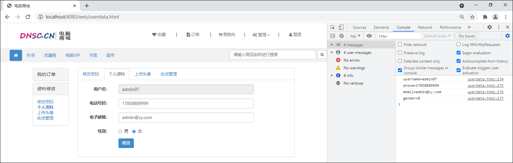

## 修改密码

### 1 用户-修改密码-持久层

#### 1.1 规划需要执行的SQL语句

用户修改密码时需要执行的SQL语句大致是：

```mysql
UPDATE t_user SET password=?, modified_user=?, modified_time=? WHERE uid=?
```

在执行修改密码之前，还应检查用户数据是否存在、并检查用户数据是否被标记为“已删除”、并检查原密码是否正确，这些检查都可以通过查询用户数据来辅助完成：

```mysql
SELECT * FROM t_user WHERE uid=?
```

#### 1.2 接口与抽象方法

在UserMapper接口添加updatePasswordByUid(Integer uid,String password,String modifiedUser,Date modifiedTime)抽象方法。

> 用注解来简化xml配置时，@Param注解的作用是给参数命名，参数命名后就能根据名字得到参数值，正确的将参数传入sql语句中。@Param("参数名")注解中的参数名需要和sql语句中的#{参数名}的参数名保持一致。

```java
/**
 * 根据uid更新用户的密码
 * @param uid 用户的id
 * @param password 新密码
 * @param modifiedUser 最后修改执行人
 * @param modifiedTime 最后修改时间
 * @return 受影响的行数
 */
Integer updatePasswordByUid(
		@Param("uid") Integer uid, 
		@Param("password") String password, 
		@Param("modifiedUser") String modifiedUser, 
		@Param("modifiedTime") Date modifiedTime);

/**
 * 根据用户id查询用户数据
 * @param uid 用户id
 * @return 匹配的用户数据，如果没有匹配的用户数据，则返回null
 */
User findByUid(Integer uid);
```

#### 1.3 配置SQL映射

1.在UserMapper.xml中配置updatePasswordByUid()、findByUid()抽象方法的映射。

```xml
<!-- 根据uid更新用户的密码：
	 Integer updatePasswordByUid(
		@Param("uid") Integer uid, 
		@Param("password") String password, 
		@Param("modifiedUser") String modifiedUser, 
		@Param("modifiedTime") Date modifiedTime) -->
<update id="updatePasswordByUid">
	UPDATE
		t_user 
	SET
		password = #{password},
		modified_user = #{modifiedUser},
		modified_time = #{modifiedTime} 
	WHERE
		uid = #{uid}
</update>

<!-- 根据用户id查询用户数据：User findByUid(Integer uid) -->
<select id="findByUid" resultMap="UserEntityMap">
	SELECT
		*
	FROM
		t_user
	WHERE
		uid = #{uid}
</select>
```

2.在UserMapperTests中编写并执行单元测试。

```java
@Test
public void updatePasswordByUid() {
	Integer uid = 7;
	String password = "123456";
	String modifiedUser = "超级管理员";
	Date modifiedTime = new Date();
	Integer rows = userMapper.updatePasswordByUid(uid, password, modifiedUser, modifiedTime);
	System.out.println("rows=" + rows);
}

@Test
public void findByUid() {
	Integer uid = 7;
	User result = userMapper.findByUid(uid);
	System.out.println(result);
}
```

### 2 用户-修改密码-业务层

#### 2.1 规划异常

1.用户在修改密码前，需要检查用户数据是否存在及是否被标记为“已删除”。如果检查不通过则应抛出UserNotFoundException异常。

2.用户修改密码时，可能会因为输入的原密码错误导致修改失败，则应抛出PasswordNotMatchException异常。

3.在执行修改密码时，如果返回的受影响行数与预期值不同，则应抛出UpdateException异常。

4.创建com.cy.store.service.ex.UpdateException异常类，继承自ServiceException类。

```java
/** 更新数据的异常 */
public class UpdateException extends ServiceException {
	// Override Methods...
}
```

#### 2.2 接口与抽象方法

在IUserService中添加changePassword(Integer uid, String username, String oldPassword, String newPassword)抽象方法。

```java
/**
 * 修改密码
 * @param uid 当前登录的用户id
 * @param username 用户名
 * @param oldPassword 原密码
 * @param newPassword 新密码
 */
public void changePassword(Integer uid, String username, String oldPassword, String newPassword);
```

#### 2.3 实现抽象方法

1.在UserServiceImpl类中实现changePassword()抽象方法。

```java
public void changePassword(Integer uid, String username, String oldPassword, String newPassword) {
	// 调用userMapper的findByUid()方法，根据参数uid查询用户数据
	// 检查查询结果是否为null
	// 是：抛出UserNotFoundException异常

	// 检查查询结果中的isDelete是否为1
	// 是：抛出UserNotFoundException异常

	// 从查询结果中取出盐值
	// 将参数oldPassword结合盐值加密，得到oldMd5Password
	// 判断查询结果中的password与oldMd5Password是否不一致
	// 是：抛出PasswordNotMatchException异常

	// 将参数newPassword结合盐值加密，得到newMd5Password
	// 创建当前时间对象
	// 调用userMapper的updatePasswordByUid()更新密码，并获取返回值
	// 判断以上返回的受影响行数是否不为1
	// 是：抛了UpdateException异常
}
```

2.changePassword()方法的具体代码。

> String中的equals与contentEquals方法，都可以用来比较String对象内容是否相同。

```java
@Override
public void changePassword(Integer uid, String username, String oldPassword, String newPassword) {
	// 调用userMapper的findByUid()方法，根据参数uid查询用户数据
	User result = userMapper.findByUid(uid);
	// 检查查询结果是否为null
	if (result == null) {
		// 是：抛出UserNotFoundException异常
		throw new UserNotFoundException("用户数据不存在");
	}
	
	// 检查查询结果中的isDelete是否为1
	if (result.getIsDelete().equals(1)) {
		// 是：抛出UserNotFoundException异常
		throw new UserNotFoundException("用户数据不存在");
	}
	
	// 从查询结果中取出盐值
	String salt = result.getSalt();
	// 将参数oldPassword结合盐值加密，得到oldMd5Password
	String oldMd5Password = getMd5Password(oldPassword, salt);
	// 判断查询结果中的password与oldMd5Password是否不一致
	if (!result.getPassword().contentEquals(oldMd5Password)) {
		// 是：抛出PasswordNotMatchException异常
		throw new PasswordNotMatchException("原密码错误");
	}
	
	// 将参数newPassword结合盐值加密，得到newMd5Password
	String newMd5Password = getMd5Password(newPassword, salt);
	// 创建当前时间对象
	Date now = new Date();
	// 调用userMapper的updatePasswordByUid()更新密码，并获取返回值
	Integer rows = userMapper.updatePasswordByUid(uid, newMd5Password, username, now);
	// 判断以上返回的受影响行数是否不为1
	if (rows != 1) {
		// 是：抛出UpdateException异常
		throw new UpdateException("更新用户数据时出现未知错误，请联系系统管理员");
	}
}
```

3.在UserServiceTests中编写并执行单元测试。

```java
@Test
public void changePassword() {
    try {
        Integer uid = 5;
        String username = "lower";
        String oldPassword = "123456";
        String newPassword = "888888";
        userService.changePassword(uid, username, oldPassword, newPassword);
        System.out.println("密码修改成功！");
    } catch (ServiceException e) {
        System.out.println("密码修改失败！" + e.getClass().getSimpleName());
        System.out.println(e.getMessage());
    }
}
```

### 3 用户-修改密码-控制器

#### 3.1 处理异常

在用户修改密码的业务中抛出了新的UpdateException异常，需要在BaseController类中进行处理。

```java
@ExceptionHandler(ServiceException.class)
public JsonResult<Void> handleException(Throwable e) {
	JsonResult<Void> result = new JsonResult<Void>(e);
	if (e instanceof UsernameDuplicateException) {
		result.setState(4000);
	} else if (e instanceof UserNotFoundException) {
		result.setState(4001);
	} else if (e instanceof PasswordNotMatchException) {
		result.setState(4002);
	} else if (e instanceof InsertException) {
		result.setState(5000);
	} else if (e instanceof UpdateException) {
		result.setState(5001);
	}
	return result;
}
```

#### 3.2 设计请求

设计用户提交的请求，并设计响应的方式。

	请求路径：/users/change_password
	请求参数：String oldPassword, String newPassword, HttpSession session
	请求类型：POST
	响应结果：JsonResult<Void>

#### 3.3 处理请求

1.在UserController类中添加处理请求的changePassword(String oldPassword, String newPassword, HttpSession session)方法。

```java
@RequestMapping("change_password")
public JsonResult<Void> changePassword(String oldPassword, String newPassword, HttpSession session) {
	// 调用session.getAttribute("")获取uid和username
	// 调用业务对象执行修改密码
	// 返回成功
	
	return null;
}
```

2.实现UserController控制器中的修改密码方法的代码。

```java
@RequestMapping("change_password")
public JsonResult<Void> changePassword(String oldPassword, String newPassword, HttpSession session) {
	// 调用session.getAttribute("")获取uid和username
	Integer uid = getUidFromSession(session);
	String username = getUsernameFromSession(session);
	// 调用业务对象执行修改密码
	iUserService.changePassword(uid, username, oldPassword, newPassword);
	// 返回成功
	return new JsonResult<Void>(OK);
}
```

3.启动项目先登录，再访问http://localhost:8080/users/change_password?oldPassword=xx&newPassword=xx进行测试。

### 4 用户-修改密码-前端页面

1.在password.html页面中body标签内部的最后，添加script标签用于编写JavaScript程序。

```js
<script type="text/javascript">
    $("#btn-change-password").click(function() {
        $.ajax({
            url: "/users/change_password",
            type: "POST",
            data: $("#form-change-password").serialize(),
            dataType: "json",
            success: function(json) {
                if (json.state == 200) {
                    alert("修改成功！");
                } else {
                    alert("修改失败！" + json.message);
                }
            }
        });
	});
</script>
```

2.启动项目先登录，再访问http://localhost:8080/web/password.html页面并进行修改密码。

> 问题：如果无法正常将数据传递给后台，重启动系统和IDEA开发工具，登陆后便可修改密码。

3.问题：在操作前端页面时用户进入修改密码页面，长时间停留在当前页面未进行任何操作，将导致登录信息过期。此时点击修改按钮时，仍会向/users/change_password发送请求，会被拦截器重定向到登录页面。由于整个过程是由$.ajax()函数采用异步的方式处理的，所以重定向也是由异步任务完成的，在页面中没有任何表现就会出现“用户登录信息超时后点击按钮没有任何反应”的问题。

> 解决方案：可以在password.html页面的$.ajax()中补充error属性的配置，该属性的值是一个回调函数。当服务器未正常响应状态码时，例如出现302、400、404、405、500等状态码时，将会调用该函数。

```js
error: function (xhr) {
    alert("您的登录信息已经过期，请重新登录！HTTP响应码：" + xhr.status);
    location.href = "login.html";
}
```

## 个人资料

### 1 用户-个人资料-持久层

#### 1.1 规划需要执行的SQL语句

1.执行修改用户个人资料的SQL语句大致是：

```mysql
UPDATE t_user SET phone=?, email=?, gender=?, modified_user=?, modified_time=? WHERE uid=?
```

2.在执行修改用户资料之前，当用户刚打开修改资料的页面时，就应把当前登录的用户信息显示到页面中。显示用户资料可以通过：

```mysql
SELECT * FROM t_user WHERE uid=?
```

> **说明：**
>
> 1.该查询功能已经实现，无需再次开发；
>
> 2.在执行修改用户资料之前，还应检查用户数据是否存在、是否标记为“已删除”，也可以通过以上查询来实现。

#### 1.2 接口与抽象方法

在UserMapper接口中添加updateInfoByUid(User user)方法。

```java
/**
 * 根据uid更新用户资料
 * @param user 封装了用户id和新个人资料的对象
 * @return 受影响的行数
 */
Integer updateInfoByUid(User user);
```

#### 1.3 配置SQL映射

1.在UserMapper.xml中配置Integer updateInfoByUid(User user)抽象方法的映射。

```xml
<!-- 根据uid更新用户个人资料：Integer updateInfoByUid(User user) -->
<update id="updateInfoByUid">
	UPDATE
		t_user 
	SET
		<if test="phone != null">phone = #{phone},</if>
		<if test="email != null">email = #{email},</if>
		<if test="gender != null">gender = #{gender},</if>
		modified_user = #{modifiedUser},
		modified_time = #{modifiedTime}
	WHERE
		uid = #{uid}
</update>
```

2.在UserMapperTests中编写并执行单元测试。

```java
@Test
public void updateInfoByUid() {
    User user = new User();
    user.setUid(20);
    user.setPhone("17858802222");
    user.setEmail("admin@cy.com");
    user.setGender(1);
    user.setModifiedUser("系统管理员");
    user.setModifiedTime(new Date());
    Integer rows = userMapper.updateInfoByUid(user);
    System.out.println("rows=" + rows);
}
```

### 2 用户-个人资料-业务层

#### 2.1 规划异常

1.关于用户修改个人资料是由两个功能组成的。

- 打开页面时显示当前登录的用户的信息；

- 点击修改按钮时更新用户的信息。

2.关于打开页面时显示当前登录的用户的信息，可能会因为用户数据不存在、用户被标记为“已删除”而无法正确的显示页面，则抛出UserNotFoundException异常。

3.关于点击修改按钮时更新用户的信息，在执行修改资料之前仍需再次检查用户数据是否存在、用户是否被标记为“已删除”，则可能抛出UserNotFoundException异常。并且在执行修改资料过程中，还可能抛出UpdateException异常。

#### 2.2 接口与抽象方法

在IUserService接口中添加两个抽象方法，分别对应以上两个功能。

```java
/**
 * 获取当前登录的用户的信息
 * @param uid 当前登录的用户的id
 * @return 当前登录的用户的信息
 */
User getByUid(Integer uid);

/**
 * 修改用户资料
 * @param uid 当前登录的用户的id
 * @param username 当前登录的用户名
 * @param user 用户的新的数据
 */
void changeInfo(Integer uid, String username, User user);
```

#### 2.3 实现抽象方法

1.在UserServiceImpl实现类中实现getByUid(Integer uid)和changeInfo(Integer uid, String username, User user)以上两个抽象方法。

```java
@Override
public User getByUid(Integer uid) {
	// 调用userMapper的findByUid()方法，根据参数uid查询用户数据
	// 判断查询结果是否为null
	// 是：抛出UserNotFoundException异常

	// 判断查询结果中的isDelete是否为1
	// 是：抛出UserNotFoundException异常

	// 创建新的User对象
	// 将以上查询结果中的username/phone/email/gender封装到新User对象中

	// 返回新的User对象
	return null;
}

@Override
public void changeInfo(Integer uid, String username, User user) {
	// 调用userMapper的findByUid()方法，根据参数uid查询用户数据
	// 判断查询结果是否为null
	// 是：抛出UserNotFoundException异常

	// 判断查询结果中的isDelete是否为1
	// 是：抛出UserNotFoundException异常

	// 向参数user中补全数据：uid
	// 向参数user中补全数据：modifiedUser(username)
	// 向参数user中补全数据：modifiedTime(new Date())
	// 调用userMapper的updateInfoByUid(User user)方法执行修改，并获取返回值
	// 判断以上返回的受影响行数是否不为1
	// 是：抛出UpdateException异常
	
}
```

2.getByUid(Integer uid)和changeInfo(Integer uid, String username, User user)方法的具体代码实现。

```java
@Override
public User getByUid(Integer uid) {
	// 调用userMapper的findByUid()方法，根据参数uid查询用户数据
	User result = userMapper.findByUid(uid);
	// 判断查询结果是否为null
	if (result == null) {
		// 是：抛出UserNotFoundException异常
		throw new UserNotFoundException("用户数据不存在");
	}
 
	// 判断查询结果中的isDelete是否为1
	if (result.getIsDelete().equals(1)) {
		// 是：抛出UserNotFoundException异常
		throw new UserNotFoundException("用户数据不存在");
	}

	// 创建新的User对象
	User user = new User();
	// 将以上查询结果中的username/phone/email/gender封装到新User对象中
	user.setUsername(result.getUsername());
	user.setPhone(result.getPhone());
	user.setEmail(result.getEmail());
	user.setGender(result.getGender());
	
	// 返回新的User对象
	return user;
}

@Override
public void changeInfo(Integer uid, String username, User user) {
	// 调用userMapper的findByUid()方法，根据参数uid查询用户数据
	User result = userMapper.findByUid(uid);
	// 判断查询结果是否为null
	if (result == null) {
		// 是：抛出UserNotFoundException异常
		throw new UserNotFoundException("用户数据不存在");
	}

	// 判断查询结果中的isDelete是否为1
	if (result.getIsDelete().equals(1)) {
		// 是：抛出UserNotFoundException异常
		throw new UserNotFoundException("用户数据不存在");
	}

	// 向参数user中补全数据：uid
	user.setUid(uid);
	// 向参数user中补全数据：modifiedUser(username)
	user.setModifiedUser(username);
	// 向参数user中补全数据：modifiedTime(new Date())
	user.setModifiedTime(new Date());
	// 调用userMapper的updateInfoByUid(User user)方法执行修改，并获取返回值
	Integer rows = userMapper.updateInfoByUid(user);
	// 判断以上返回的受影响行数是否不为1
	if (rows != 1) {
		// 是：抛出UpdateException异常
		throw new UpdateException("更新用户数据时出现未知错误，请联系系统管理员");
	}
}
```

3.在UserServiceTests类中进行单元测试。

```java
@Test
public void getByUid() {
    try {
        Integer uid = 20;
        User user = iUserService.getByUid(uid);
        System.out.println(user);
    } catch (ServiceException e) {
        System.out.println(e.getClass().getSimpleName());
        System.out.println(e.getMessage());
    }
}

@Test
public void changeInfo() {
    try {
        Integer uid = 20;
        String username = "数据管理员";
        User user = new User();
        user.setPhone("15512328888");
        user.setEmail("admin03@cy.cn");
        user.setGender(2);
        iUserService.changeInfo(uid, username, user);
        System.out.println("OK.");
    } catch (ServiceException e) {
        System.out.println(e.getClass().getSimpleName());
        System.out.println(e.getMessage());
    }
}
```

### 3 用户-个人资料-控制器

#### 3.1 处理异常

> **说明**：无需再次开发。

#### 3.2 设计请求

1.设计用户提交显示当前登录的用户信息的请求，并设计响应的方式。

	请求路径：/users/get_by_uid
	请求参数：HttpSession session
	请求类型：GET
	响应结果：JsonResult<User>

2.设计用户提交执行修改用户信息的请求，并设计响应的方式。

	请求路径：/users/change_info
	请求参数：User user, HttpSession session
	请求类型：POST
	响应结果：JsonResult<Void>

#### 3.3 处理请求

**1.处理获取用户信息请求**

1.在UserController类中添加处理请求的getByUid()方法，并导入org.springframework.web.bind.annotation.GetMapping包。

```java
@GetMapping("get_by_uid")
public JsonResult<User> getByUid(HttpSession session) {
	// 从HttpSession对象中获取uid
	// 调用业务对象执行获取数据
	// 响应成功和数据
	return null;
}
```

2.getByUid(HttpSession session)方法中具体代码实现为。

```java
@GetMapping("get_by_uid")
public JsonResult<User> getByUid(HttpSession session) {
    // 从HttpSession对象中获取uid
    Integer uid = getUidFromSession(session);
    // 调用业务对象执行获取数据
    User data = userService.getByUid(uid);
    // 响应成功和数据
    return new JsonResult<User>(OK, data);
}
```

3.完成后启动项目，打开浏览器先登录，再访问http://localhost:8080/users/get_by_uid请求进行测试。

**2.处理修改用户个人信息请求**

1.在UserController类中添加处理请求的changeInfo(User user, HttpSession session)方法。

```java
@RequestMapping("change_info")
public JsonResult<Void> changeInfo(User user, HttpSession session) {
	// 从HttpSession对象中获取uid和username
	// 调用业务对象执行修改用户资料
	// 响应成功
	return null;
}
```

2.changeInfo(User user, HttpSession session)方法中具体代码实现为。

```java
@RequestMapping("change_info")
public JsonResult<Void> changeInfo(User user, HttpSession session) {
	// 从HttpSession对象中获取uid和username
	Integer uid = getUidFromSession(session);
	String username = getUsernameFromSession(session);
	// 调用业务对象执行修改用户资料
	userService.changeInfo(uid, username, user);
	// 响应成功
	return new JsonResult<Void>(OK);
}
```

3.完成后启动项目，打开浏览器先登录，再访问http://localhost:8080/users/change_info?phone=17858800000&email=admin07@cy.com&gender=1进行测试。

### 4 用户-个人资料-前端页面

1.在userdata.html页面中body标签内部的最后，添加script标签用于编写JavaScript程序。

```js
<script type="text/javascript">
    $(document).ready(function() {
        $.ajax({
            url: "/users/get_by_uid",
            type: "GET",
            dataType: "json",
            success: function(json) {
                if (json.state == 200) {
                    console.log("username=" + json.data.username);
                    console.log("phone=" + json.data.phone);
                    console.log("email=" + json.data.email);
                    console.log("gender=" + json.data.gender);

                    $("#username").val(json.data.username);
                    $("#phone").val(json.data.phone);
                    $("#email").val(json.data.email);

                    let radio = json.data.gender == 0 ? $("#gender-female") : $("#gender-male");
                    radio.prop("checked", "checked");
                } else {
                    alert("获取用户信息失败！" + json.message);
                }
            }
        });
	});

    $("#btn-change-info").click(function() {
        $.ajax({
            url: "/users/change_info",
            type: "POST",
            data: $("#form-change-info").serialize(),
            dataType: "json",
            success: function(json) {
                if (json.state == 200) {
                    alert("修改成功！");
                    location.href = "login.html";
                } else {
                    alert("修改失败！" + json.message);
                }
            },
            error: function(xhr) {
                alert("您的登录信息已经过期，请重新登录！HTTP响应码：" + xhr.status);
                location.href = "login.html";
            }
        });
    });
</script>
```

2.完成后启动项目，打开浏览器先登录，再访问http://localhost:8080/web/userdata.html页面并进行用户个人资料的修改测试。


