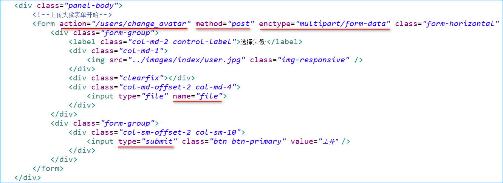
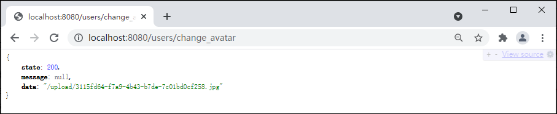
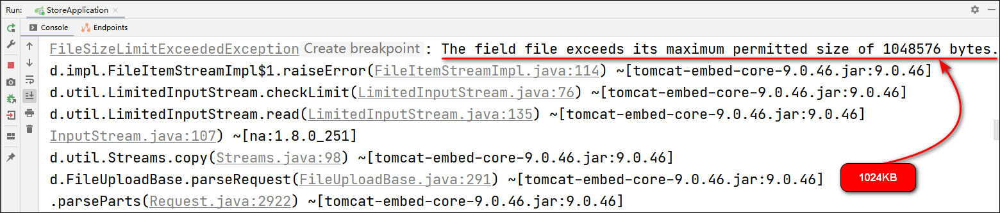
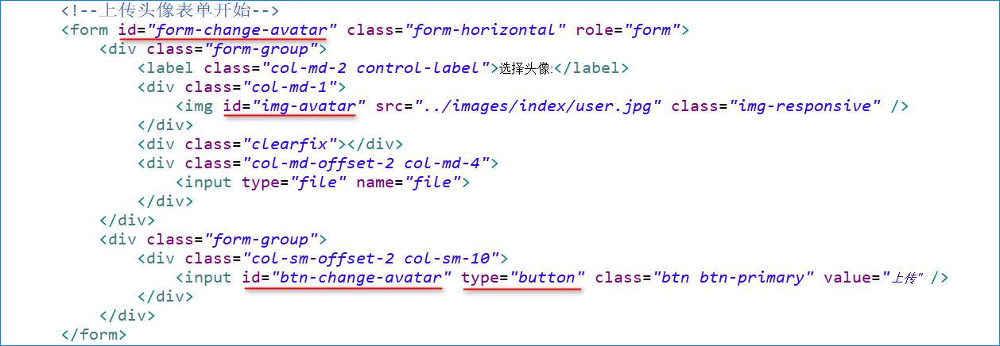
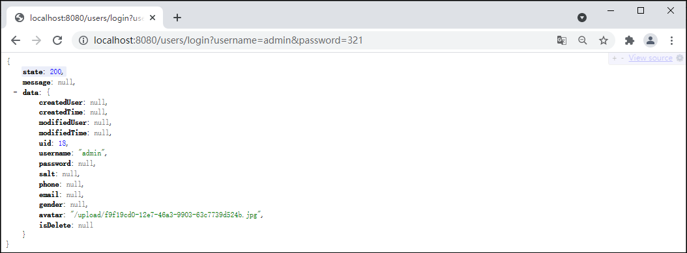
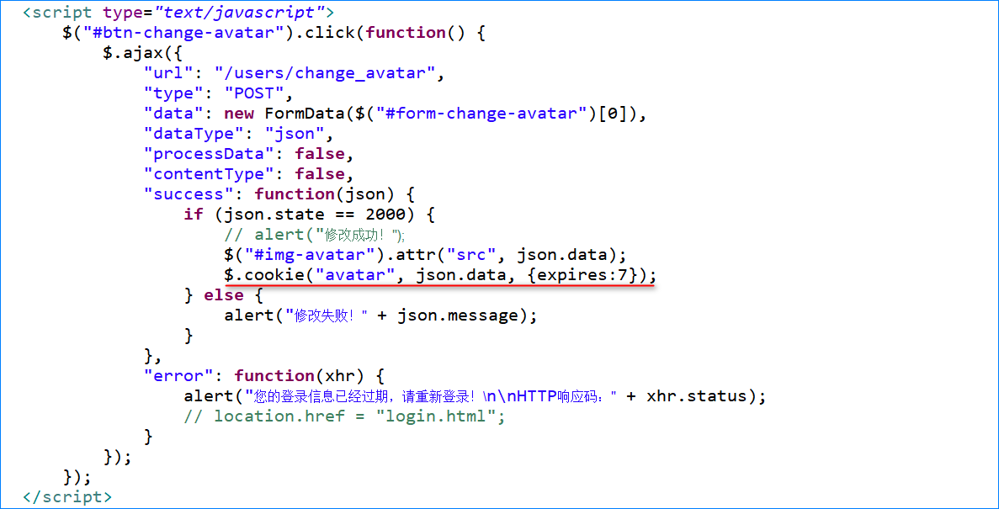

## 基于SpringMVC的文件上传

### 1 MultipartFile接口

MultipartFile接口常用的的API见下表：

| 方法                         | 功能描述                                                     |
| :--------------------------- | ------------------------------------------------------------ |
| String getOriginalFilename() | 获取上传文件的原始文件名，即该文件在客户端中的文件名         |
| boolean isEmpty()            | 判断上传的文件是否为空，当没有选择文件就直接上传，或者选中的文件是0字节的空文件时，返回true，否则返回false |
| long getSize()               | 获取上传的文件大小，以字节为单位                             |
| String getContentType()      | 根据所上传的文件的扩展名决定该文件的MIME类型，例如上传.jpg格式的图片，将返回image/jpeg |
| InputStream getInputStream() | 获取上传文件的输入字节流，通常用于自定义读取所上传的文件的过程，该方法与transferTo()方法不可以同时使用 |
| void transferTo(File dest)   | 保存上传的文件，该方法与getInputStream()方法不可以同时使用   |

### 2 MultipartResolver接口

1.MultipartResolver可以将上传过程中产生的数据封装为MultipartFile类型的对象中。

2.在配置MultipartResovler时，可以为其中的几个属性注入值：

- maxUploadSize：上传文件的最大大小，假设设置值为10M，一次性上传5个文件，则5个文件的大小总和不允许超过10M。
- maxUploadSizePerFile：每个上传文件的最大大小，假设设置值为10M，一次性上传5个文件，则每个文件的大小都不可以超过10M，但是5个文件的大小总和可以接近50M。
- defaultEncoding：默认编码。

### 3 基于SpringMVC的文件上传案例

#### 3.1 创建项目

1.创建Java Enterprise项目，设置Name为springmvc-upload，Group为com.cy，Artifact为controller的Java企业级项目。

2.将项目com.cy.controller包下自动生成的HelloServlet类删除，并删除webapp下自动生成的index.jsp文件。

3.添加文件上传jar包依赖（关于文件上传需要添加spring-webmvc和commons-fileupload依赖）。

```xml
<dependencies>
    <dependency>
        <groupId>org.springframework</groupId>
        <artifactId>spring-webmvc</artifactId>
        <version>4.3.6.RELEASE</version>
    </dependency>
    <!-- 文件上传 -->
    <dependency>
        <groupId>commons-fileupload</groupId>
        <artifactId>commons-fileupload</artifactId>
        <version>1.4</version>
    </dependency>
</dependencies>
```

4.在src\main\resources文件夹下创建spring配置文件，并将文件命名为spring-upload.xml。

```xml
<?xml version="1.0" encoding="UTF-8"?>
<beans xmlns="http://www.springframework.org/schema/beans"
	   xmlns:context="http://www.springframework.org/schema/context"
	   xmlns:xsi="http://www.w3.org/2001/XMLSchema-instance"
	   xsi:schemaLocation="http://www.springframework.org/schema/beans
	   http://www.springframework.org/schema/beans/spring-beans-4.3.xsd
	   http://www.springframework.org/schema/context
	   http://www.springframework.org/schema/context/spring-context-4.3.xsd">
	
</beans>
```

#### 3.2 前端页面设计

在webapp目录下创建upload.html页面，并在页面中添加如下代码。

```html
<!DOCTYPE html>
<html lang="en">
<head>
    <meta charset="UTF-8">
    <title>文件上传</title>
</head>
<body>
    <h3>文件上传</h3>
    <!-- enctype属性：规定表单中数据在提交给服务器之前如何进行编码。默认表单数据的编码是"application/x-www-form-urlencoded"。
         application/x-www-form-urlencoded：提交前表单中所有数据都会进行编码；编码的规则是：空格转换为"+"加号，特殊符号转换为ASCII HEX值
         text/plain：提交前表单中数据空格转换为"+"加号，但不对特殊字符进行编码。
         multipart/form-data：提交前表单中不对字符进行编码；在使用包含文件上传控件的表单中，必须使用该值
    -->
    <form action="upload.do" method="post" enctype="multipart/form-data">
        <table border="1" cellspacing="0" cellpadding="0">
            <tr>
                <td>文件名(N)：</td>
                <td><p><input type="file" name="file"/></p></td>
            </tr>
            <tr>
                <td colspan="2" align="center"><input type="submit" name="上传"/></td>
            </tr>
        </table>
    </form>
</body>
</html>
```

>**注意**：form表单的请求方式必须设置为POST，并配置属性enctype="multipart/form-data"，文件上传input控件的name属性值需设置为file值。

#### 3.3 后台功能实现

1.在web.xml文件中配置前端控制器和过滤器，并指定DispatcherServlet加载的配置文件springmvc-upload.xml的位置。

```xml
<servlet>
    <servlet-name>springmvc</servlet-name>
    <servlet-class>org.springframework.web.servlet.DispatcherServlet</servlet-class>
    <init-param>
        <param-name>contextConfigLocation</param-name>
        <param-value>classpath:springmvc-upload.xml</param-value>
    </init-param>
    <load-on-startup>1</load-on-startup>
</servlet>
<servlet-mapping>
    <servlet-name>springmvc</servlet-name>
    <url-pattern>*.do</url-pattern>
</servlet-mapping>

<filter>
    <filter-name>CharacterEncodingFilter</filter-name>
    <filter-class>org.springframework.web.filter.CharacterEncodingFilter</filter-class>
    <init-param>
        <param-name>encoding</param-name>
        <param-value>utf-8</param-value>
    </init-param>
</filter>
<filter-mapping>
    <filter-name>CharacterEncodingFilter</filter-name>
    <url-pattern>/*</url-pattern>
</filter-mapping>
```

2.创建com.cy.controller.UploadController控制器类，在类的声明之前添加@Controller注解，并在控制器中添加处理请求的upload()方法，为此方法添加类型为MultipartFile接口的参数，并为该参数添加@RequestParam注解，表示客户端上传的文件。

```java
package com.cy.controller;
import org.springframework.stereotype.Controller;
import org.springframework.web.bind.annotation.RequestMapping;
import org.springframework.web.bind.annotation.RequestParam;
import org.springframework.web.bind.annotation.ResponseBody;
import org.springframework.web.multipart.MultipartFile;
import javax.servlet.http.HttpServletRequest;
import java.io.File;
import java.io.IOException;
import java.util.UUID;

@Controller
public class UploadController {
    /*
    @RequestMapping("upload.do")
    @ResponseBody
    public String upload(@RequestParam("file") MultipartFile file) {
        System.out.println("UploadController.upload()...");
        File dest = new File("D:/1.png");
        try {
            // 调用MultipartFile参数对象的transferTo()方法即可保存上传的文件
            file.transferTo(dest);
        } catch (IOException e) {
            e.printStackTrace();
        }
        return "OK";
    }
    */
    
    @RequestMapping("upload.do")
    @ResponseBody
    public String upload(HttpServletRequest request, @RequestParam("file") MultipartFile file) throws IOException {
        // 获取上传文件的原始文件名
        String originalFilename = file.getOriginalFilename();
        // 获取上下文的绝对路径
        String realPath = request.getServletContext().getRealPath("upload");
        System.out.println(realPath);
        // 创建File文件对象
        File dir = new File(realPath);
        if (!dir.exists()) {
            dir.mkdirs();
        }
        // 自定义上传文件名
        String fileName = UUID.randomUUID().toString();
        // 获取上传文件扩展名
        String suffix = "";
        int beginIndex = originalFilename.lastIndexOf(".");
        if (beginIndex > 0) {
            suffix = originalFilename.substring(beginIndex);
        }
        String fullFilename = fileName + suffix;
        // 调用MultipartFile参数对象的transferTo()方法即可保存上传的文件
        file.transferTo(new File(dir, fullFilename));

        return "OK";
    }
}
```

3.在springmvc-upload.xml配置文件中添加组件扫描和CommonsMultipartResolver类的bean标签配置。

```xml
<!-- 组件扫描 -->
<context:component-scan base-package="com.cy" />

<!-- CommonsMultipartResolver -->
<bean id="multipartResolver" class="org.springframework.web.multipart.commons.CommonsMultipartResolver"></bean>
```

> **注意**：CommonsMultipartResolver类在配置时，id值必须设置成multipartResolver。

4.启动项目，访问http://localhost:8080/springmvc_upload_war_exploded/upload.html网址测试文件提交。

## 上传头像

### 1 用户-上传头像-持久层

#### 1.1 规划需要执行的SQL语句

上传文件的操作其实是：先将用户上传的文件保存到服务器端的某个位置，然后将保存文件的路径记录在数据库中。当后续需要使用该文件时，从数据库中读出文件的路径，即可实现在线访问该文件。

在持久层处理数据库中的数据时，只需要关心如何记录头像文件的路径，并不需要考虑上传时保存文件的过程。所以，需要执行的SQL语句大致是：

```mysql
update t_user set avatar=?, modified_user=?, modified_time=? where uid=?
```

#### 1.2 接口与抽象方法

在UserMapper接口中添加updateAvatarByUid()抽象方法。

```java
/**
 * 根据uid更新用户的头像
 * @param uid 用户的id
 * @param avatar 新头像的路径
 * @param modifiedUser 修改执行人
 * @param modifiedTime 修改时间
 * @return 受影响的行数
 */
Integer updateAvatarByUid(
		@Param("uid") Integer uid,
		@Param("avatar") String avatar,
		@Param("modifiedUser") String modifiedUser,
		@Param("modifiedTime") Date modifiedTime);
```

#### 1.3 配置SQL映射

1.在UserMapper.xml中配置updateAvatarByUid()抽象方法的映射。

```xml
<!-- 根据uid更新用户的头像
	 Integer updateAvatarByUid(
		@Param("uid") Integer uid,
		@Param("avatar") String avatar,
		@Param("modifiedUser") String modifiedUser,
		@Param("modifiedTime") Date modifiedTime) -->
<update id="updateAvatarByUid">
	UPDATE
		t_user
	SET
		avatar = #{avatar},
		modified_user = #{modifiedUser},
		modified_time = #{modifiedTime}
	WHERE
		uid = #{uid}
</update>
```

2.在UserMapperTests中编写并执行单元测试。

```java
@Test
public void updateAvatarByUid() {
    Integer uid = 20;
    String avatar = "/upload/avatar.png";
    String modifiedUser = "超级管理员";
    Date modifiedTime = new Date();
    Integer rows = userMapper.updateAvatarByUid(uid, avatar, modifiedUser, modifiedTime);
    System.out.println("rows=" + rows);
}
```

### 2 用户-上传头像-业务层

#### 2.1 规划异常

在修改头像值前先检查用户数据状态，可能抛UserNotFoundException异常；由于最终执行的是修改操作还可能抛UpdateException异常。

#### 2.2 接口与抽象方法

在IUserService中添加changeAvatar(Integer uid, String username, String avatar)抽象方法。

```java
/**
 * 修改用户头像
 * @param uid 当前登录的用户的id
 * @param username 当前登录的用户名
 * @param avatar 用户的新头像的路径
 */
void changeAvatar(Integer uid, String username, String avatar);
```

#### 2.3 实现抽象方法

1.在UserServiceImpl类中实现changeAvatar(Integer uid, String username, String avatar)方法。

```java
@Override
public void changeAvatar(Integer uid, String username, String avatar) {
    // 调用userMapper的findByUid()方法，根据参数uid查询用户数据
    // 检查查询结果是否为null
    // 是：抛出UserNotFoundException

    // 检查查询结果中的isDelete是否为1
    // 是：抛出UserNotFoundException

    // 创建当前时间对象
    // 调用userMapper的updateAvatarByUid()方法执行更新，并获取返回值
    // 判断以上返回的受影响行数是否不为1
    // 是：抛了UpdateException
}
```

2.changeAvatar(Integer uid, String username, String avatar)方法中代码的具体实现为。

```java
@Override
public void changeAvatar(Integer uid, String username, String avatar) {
	// 调用userMapper的findByUid()方法，根据参数uid查询用户数据
	User result = userMapper.findByUid(uid);
	// 检查查询结果是否为null
	if (result == null) {
		// 是：抛出UserNotFoundException
		throw new UserNotFoundException("用户数据不存在");
	}
	
	// 检查查询结果中的isDelete是否为1
	if (result.getIsDelete().equals(1)) {
		// 是：抛出UserNotFoundException
		throw new UserNotFoundException("用户数据不存在");
	}
	
	// 创建当前时间对象
	Date now = new Date();
	// 调用userMapper的updateAvatarByUid()方法执行更新，并获取返回值
	Integer rows = userMapper.updateAvatarByUid(uid, avatar, username, now);
	// 判断以上返回的受影响行数是否不为1
	if (rows != 1) {
		// 是：抛出UpdateException
		throw new UpdateException("更新用户数据时出现未知错误，请联系系统管理员");
	}
}
```

3.在UserServiceTests类中进行单元测试。

```java
@Test
public void changeAvatar() {
    try {
        Integer uid = 20;
        String username = "头像管理员";
        String avatar = "/upload/avatar.png";
        userService.changeAvatar(uid, username, avatar);
        System.out.println("OK.");
    } catch (ServiceException e) {
        System.out.println(e.getClass().getSimpleName());
        System.out.println(e.getMessage());
    }
}
```

### 3 用户-上传头像-控制器

#### 3.1 处理异常

1.在处理上传文件的过程中，用户可能会选择错误的文件上传，此时就应该抛出对应的异常并进行处理。所以需要创建文件上传相关异常的基类，即在com.cy.store.controller.ex包下创建FileUploadException类，并继承自RuntimeException类。

```java
package com.cy.store.service.ex;

/** 文件上传相关异常的基类 */
public class FileUploadException extends RuntimeException {
    public FileUploadException() {
        super();
    }

    public FileUploadException(String message) {
        super(message);
    }

    public FileUploadException(String message, Throwable cause) {
        super(message, cause);
    }

    public FileUploadException(Throwable cause) {
        super(cause);
    }

    protected FileUploadException(String message, Throwable cause, boolean enableSuppression, boolean writableStackTrace) {
        super(message, cause, enableSuppression, writableStackTrace);
    }
}
```

2.在处理上传的文件过程中，经分析可能会产生以下异常。这些异常类都需要继承自FileUploadException类。

```java
// 上传的文件为空
cn.tedu.store.controller.ex.FileEmptyException
// 上传的文件大小超出了限制值
cn.tedu.store.controller.ex.FileSizeException
// 上传的文件类型超出了限制
cn.tedu.store.controller.ex.FileTypeException
// 上传的文件状态异常
cn.tedu.store.controller.ex.FileStateException
// 上传文件时读写异常
cn.tedu.store.controller.ex.FileUploadIOException
```

3.创建FileEmptyException异常类，并继承FileUploadException类。

```java
package com.cy.store.service.ex;

/** 上传的文件为空的异常，例如没有选择上传的文件就提交了表单，或选择的文件是0字节的空文件 */
public class FileEmptyException extends FileUploadException {
    // Override Methods...
}
```

4.创建FileSizeException异常类，并继承FileUploadException类。

```java
package com.cy.store.service.ex;

/** 上传的文件的大小超出了限制值 */
public class FileSizeException extends FileUploadException {
    // Override Methods...
}
```

5.创建FileTypeException异常类，并继承FileUploadException类。

```java
package com.cy.store.service.ex;

/** 上传的文件类型超出了限制 */
public class FileTypeException extends FileUploadException {
    // Override Methods...
}
```

6.创建FileStateException异常类，并继承FileUploadException类。

```java
package com.cy.store.service.ex;

/** 上传的文件状态异常 */
public class FileStateException extends FileUploadException {
    // Override Methods...
}
```

7.创建FileUploadIOException异常类，并继承FileUploadException类。

```java
package com.cy.store.service.ex;

/** 上传文件时读写异常 */
public class FileUploadIOException extends FileUploadException {
    // Override Methods...
}
```

8.然后在BaseController的handleException()的@ExceptionHandler注解中添加FileUploadException.class异常的处理；最后在方法中处理这些异常。

```java
@ExceptionHandler({ServiceException.class, FileUploadException.class})
public JsonResult<Void> handleException(Throwable e) {
	JsonResult<Void> result = new JsonResult<Void>(e);
	if (e instanceof UsernameDuplicateException) {
		result.setState(4000);
	} else if (e instanceof UserNotFoundException) {
		result.setState(4001);
	} else if (e instanceof PasswordNotMatchException) {
		result.setState(4002);
	} else if (e instanceof InsertException) {
		result.setState(5000);
	} else if (e instanceof UpdateException) {
		result.setState(5001);
	} else if (e instanceof FileEmptyException) {
		result.setState(6000);
	} else if (e instanceof FileSizeException) {
		result.setState(6001);
	} else if (e instanceof FileTypeException) {
		result.setState(6002);
	} else if (e instanceof FileStateException) {
		result.setState(6003);
	} else if (e instanceof FileUploadIOException) {
		result.setState(6004);
	}
	
	return result;
}
```

#### 3.2 设计请求

设计用户提交的请求，并设计响应的方式：

	请求路径：/users/change_avatar
	请求参数：MultipartFile file, HttpSession session
	请求类型：POST
	响应结果：JsonResult<String>

#### 3.3 处理请求

1.在UserController类中添加处理请求的changeAvatar(@RequestParam("file") MultipartFile file, HttpSession session)方法。

```java
@PostMapping("change_avatar")
public JsonResult<String> changeAvatar(@RequestParam("file") MultipartFile file, HttpSession session) {
	// 判断上传的文件是否为空
	// 是：抛出异常
	
	// 判断上传的文件大小是否超出限制值
	// 是：抛出异常
	
	// 判断上传的文件类型是否超出限制
	// 是：抛出异常
	
	// 获取当前项目的绝对磁盘路径
	// 保存头像文件的文件夹
	
	// 保存的头像文件的文件名
			
	// 创建文件对象，表示保存的头像文件
	// 执行保存头像文件
	// 如果产生异常则抛出

	// 头像路径
	// 从Session中获取uid和username
	// 将头像写入到数据库中
	
	// 返回成功和头像路径
	return null;
}
```

2.changeAvatar(@RequestParam("file") MultipartFile file, HttpSession session)方法中具体代码实现为。

```java
/** 头像文件大小的上限值(10MB) */
public static final int AVATAR_MAX_SIZE = 10 * 1024 * 1024;
/** 允许上传的头像的文件类型 */
public static final List<String> AVATAR_TYPES = new ArrayList<String>();

/** 初始化允许上传的头像的文件类型 */
static {
	AVATAR_TYPES.add("image/jpeg");
	AVATAR_TYPES.add("image/png");
	AVATAR_TYPES.add("image/bmp");
	AVATAR_TYPES.add("image/gif");
}

@PostMapping("change_avatar")
public JsonResult<String> changeAvatar(@RequestParam("file") MultipartFile file, HttpSession session) {
	// 判断上传的文件是否为空
	if (file.isEmpty()) {
		// 是：抛出异常
		throw new FileEmptyException("上传的头像文件不允许为空");
	}
	
	// 判断上传的文件大小是否超出限制值
	if (file.getSize() > AVATAR_MAX_SIZE) { // getSize()：返回文件的大小，以字节为单位
		// 是：抛出异常
		throw new FileSizeException("不允许上传超过" + (AVATAR_MAX_SIZE / 1024) + "KB的头像文件");
	}
	
	// 判断上传的文件类型是否超出限制
	String contentType = file.getContentType();
	// public boolean list.contains(Object o)：当前列表若包含某元素，返回结果为true；若不包含该元素，返回结果为false。
	if (!AVATAR_TYPES.contains(contentType)) {
		// 是：抛出异常
		throw new FileTypeException("不支持使用该类型的文件作为头像，允许的文件类型：\n" + AVATAR_TYPES);
	}
	
	// 获取当前项目的绝对磁盘路径
	String parent = session.getServletContext().getRealPath("upload");
	// 保存头像文件的文件夹
	File dir = new File(parent);
	if (!dir.exists()) {
		dir.mkdirs();
	}
	
	// 保存的头像文件的文件名
	String suffix = "";
	String originalFilename = file.getOriginalFilename();
	int beginIndex = originalFilename.lastIndexOf(".");
	if (beginIndex > 0) {
		suffix = originalFilename.substring(beginIndex);
	}
	String filename = UUID.randomUUID().toString() + suffix;
	
	// 创建文件对象，表示保存的头像文件
	File dest = new File(dir, filename);
	// 执行保存头像文件
	try {
		file.transferTo(dest);
	} catch (IllegalStateException e) {
		// 抛出异常
		throw new FileStateException("文件状态异常，可能文件已被移动或删除");
	} catch (IOException e) {
		// 抛出异常
		throw new FileUploadIOException("上传文件时读写错误，请稍后重尝试");
	}
	
	// 头像路径
	String avatar = "/upload/" + filename;
	// 从Session中获取uid和username
	Integer uid = getUidFromSession(session);
	String username = getUsernameFromSession(session);
	// 将头像写入到数据库中
	userService.changeAvatar(uid, username, avatar);
	
	// 返回成功头像路径
	return new JsonResult<String>(OK, avatar);
}
```

### 4 用户-上传头像-前端页面

1.然后在upload.html页面中配置用户上传头像的form表单。



2.完成后启动项目，打开浏览器先登录，再访问http://localhost:8080/web/upload.html进行测试。



### 5 用户-上传头像-设置上传文件大小

1.SpringBoot中默认MultipartResolver的最大文件大小值为1M。如果上传的文件的大小超过1M，会抛FileSizeLimitExceededException异常。



2.如果需要调整上传的限制值，直接在启动类中添加getMultipartConfigElement()方法，并且在启动类之前添加@Configuration注解。

```java
package com.cy.store;
import org.mybatis.spring.annotation.MapperScan;
import org.springframework.boot.SpringApplication;
import org.springframework.boot.autoconfigure.SpringBootApplication;
import org.springframework.boot.web.servlet.MultipartConfigFactory;
import org.springframework.context.annotation.Bean;
import org.springframework.context.annotation.Configuration;
import org.springframework.util.unit.DataSize;
import org.springframework.util.unit.DataUnit;
import javax.servlet.MultipartConfigElement;

@Configuration
@SpringBootApplication
@MapperScan("com.cy.store.mapper")
public class StoreApplication {

    public static void main(String[] args) {
        SpringApplication.run(StoreApplication.class, args);
    }

    @Bean
    public MultipartConfigElement getMultipartConfigElement() {
        MultipartConfigFactory factory = new MultipartConfigFactory();
        // DataSize dataSize = DataSize.ofMegabytes(10);
        // 设置文件最大10M，DataUnit提供5中类型B,KB,MB,GB,TB
        factory.setMaxFileSize(DataSize.of(10, DataUnit.MEGABYTES));
        factory.setMaxRequestSize(DataSize.of(10, DataUnit.MEGABYTES));
        // 设置总上传数据总大小10M
        return factory.createMultipartConfig();
    }
}
```

3.除了以上编写方法配置上传的上限值以外，还可以通过在application.properties或application.yml中添加配置来实现。

(1) 低版本：1.X

```properties
spring.http.multipart.max-file-size=10MB
spring.http.multipart.max-request-size=10MB
```
(2) 高版本：2.X

```properties
#方式1
spring.servlet.multipart.max-file-size=10MB
spring.servlet.multipart.max-request-size=10MB
#方式2
spring.servlet.multipart.maxFileSize=10MB
spring.servlet.multipart.maxRequestSize=10MB
```
### 6 用户-上传头像-前端页面BUG解决

#### 6.1 上传后显示头像

1.头像上传成功后，显示上传的头像。在upload.html页面中，是使用img标签来显示头像图片的。首先确定img标签是否添加有id="img-avatar"属性，便于后续访问该标签；而img标签是通过src属性来决定显示哪张图片的，所以修改src该属性的值即可设置需要显示的图片。修改表单添加id="form-change-avatar"属性。修改input标签，添加id="btn-change-avatar"和type="button"属性。



2.在upload.html页面中body标签内部的最后，添加script标签用于编写JavaScript程序。

- processData：处理数据。默认情况下，processData的值是true，其代表以对象的形式上传的数据都会被转换为字符串的形式上传。而当上传文件的时候，则不需要把其转换为字符串，因此要改成false。
- contentType：发送数据的格式。其代表的是前端发送数据的格式，默认值application/x-www-form-urlencoded。代表的是ajax的 data是以字符串的形式传递，使用这种传数据的格式，无法传输复杂的数据，比如多维数组、文件等。把contentType设置为false就会改掉之前默认的数据格式，在上传文件时就不会报错。

```javascript
<script type="text/javascript">
    $("#btn-change-avatar").click(function() {
        $.ajax({
            url: "/users/change_avatar",
            type: "POST",
            data: new FormData($("#form-change-avatar")[0]),
            dataType: "JSON",
            processData: false, // processData处理数据
            contentType: false, // contentType发送数据的格式
            success: function(json) {
                if (json.state == 200) {
                    $("#img-avatar").attr("src", json.data);
                } else {
                    alert("修改失败！" + json.message);
                }
            },
            error: function(xhr) {
                alert("您的登录信息已经过期，请重新登录！HTTP响应码：" + xhr.status);
                location.href = "login.html";
            }
        });
	});
</script>
```

3.完成后启动项目，打开浏览器先登录，再访问http://localhost:8080/web/upload.html进行测试。

#### 6.2 登录后显示头像

1.首先检查登录成功后是否返回了头像的数据。访问http://localhost:8080/users/login?username=admin&password=321测试。



2.用户名、用户Id、用户头像等数据，属于常用数据，在客户端的许多页面都可能需要使用，如果每次都向服务器提交请求获取这些数据，是非常不合适的。可以在用户登录成功后，将这些数据存储在客户端本地，后续在客户端中需要显示这些数据时，直接从本地获取即可，无需再向服务器请求这些数据。在客户端本地存取数据时，可以使用Cookie技术。

3.设计思路：当用户登录成功后，将服务器返回的头像路径存储到本地的Cookie中，在打开“上传头像”页面时，从本地的Cookie中读取头像路径并显示即可。在登录login.html页面中，当登录成功后，将用户头像路径保存到Cookie中。

```javascript
$("#btn-login").click(function() {
    $.ajax({
        url: "/users/login",
        type: "POST",
        data: $("#form-login").serialize(),
        dataType: "json",
        success: function(json) {
            if (json.state == 200) {
                alert("登录成功！");
                $.cookie("avatar", json.data.avatar, {expires: 7});
                console.log("cookie中的avatar=" + $.cookie("avatar"));
                location.href = "index.html";
            } else {
                alert("登录失败！" + json.message);
            }
        }
    });
});
```

> 语法：**$.cookie(名称,值,[option])**。[option]参数说明：
>
> expires：有限日期，可以是一个整数或一个日期(单位天)。如果不设置这个值，默认情况下浏览器关闭之后此Cookie就会失效。
>
> path：表示Cookie值保存的路径，默认与创建页路径一致。
>
> domin：表示Cookie域名属性，默认与创建页域名一样。要注意跨域的概念，如果要主域名二级域名有效则要设置“.xxx.com”。
>
> secrue：布尔类型的值，表示传输Cookie值时，是否需要一个安全协议。

4.在upload.html页面中，默认并没有引用jqueyr.cookie.js文件，因此无法识别$.cookie()函数；所以需要在upload.html页面head标签内添加jqueyr.cookie.js文件。

```javascript
<script src="../bootstrap3/js/jquery.cookie.js" type="text/javascript" charset="utf-8"></script>
```

5.在打开页面时自动读取显示用户图像。获取Cookie中头像的路径，然后将获取到的头像路径设置给img标签的src属性以显示头像。在upload.html页面中的script标签的内部添加自动读取用户图像的jquery代码。

```js
$(document).ready(function () {
    console.log("cookie中的avatar=" + $.cookie("avatar"));
    $("#img-avatar").attr("src", $.cookie("avatar"));
});
```

#### 6.3 显示最新头像

以上代码表示“每次打开页面时，读取Cookie中的头像并显示”，如果此时重新上传用户头像，而Cookie中所保存的头像还是之前上传的头像路径值，无法显示最新的用户头像。所以当用户重新上传头像后，还应把新头像的路径更新到Cookie中。

1.在upload.html页面中，用户头像修改成功后，并将新的用户头像路径保存到Cookie中。

```js
$.cookie("avatar", json.data, {expires: 7});
```



2.完成后启动项目，打开浏览器先登录，再访问http://localhost:8080/web/upload.html进行测试。
