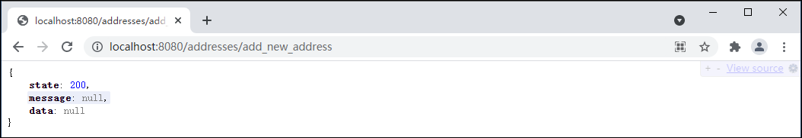
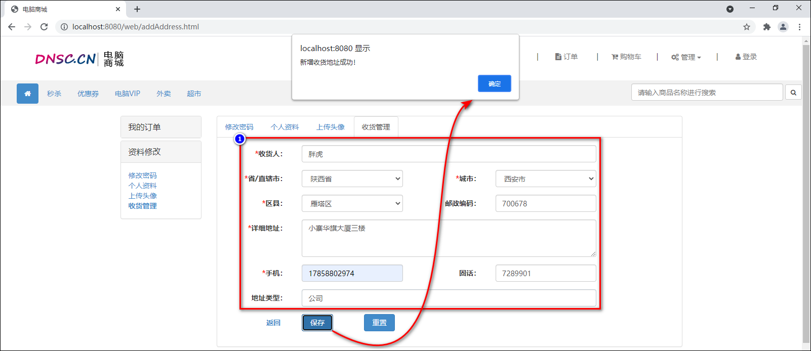
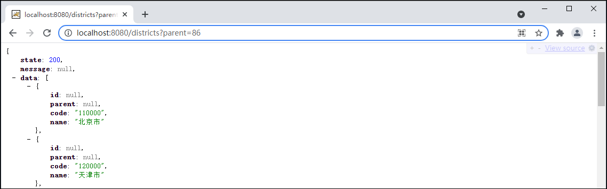
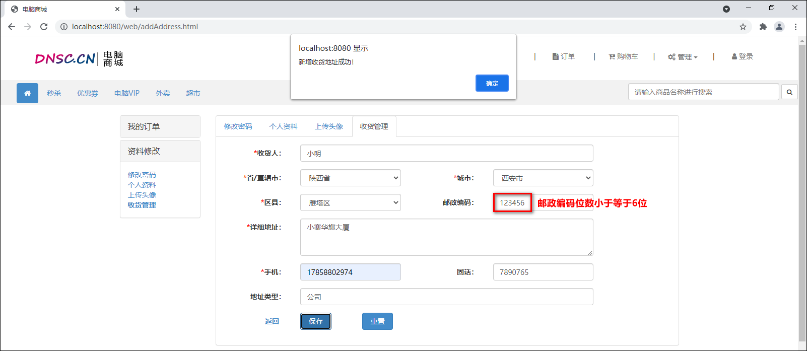
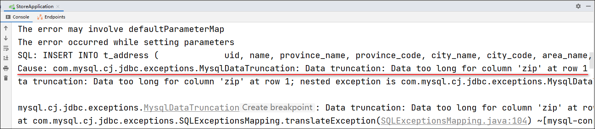
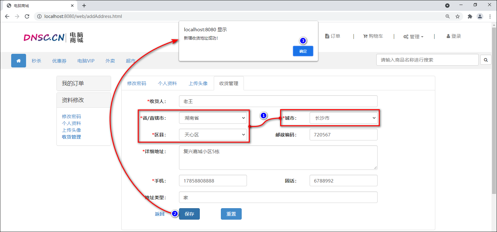
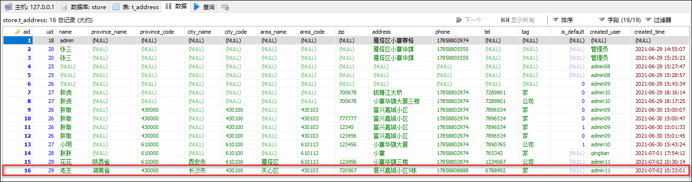
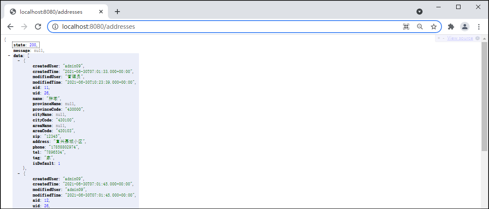
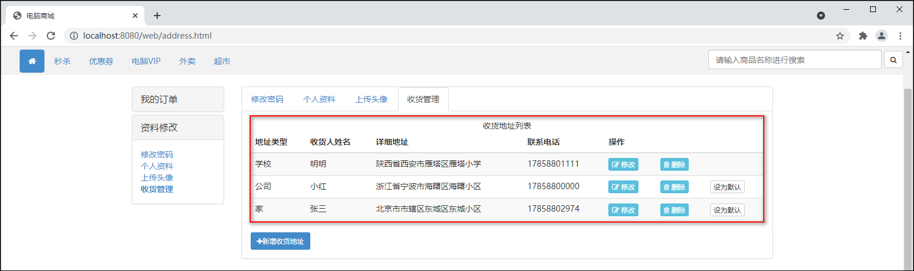
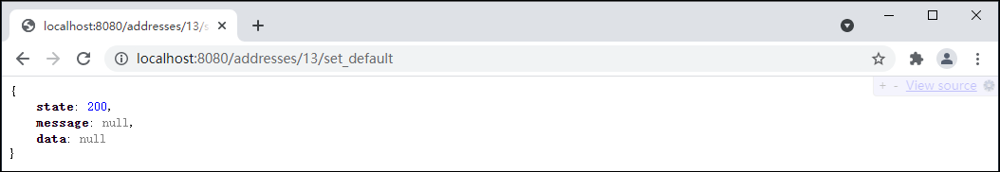

## 新增收货地址

### 1 新增收货地址-创建数据表

1.使用use命令先选中store数据库。

```mysql
USE store;
```

2.在store数据库中创建t_address用户数据表。

```mysql
CREATE TABLE t_address (
	aid INT AUTO_INCREMENT COMMENT '收货地址id',
	uid INT COMMENT '归属的用户id',
	name VARCHAR(20) COMMENT '收货人姓名',
	province_name VARCHAR(15) COMMENT '省-名称',
	province_code CHAR(6) COMMENT '省-行政代号',
	city_name VARCHAR(15) COMMENT '市-名称',
	city_code CHAR(6) COMMENT '市-行政代号',
	area_name VARCHAR(15) COMMENT '区-名称',
	area_code CHAR(6) COMMENT '区-行政代号',
	zip CHAR(6) COMMENT '邮政编码',
	address VARCHAR(50) COMMENT '详细地址',
	phone VARCHAR(20) COMMENT '手机',
	tel VARCHAR(20) COMMENT '固话',
	tag VARCHAR(6) COMMENT '标签',
	is_default INT COMMENT '是否默认：0-不默认，1-默认',
	created_user VARCHAR(20) COMMENT '创建人',
	created_time DATETIME COMMENT '创建时间',
	modified_user VARCHAR(20) COMMENT '修改人',
	modified_time DATETIME COMMENT '修改时间',
	PRIMARY KEY (aid)
) ENGINE=InnoDB DEFAULT CHARSET=utf8;
```

### 2 新增收货地址-创建实体类

创建com.cy.store.entity.Address新增收获地址的实体类，继承自BaseEntity类，在类中声明与数据表中对应的属性，添加Getters and Setters方法，基于唯一标识aid生成hashCode()和equals()方法。

```java
package com.cy.store.entity;

/** 收货地址数据的实体类 */
public class Address extends BaseEntity implements Serializable {
    private Integer aid;
    private Integer uid;
    private String name;
    private String provinceName;
    private String provinceCode;
    private String cityName;
    private String cityCode;
    private String areaName;
    private String areaCode;
    private String zip;
    private String address;
    private String phone;
    private String tel;
    private String tag;
    private Integer isDefault;

    // Generate: Getter and Setter、Generate hashCode() and equals()、toString()
}
```

### 3 新增收货地址-持久层

#### 3.1 各功能的开发顺序

关于收货地址数据的管理，涉及的功能有：增加，删除，修改，设为默认，显示列表。这些功能的开发顺序为：增加-显示列表-设为默认-删除-修改。

#### 3.2 规划需要执行的SQL语句

增加收货地址的本质是插入新的收货地址数据，需要执行的SQL语句大致是：

```mysql
INSERT INTO t_address (除了aid以外的字段列表) VALUES (匹配的值列表)
```

后续在处理业务时，还需要确定“即将增加的收货地址是不是默认收货地址”；可以设定规则“用户的第1条收货地址是默认的，以后添加的每一条都不是默认的”；要应用该规则，就必须知道“即将增加的收货地址是不是第1条”，可以“根据用户id统计收货地址的数量”，如果统计结果为0，则即将增加的就是该用户的第1条收货地址，如果统计结果不是0，则该用户已经有若干条收货地址了，即将增加的就一定不是第1条。关于统计的SQL语句大致是：

```mysql
SELECT count(*) FROM t_address WHERE uid=?
```

一般电商平台都会限制每个用户可以创建的收货地址的数量，如“每个用户最多只允许创建20个收货地址”，也可以通过以上查询来实现。

#### 3.3 接口与抽象方法

创建com.cy.store.mapper.AddressMapper接口，并在接口中添加抽象方法。

```java
package com.cy.store.mapper;
import com.cy.store.entity.Address;

/** 处理收货地址数据的持久层接口 */
public interface AddressMapper {
    /**
     * 插入收货地址数据
     * @param address 收货地址数据
     * @return 受影响的行数
     */
    Integer insert(Address address);

    /**
     * 统计某用户的收货地址数据的数量
     * @param uid 用户的id
     * @return 该用户的收货地址数据的数量
     */
    Integer countByUid(Integer uid);
}
```

#### 3.4 配置SQL映射

1.在src/main/resources/mapper文件夹下复制粘贴得到AddressMapper.xml映射文件，修改根节点mapper的namespace属性的值为com.cy.store.mapper.AddressMapper，并在根节点中配置pojo类属性与数据库中表的字段映射。

```xml
<?xml version="1.0" encoding="UTF-8" ?>
<!DOCTYPE mapper
        PUBLIC "-//mybatis.org//DTD Mapper 3.0//EN"
        "http://mybatis.org/dtd/mybatis-3-mapper.dtd">
<mapper namespace="com.cy.store.mapper.AddressMapper">
    <resultMap id="AddressEntityMap" type="com.cy.store.entity.Address">
        <id column="aid" property="aid"/>
        <result column="province_code" property="provinceCode"/>
        <result column="province_name" property="provinceName"/>
        <result column="city_code" property="cityCode"/>
        <result column="city_name" property="cityName"/>
        <result column="area_code" property="areaCode"/>
        <result column="area_name" property="areaName"/>
        <result column="is_default" property="isDefault"/>
        <result column="created_user" property="createdUser"/>
        <result column="created_time" property="createdTime"/>
        <result column="modified_user" property="modifiedUser"/>
        <result column="modified_time" property="modifiedTime"/>
    </resultMap>
</mapper>
```

2.在AddressMapper.xml映射文件的根节点中配置以上两个抽象方法的映射。

```xml
<!-- 插入收货地址数据：Integer insert(Address address) -->
<insert id="insert" useGeneratedKeys="true" keyProperty="aid">
    INSERT INTO t_address (
        uid, name, province_name, province_code, city_name, city_code, area_name, area_code, zip,
        address, phone, tel,tag, is_default, created_user, created_time, modified_user, modified_time
    ) VALUES (
        #{uid}, #{name}, #{provinceName}, #{provinceCode}, #{cityName}, #{cityCode}, #{areaName},
        #{areaCode}, #{zip}, #{address}, #{phone}, #{tel}, #{tag}, #{isDefault}, #{createdUser},
        #{createdTime}, #{modifiedUser}, #{modifiedTime}
    )
</insert>

<!-- 统计某用户的收货地址数据的数量：Integer countByUid(Integer uid) -->
<select id="countByUid" resultType="java.lang.Integer">
    SELECT
    	COUNT(*)
    FROM
   		t_address
    WHERE
    	uid=#{uid}
</select>
```

3.在src/test/java下创建com.cy.store.mapper.AddressMapperTests测试类，在类定义之前添加测试的两个注解，在类中编写并执行以上两个抽象方法的测试。

```java
package com.cy.store.mapper;
import com.cy.store.entity.Address;
import org.junit.Test;
import org.junit.runner.RunWith;
import org.springframework.beans.factory.annotation.Autowired;
import org.springframework.boot.test.context.SpringBootTest;
import org.springframework.test.context.junit4.SpringRunner;

@RunWith(SpringRunner.class)
@SpringBootTest
public class AddressMapperTests {
    @Autowired
    private AddressMapper addressMapper;

    @Test
    public void insert() {
        Address address = new Address();
        address.setUid(18);
        address.setName("admin");
        address.setPhone("17858802974");
        address.setAddress("雁塔区小寨赛格");
        Integer rows = addressMapper.insert(address);
        System.out.println("rows=" + rows);
    }

    @Test
    public void countByUid() {
        Integer uid = 18;
        Integer count = addressMapper.countByUid(uid);
        System.out.println("count=" + count);
    }
}
```

### 4 增收货地址-业务层

#### 4.1 规划异常

1.无论用户将要增加的收货地址是不是默认收货地址，都需正常增加。即通过countByUid()方法统计的结果不管是不是0，都不能代表是错误的操作。

2.在执行插入收货地址数据之前，需判断countByUid()方法返回值是否超出上限值，如果超出上限值则抛AddressCountLimitException异常。

3.在执行插入数据时，还可能抛出InsertException异常，此异常无需再次创建。

4.创建com.cy.store.service.ex.AddressCountLimitException类后，需继承自ServiceException类。

```java
package com.cy.store.service.ex;

/** 收货地址数量达到上限的异常 */
public class AddressCountLimitException extends ServiceException {
    // Override Methods...
}
```

#### 4.2 接口与抽象方法

创建com.cy.store.service.IAddressService业务层接口，并添加抽象方法。

```java
package com.cy.store.service;
import com.cy.store.entity.Address;

/** 处理收货地址数据的业务层接口 */
public interface IAddressService {
    /**
     * 创建新的收货地址
     * @param uid 当前登录的用户的id
     * @param username 当前登录的用户名
     * @param address 用户提交的收货地址数据
     */
    void addNewAddress(Integer uid, String username, Address address);
}
```

#### 4.3 实现抽象方法

1.创建com.cy.store.service.impl.AddressServiceImpl业务层实现类，在类定义之前添加@Service注解，并实现IAddressService接口，最后在类中添加持久层对象并使用@Autowired注解修饰。

```java
package com.cy.store.service.impl;
import com.cy.store.entity.Address;
import com.cy.store.mapper.AddressMapper;
import com.cy.store.service.IAddressService;
import org.springframework.beans.factory.annotation.Autowired;
import org.springframework.stereotype.Service;

@Service
public class AddressServiceImpl implements IAddressService {
    @Autowired
    private AddressMapper addressMapper;

    @Override
    public void addNewAddress(Integer uid, String username, Address address) {
		// TODO
    }
}
```

2.分析重写的addNewAddress(Integer uid, String username, Address address)抽象方法中的业务逻辑。

```java
@Override
public void addNewAddress(Integer uid, String username, Address address) {
    // 根据参数uid调用addressMapper的countByUid()方法，统计当前用户的收货地址数据的数量
    // 判断数量是否达到上限值
    // 是：抛出AddressCountLimitException

    // 补全数据：将参数uid封装到参数address中
    // 补全数据：根据以上统计的数量，得到正确的isDefault值(是否默认：0-不默认，1-默认)，并封装
    // 补全数据：4项日志

    // 调用addressMapper的insert()方法插入收货地址数据，并获取返回的受影响行数
    // 判断受影响行数是否不为1
    // 是：抛出InsertException
}
```

3.addNewAddress(Integer uid, String username, Address address)方法的具体代码实现。

```java
package com.cy.store.service.impl;
import com.cy.store.entity.Address;
import com.cy.store.mapper.AddressMapper;
import com.cy.store.service.IAddressService;
import com.cy.store.service.ex.AddressCountLimitException;
import com.cy.store.service.ex.InsertException;
import org.springframework.beans.factory.annotation.Autowired;
import org.springframework.beans.factory.annotation.Value;
import org.springframework.stereotype.Service;
import java.util.Date;

@Service
public class AddressServiceImpl implements IAddressService {
    @Autowired
    private AddressMapper addressMapper;

    @Value("${user.address.max-count}")
    private int maxCount;

    @Override
    public void addNewAddress(Integer uid, String username, Address address) {
        // 根据参数uid调用addressMapper的countByUid(Integer uid)方法，统计当前用户的收货地址数据的数量
        Integer count = addressMapper.countByUid(uid);
        // 判断数量是否达到上限值
        if (count > maxCount) {
            // 是：抛出AddressCountLimitException
            throw new AddressCountLimitException("收货地址数量已经达到上限(" + maxCount + ")！");
        }

        // 补全数据：将参数uid封装到参数address中
        address.setUid(uid);
        // 补全数据：根据以上统计的数量，得到正确的isDefault值(是否默认：0-不默认，1-默认)，并封装
        Integer isDefault = count == 0 ? 1 : 0;
        address.setIsDefault(IsDefault);
        // 补全数据：4项日志
        Date now = new Date();
        address.setCreatedUser(username);
        address.setCreatedTime(now);
        address.setModifiedUser(username);
        address.setModifiedTime(now);

        // 调用addressMapper的insert(Address address)方法插入收货地址数据，并获取返回的受影响行数
        Integer rows = addressMapper.insert(address);
        // 判断受影响行数是否不为1
        if (rows != 1) {
            // 是：抛出InsertException
            throw new InsertException("插入收货地址数据时出现未知错误，请联系系统管理员！");
        }
    }
}
```

4.在application.properties文件中添加收货地址数据上限值的配置。

```properties
user.address.max-count=20
```

5.在src/test/java下创建com.cy.store.service.AddressServiceTests测试类，在测试类中测试以上方法。

```java
package com.cy.store.service;
import com.cy.store.entity.Address;
import com.cy.store.service.ex.ServiceException;
import org.junit.Test;
import org.junit.runner.RunWith;
import org.springframework.beans.factory.annotation.Autowired;
import org.springframework.boot.test.context.SpringBootTest;
import org.springframework.test.context.junit4.SpringRunner;

@RunWith(SpringRunner.class)
@SpringBootTest
public class AddressServiceTests {
    @Autowired
    private IAddressService addressService;

    @Test
    public void addNewAddress() {
        try {
            Integer uid = 20;
            String username = "管理员";
            Address address = new Address();
            address.setName("张三");
            address.setPhone("17858805555");
            address.setAddress("雁塔区小寨华旗");
            addressService.addNewAddress(uid, username, address);
            System.out.println("OK.");
        } catch (ServiceException e) {
            System.out.println(e.getClass().getSimpleName());
            System.out.println(e.getMessage());
        }
    }
}
```

### 5 新增收货地址-控制器

#### 5.1 处理异常

在控制器层新增收货地址时，如果收货地址已经达到上限值，则抛出AddressCountLimitException异常，并在BaseController类中添加处理AddressCountLimitException的异常。

```java
// ...
else if (e instanceof AddressCountLimitException) {
	result.setState(4003);
}
// ...
```

#### 5.2 设计请求

设计用户提交的请求，并设计响应的方式。

	请求路径：/addresses/add_new_address
	请求参数：Address address, HttpSession session
	请求类型：POST
	响应结果：JsonResult<Void>

#### 5.3 处理请求

1.创建com.cy.store.controller.AddressController控制器类继承自BaseController类，在类的声明添加@RequestMapping("addresses")和@RestController注解，在类中声明业务层对象并添加Autowired注解修饰。

```java
package com.cy.store.controller;
import com.cy.store.service.IAddressService;
import org.springframework.beans.factory.annotation.Autowired;
import org.springframework.web.bind.annotation.RequestMapping;
import org.springframework.web.bind.annotation.RestController;

@RestController
@RequestMapping("addresses")
public class AddressController extends BaseController {
    @Autowired
    private IAddressService addressService;    
}
```

2.然后在AddressController类中添加处理请求的addNewAddress(Address address, HttpSession session)方法。

```java
@RequestMapping("add_new_address")
public JsonResult<Void> addNewAddress(Address address, HttpSession session) {
    // 从Session中获取uid和username
    Integer uid = getUidFromSession(session);
    String username = getUsernameFromSession(session);

    // 调用业务对象的方法执行业务
    addressService.addNewAddress(uid, username, address);
    // 响应成功
    return new JsonResult<Void>(OK);
}
```

3.完成后启动项目，打开浏览器先登录，再访问http://localhost:8080/addresses/add_new_address进行测试。



### 6 新增收货地址-前端页面

1.在addAddress.html页面中配置新增收货地址表单的属性。给form表单添加id="form-add-new-address"属性、"请输入收货人姓名"添加name="name"属性、"请输入邮政编码"添加name="zip"属性、"输入详细的收货地址，小区名称、门牌号等"添加name="address"属性、"请输入手机号码"添加name="phone"属性、"请输入固定电话号码"添加name="tel"属性、"请输入地址类型，如：家、公司或者学校"添加name="tag"属性、"保存"按钮添加id="btn-add-new-address"属性。以上属性如果已经添加无需重复添加。

2.在addAddress.html页面中body标签内部的最后，添加script标签用于编写JavaScript程序。

```javascript
<script type="text/javascript">
    $("#btn-add-new-address").click(function() {
        $.ajax({
            url: "/addresses/add_new_address",
            type: "POST",
            data: $("#form-add-new-address").serialize(),
            dataType: "JSON",
            success: function(json) {
                if (json.state == 200) {
                    alert("新增收货地址成功！");
                } else {
                    alert("新增收货地址失败！" + json.message);
                }
            },
            error: function(xhr) {
                alert("您的登录信息已经过期，请重新登录！HTTP响应码：" + xhr.status);
                location.href = "login.html";
            }
        });
	});
</script>
```

3.完成后启动项目，打开浏览器先登录，再访问http://localhost:8080/web/addAddress.html页面。



## 获取省/市/区的列表

### 1 获取省/市/区的列表-数据库

1.使用该数据库：

```mysql
USE store;
```

2.向数据库中导入省/市/区数据t_dict_district.sql文件，执行以下指令：

```mysql
mysql> source C:/Users/yuanxin/t_dict_district.sql
```

3.创建省/市/区数据的com.cy.store.entity实体类，在类中声明与数据表中对应的属性，添加Getters and Setters方法，基于唯一标识id生成equals()方法及hashCode()和toString()方法。

```java
package com.cy.store.entity;
import java.io.Serializable;

/** 省/市/区数据的实体类 */
public class District implements Serializable {
    private Integer id;
    private String parent;
    private String code;
    private String name;

    // Generate: Getter and Setter、Generate hashCode() and equals()、toString()
}
```

### 2 获取省/市/区的列表-持久层

#### 2.1 规划需要执行的SQL语句

获取全国所有省/某省所有市/某市所有区的查询SQL语句大致是：

```mysql
select * from t_dict_district where parent=? order by code ASC;
```

#### 2.2 接口与抽象方法

创建com.cy.store.mapper.DistrictMapper接口，添加抽象方法。

```java
package com.cy.store.mapper;
import com.cy.store.entity.District;
import java.util.List;

/** 处理省/市/区数据的持久层接口 */
public interface DistrictMapper {
    /**
     * 获取全国所有省/某省所有市/某市所有区
     * @param parent 父级代号，当获取某市所有区时，使用市的代号；当获取省所有市时，使用省的代号；当获取全国所有省时，使用"86"作为父级代号
     * @return 全国所有省/某省所有市/某市所有区的列表
     */
    List<District> findByParent(String parent);
}
```

#### 2.3 配置SQL映射

1.在src/main/resources/mapper中复制得到DistrictMapper.xml，修改根节点的namespace属性的值为以上接口文件，并配置以上抽象方法的映射。

```xml
<?xml version="1.0" encoding="UTF-8" ?>
<!DOCTYPE mapper
        PUBLIC "-//mybatis.org//DTD Mapper 3.0//EN"
        "http://mybatis.org/dtd/mybatis-3-mapper.dtd">
<mapper namespace="com.cy.store.mapper.DistrictMapper">
    <!-- 获取全国所有省/某省所有市/某市所有区：List<District> findByParent(String parent) -->
    <select id="findByParent" resultType="com.cy.store.entity.District">
        SELECT
            *
        FROM
            t_dict_district
        WHERE
            parent=#{parent}
        ORDER BY
            code ASC
    </select>
</mapper>
```

2.在src/test/java下创建com.cy.store.mapper.DistrictMapperTests测试类，编写并执行以上抽象方法的测试。

```java
package com.cy.store.mapper;
import com.cy.store.entity.District;
import org.junit.Test;
import org.junit.runner.RunWith;
import org.springframework.beans.factory.annotation.Autowired;
import org.springframework.boot.test.context.SpringBootTest;
import org.springframework.test.context.junit4.SpringRunner;
import java.util.List;

@RunWith(SpringRunner.class)
@SpringBootTest
public class DistrictMapperTests {
    @Autowired
    private DistrictMapper districtMapper;

    @Test
    public void findByParent() {
        String parent = "110100";
        List<District> list = districtMapper.findByParent(parent);
        System.out.println("count=" + list.size());
        for (District district : list) {
            System.out.println(district);
        }
    }
}
```

### 3 获取省/市/区的列表-业务层

#### 3.1 规划异常

> **说明**：无异常。

#### 3.2 接口与抽象方法

创建com.cy.store.service.IDistrictService接口，并添加抽象方法。

```java
package com.cy.store.service;
import com.cy.store.entity.District;
import java.util.List;

/** 处理省/市/区数据的业务层接口 */
public interface IDistrictService {
    /**
     * 获取全国所有省/某省所有市/某市所有区
     * @param parent 父级代号，当获取某市所有区时，使用市的代号；当获取某省所有市时，使用省的代号；当获取全国所有省时，使用"86"作为父级代号
     * @return 全国所有省/某省所有市/某市所有区的列表
     */
    List<District> getByParent(String parent);
}
```

#### 3.3 实现抽象方法

1.创建com.cy.store.service.impl.DistrictServiceImpl类，实现IDistrictService接口，在类之前添加@Service注解，以及在类中添加持久层对象并使用@Autowired修饰。

```java
package com.cy.store.service.impl;
import com.cy.store.entity.District;
import com.cy.store.mapper.DistrictMapper;
import com.cy.store.service.IDistrictService;
import org.springframework.beans.factory.annotation.Autowired
import org.springframework.stereotype.Service;
import java.util.List;

/** 处理省/市/区数据的业务层实现类 */
@Service
public class DistrictServiceImpl implements IDistrictService {
    @Autowired
    private DistrictMapper districtMapper;

    @Override
    public List<District> getByParent(String parent) {
        return null;
    }
}
```

2.在DistrictServiceImpl实现类中实现getByParent(String parent)方法的具体代码。

```java
@Override
public List<District> getByParent(String parent) {
	List<District> list = districtMapper.findByParent(parent);
	for (District district : list) {
		district.setId(null);
		district.setParent(null);
	}
	return list;
}
```

3.在src/test/java下创建com.cy.store.service.DistrictServiceTests测试类，编写并执行单元测试。

```java
package com.cy.store.service;
import com.cy.store.entity.District;
import com.cy.store.service.ex.ServiceException;
import org.junit.Test;
import org.junit.runner.RunWith;
import org.springframework.beans.factory.annotation.Autowired;
import org.springframework.boot.test.context.SpringBootTest;
import org.springframework.test.context.junit4.SpringRunner;
import java.util.List;

@RunWith(SpringRunner.class)
@SpringBootTest
public class DistrictServiceTests {
    @Autowired
    private IDistrictService districtService;

    @Test
    public void getByParent() {
        try {
            String parent = "86";
            List<District> list = districtService.getByParent(parent);
            System.out.println("count=" + list.size());
            for (District item : list) {
                System.out.println(item);
            }
        } catch (ServiceException e) {
            System.out.println(e.getClass().getSimpleName());
            System.out.println(e.getMessage());
        }
    }
}
```

### 4 获取省/市/区的列表-控制器

#### 4.1 处理异常

> **说明**：无异常。

#### 4.2 设计请求

设计用户提交的请求，并设计响应的方式。

	请求路径：/districts/
	请求参数：String parent
	请求类型：GET
	响应结果：JsonResult<List<District>>
	是否拦截：否，需要在拦截器的配置中添加白名单

#### 4.3 处理请求

1.创建com.cy.store.controller.DistrictController控制器类，继承自BaseController类，在类之前添加@RequestMapping("districts")和@RestController注解，并在类中添加业务层对象，对其使用@Autowired注解修饰。

```java
package com.cy.store.controller;
import java.util.List;
import org.springframework.beans.factory.annotation.Autowired;
import org.springframework.web.bind.annotation.GetMapping;
import org.springframework.web.bind.annotation.RequestMapping;
import org.springframework.web.bind.annotation.RestController;
import cn.tedu.store.entity.District;
import cn.tedu.store.service.IDistrictService;
import cn.tedu.store.util.JsonResult;

@RequestMapping("districts")
@RestController
public class DistrictController extends BaseController {
	@Autowired
	private IDistrictService districtService;
	
}
```

2.在类中添加处理请求的方法getByParent(String parent)及方法的实现。

> @GetMapping：是一个组合注解，等价于@RequestMapping(method={RequestMethod.GET})，它将HTTP的GET请求映射到特定的处理方法上。“/”表示方法将处理所有传入的URI请求。简化代码。

```java
@GetMapping({"", "/"})
public JsonResult<List<District>> getByParent(String parent) {
    List<District> data = districtService.getByParent(parent);
    return new JsonResult<>(OK, data);
}
```

3.在拦截器LoginInterceptorConfigurer类的addInterceptors(InterceptorRegistry registry)方法中将“districts”请求添加为白名单。如果已经添加无需重复添加。

```java
patterns.add("/districts/**");
```

4.完成后启动项目，打开浏览器（不需要登录），直接访问http://localhost:8080/districts?parent=86进行测试。



### 5 获取省/市/区的列表-前端页面

1.在addAddress.html页面中的head标签内导入的distpicker.data.js和distpicker.js文件注释掉。

>JQuery实现中国省市区地址三级联动插件Distpicker。

```javascript
<!--
<script type="text/javascript" src="../js/distpicker.data.js"></script>
<script type="text/javascript" src="../js/distpicker.js"></script>
-->
```

2.在新增收货地址表单中，给"选择省"控件添加name="provinceCode"和id="province-list"属性，给"选择市"添加name="cityCode"和id="city-list"属性，给"选择区"控件添加name="areaCode"和id="area-list"属性。以上属性如果已经添加无需重复添加。

3.在addAddress.html页面中body标签内的script标签中添加获取省/市/区列表的代码。

```javascript
<script type="text/javascript">
    let defaultOption = '<option value="0">----- 请选择 -----</option>';

    $(document).ready(function() {
        showProvinceList();
        $("#city-list").append(defaultOption);
        $("#area-list").append(defaultOption);
    });

    $("#province-list").change(function() {
        showCityList();
    });

    $("#city-list").change(function() {
        showAreaList();
    });

    function showProvinceList() {
        $("#province-list").append(defaultOption);
        $.ajax({
            url: "/districts",
            type: "GET",
            data: "parent=86",
            dataType: "JSON",
            success: function(json) {
                if (json.state == 200) {
                    let list = json.data;
                    console.log("count=" + list.length);
                    for (let i = 0; i < list.length; i++) {
                        console.log(list[i].name);
                        let option = '<option value="' + list[i].code + '">' + list[i].name + '</option>';
                        $("#province-list").append(option);
                    }
                }
            }
        });
    }

    function showCityList() {
        let parent = $("#province-list").val();
        $("#city-list").empty();
        $("#area-list").empty();

        $("#city-list").append(defaultOption);
        $("#area-list").append(defaultOption);

        if (parent == 0) {
            return;
        }

        $.ajax({
            url: "/districts",
            type: "GET",
            data: "parent=" + parent,
            dataType: "JSON",
            success: function(json) {
                if (json.state == 200) {
                    let list = json.data;
                    console.log("count=" + list.length);
                    for (let i = 0; i < list.length; i++) {
                        console.log(list[i].name);
                        let option = '<option value="' + list[i].code + '">' + list[i].name + '</option>';
                        $("#city-list").append(option);
                    }
                }
            }
        });
    }

    function showAreaList() {
        let parent = $("#city-list").val();
        $("#area-list").empty();
        $("#area-list").append(defaultOption);

        if (parent == 0) {
            return;
        }

        $.ajax({
            url: "/districts",
            type: "GET",
            data: "parent=" + parent,
            dataType: "JSON",
            success: function(json) {
                if (json.state == 200) {
                    let list = json.data;
                    console.log("count=" + list.length);
                    for (let i = 0; i < list.length; i++) {
                        console.log(list[i].name);
                        let option = '<option value="' + list[i].code + '">' + list[i].name + '</option>';
                        $("#area-list").append(option);
                    }
                }
            }
        });
    }
</script>
```

>**JQuery事件-change()方法**
>
>1.定义和用法
>
>（1）当元素的值发生改变时，会发生change事件。
>
>（2）该事件仅适用于文本域(textfield)，以及textarea和select元素。
>
>（3）change()函数触发change事件，或规定当发生change事件时运行的函数。
>
>当用于select元素时，change事件会在选择某个选项时发生。当用于textfield或textarea时，该事件会在元素失去焦点时发生。
>
>2.触发change事件
>
>触发被选元素的change事件。语法：$(selector).change()
>
>3.将函数绑定到change事件
>
>规定当被选元素的 change 事件发生时运行的函数。语法：$(selector).change(function)

4.完成后启动项目，打开浏览器先登录，再访问http://localhost:8080/web/addAddress.html页面。



5.说明：如果输入的邮政编码位数大于6位数字，则会抛MysqlDataTruncation异常。



## 获取省/市/区的名称

此功能模块主要实现根据省/市/区的行政代号获取省/市/区的名称。

### 1 获取省/市/区的名称-持久层

#### 1.1 规划需要执行的SQL语句

根据省/市/区的行政代号获取省/市/区的名称，需要执行的SQL语句大致是：

```mysql
select name from t_dict_district where code=?
```

#### 1.2 接口与抽象方法

在DistrictMapper接口中添加根据省/市/区的行政代号获取省/市/区的名称findNameByCode(String code)抽象方法。

```java
/**
 * 根据省/市/区的行政代号获取省/市/区的名称
 * @param code 省/市/区的行政代号
 * @return 匹配的省/市/区的名称，如果没有匹配的数据则返回null
 */
String findNameByCode(String code);
```

#### 1.3 配置SQL映射

1.在DistrictMapper.xml文件中配置映射。

```xml
<!-- 根据省/市/区的行政代号获取省/市/区的名称：String findNameByCode(String code) -->
<select id="findNameByCode" resultType="java.lang.String">
    SELECT
    	name
    FROM
    	t_dict_district
    WHERE
    	code=#{code}
</select>
```

2.然后在DistrictMapperTests测试类中编写并执行测试方法。

```java
@Test
public void findNameByCode() {
    String code = "540000";
    String name = districtMapper.findNameByCode(code);
    System.out.println(name);
}
```

### 2 获取省/市/区的名称-业务层

#### 2.1 规划异常

> **说明**：无异常。

#### 2.2 接口与抽象方法

在业务层IDistrictService接口中添加getNameByCode(String code)抽象方法。

```java
/**
 * 根据省/市/区的行政代号获取省/市/区的名称
 * @param code 省/市/区的行政代号
 * @return 匹配的省/市/区的名称，如果没有匹配的数据则返回null
 */
String getNameByCode(String code);
```

#### 2.3 实现抽象方法

1.在业务层DistrictServiceImpl类中重写getNameByCode(String code)方法。

```java
@Override
public String getNameByCode(String code) {
    return districtMapper.findNameByCode(code);
}
```

2.然后在DistrictServiceTests测试类中编写并执行测试方法。

```java
@Test
public void getNameByCode() {
    try {
        String code = "430000";
        String result = districtService.getNameByCode(code);
        System.out.println(result);
    } catch (ServiceException e) {
        System.out.println(e.getClass().getSimpleName());
        System.out.println(e.getMessage());
    }
}
```

### 3 新增收货地址-业务层优化

1.在AddressServiceImpl类中声明处理省/市/区数据的业务层对象。

```java
@Autowired
private IDistrictService districtService;
```

2.在addNewAddress(Integer uid, String username, Address address)方法中补全省/市/区数据。

```java
// 补全数据：省、市、区的名称
String provinceName = districtService.getNameByCode(address.getProvinceCode());
String cityName = districtService.getNameByCode(address.getCityCode());
String areaName = districtService.getNameByCode(address.getAreaCode());
address.setProvinceName(provinceName);
address.setCityName(cityName);
address.setAreaName(areaName);
```

### 4 新增收货地址-前端页面测试

1.完成后启动项目，打开浏览器先登录，再访问http://localhost:8080/web/addAddress.html页面。输入收货人相关的信息并保存。



2.在后台数据库中检查数据是否被正常的插入到t_address表中。



## 收货地址列表

### 1 收货地址列表显示-持久层

#### 1.1 规划需要执行的SQL语句

显示当前登录用户的收货地址列表的SQL语句大致是：

```mysql
select * from t_address where uid=? order by is_default desc, created_time desc;
```

#### 1.2 接口与抽象方法

在AddressMapper接口中添加findByUid(Integer uid)抽象方法。

```java
/**
 * 查询某用户的收货地址列表数据
 * @param uid 收货地址归属的用户id
 * @return 该用户的收货地址列表数据
 */
List<Address> findByUid(Integer uid);
```

#### 1.3 配置SQL映射

1.在AddressMapper.xml文件中配置findByUid(Integer uid)方法的映射。

```xml
<!--
<resultMap id="AddressEntityMap" type="cn.tedu.store.entity.Address">
	<id column="aid" property="aid"/>
	<result column="province_code" property="provinceCode"/>
	<result column="province_name" property="provinceName"/>
	<result column="city_code" property="cityCode"/>
	<result column="city_name" property="cityName"/>
	<result column="area_code" property="areaCode"/>
	<result column="area_name" property="areaName"/>
	<result column="is_default" property="isDefault"/>
	<result column="created_user" property="createdUser"/>
	<result column="created_time" property="createdTime"/>
	<result column="modified_user" property="modifiedUser"/>
	<result column="modified_time" property="modifiedTime"/>
</resultMap>
-->

<!-- 查询某用户的收货地址列表数据：List<Address> findByUid(Integer uid) -->
<select id="findByUid" resultMap="AddressEntityMap">
	SELECT
		*
	FROM
		t_address
	WHERE
		uid=#{uid}
	ORDER BY
		is_default DESC, created_time DESC
</select>
```

2.在AddressMapperTests测试类中添加findByUid()测试方法。

```java
@Test
public void findByUid() {
    Integer uid = 26;
    List<Address> list = addressMapper.findByUid(uid);
    System.out.println("count=" + list.size());
    for (Address item : list) {
        System.out.println(item);
    }
}
```

### 2 收货地址列表显示-业务层

#### 2.1 规划异常

> **说明**：无异常。

#### 2.2 接口与抽象方法

在IAddressService接口中添加getByUid(Integer uid)抽象方法。

```java
/**
 * 查询某用户的收货地址列表数据
 * @param uid 收货地址归属的用户id
 * @return 该用户的收货地址列表数据
 */
List<Address> getByUid(Integer uid);
```

#### 2.3 实现抽象方法

1.在AddressServiceImpl类中实现getByUid(Integer uid)抽象方法。

```java
@Override
public List<Address> getByUid(Integer uid) {
	List<Address> list = addressMapper.findByUid(uid);
	for (Address address : list) {
		address.setUid(null);
		address.setProvinceCode(null);
		address.setCityCode(null);
		address.setAreaCode(null);
		address.setCreatedUser(null);
		address.setCreatedTime(null);
		address.setModifiedUser(null);
		address.setModifiedTime(null);
	}
	return list;
}
```

2.在AddressServiceTests测试类中添加getByUid()测试方法。

```java
@Test
public void getByUid() {
    Integer uid = 26;
    List<Address> list = addressService.getByUid(uid);
    System.out.println("count=" + list.size());
    for (Address item : list) {
        System.out.println(item);
    }
}
```

### 3 收货地址列表显示-控制器

#### 3.1 处理异常

> **说明**：无异常。

#### 3.2 设计请求

设计用户提交的请求，并设计响应的方式。

	请求路径：/addresses
	请求参数：HttpSession session
	请求类型：GET
	响应结果：JsonResult<List<Address>>

#### 3.3 处理请求

1.在AddressController类中添加处理请求的getByUid(HttpSession session)方法。

```java
@GetMapping({"", "/"})
public JsonResult<List<Address>> getByUid(HttpSession session) {
	Integer uid = getUidFromSession(session);
	List<Address> data = addressService.getByUid(uid);
	return new JsonResult<>(OK, data);
}
```

2.完成后启动项目，打开浏览器先登录，再访问http://localhost:8080/addresses页面。



### 4 收货地址列表显示-前端页面

1.在address.html页面中body标签内部的最后，添加展示用户收货地址列表数据的JavaScript代码。

```javascript
<script type="text/javascript">
$(document).ready(function () {
    showAddressList();
});

function showAddressList() {
    $("#address-list").empty();
    $.ajax({
        url: "/addresses",
        type: "GET",
        dataType: "JSON",
        success: function (json) {
            let list = json.data;
            for (let i = 0; i < list.length; i++) {
                console.log(list[i].name);
                let address = '<tr>'
                    + '<td>#{tag}</td>'
                    + '<td>#{name}</td>'
                    + '<td>#{province}#{city}#{area}#{address}</td>'
                    + '<td>#{phone}</td>'
                    + '<td><a class="btn btn-xs btn-info"><span class="fa fa-edit"></span> 修改</a></td>'
                    + '<td><a class="btn btn-xs add-del btn-info"><span class="fa fa-trash-o"></span> 删除</a></td>'
                    + '<td><a class="btn btn-xs add-def btn-default">设为默认</a></td>'
                + '</tr>';

                address = address.replace(/#{aid}/g, list[i].aid);
                address = address.replace(/#{tag}/g, list[i].tag);
                address = address.replace("#{name}", list[i].name);
                address = address.replace("#{province}", list[i].provinceName);
                address = address.replace("#{city}", list[i].cityName);
                address = address.replace("#{area}", list[i].areaName);
                address = address.replace("#{address}", list[i].address);
                address = address.replace("#{phone}", list[i].phone);

                $("#address-list").append(address);
            }
            $(".add-def:eq(0)").hide();
        }
    });
}
</script>
```

2.完成后启动项目，打开浏览器先登录，再访问http://localhost:8080/web/address.html页面。



## 默认收货地址

### 1 默认收货地址-持久层

#### 1.1 规划需要执行的SQL语句

1.将某用户的所有收货地址设置为非默认地址（是否默认：0-不默认，1-默认）。

```mysql
update t_address set is_default=0 where uid=?
```

2.将某用户指定的收货地址设置为默认地址。

```mysql
update t_address set is_default=1, modified_user=?, modified_time=? where aid=?
```

3.检查该收货地址是否存在，并检查数据归属是否正确。可根据收货地址aid值，查询收货地址详情数据。

```mysql
select * from t_address where aid=?
```

#### 1.2 接口与抽象方法

在AddressMapper接口中声明三个抽象方法。

```java
/**
 * 将某用户的所有收货地址设置为非默认地址
 * @param uid 收货地址归属的用户id
 * @return 受影响的行数
 */
Integer updateNonDefaultByUid(Integer uid);

/**
 * 将指定的收货地址设置为默认地址
 * @param aid 收货地址id
 * @param modifiedUser 修改执行人
 * @param modifiedTime 修改时间
 * @return 受影响的行数
 */
Integer updateDefaultByAid(
        @Param("aid") Integer aid,
        @Param("modifiedUser") String modifiedUser,
        @Param("modifiedTime") Date modifiedTime);

/**
 * 根据收货地址aid值，查询收货地址详情
 * @param aid 收货地址id
 * @return 匹配的收货地址详情，如果没有匹配的数据，则返回null
 */
Address findByAid(Integer aid);
```

#### 1.3 配置SQL映射

1.在AddressMapper.xml映射文件，配置以上三个抽象方法的映射。

```xml
<!-- 将某用户的所有收货地址设置为非默认地址：Integer updateNonDefaultByUid(Integer uid) -->
<update id="updateNonDefaultByUid">
    UPDATE
    	t_address
    SET
    	is_default=0
    WHERE
    	uid=#{uid}
</update>

<!-- 将指定的收货地址设置为默认地址：
         Integer updateDefaultByAid(
            @Param("aid") Integer aid,
            @Param("modifiedUser") String modifiedUser,
            @Param("modifiedTime") Date modifiedTime) -->
<update id="updateDefaultByAid">
    UPDATE
    	t_address
    SET
        is_default=1,
        modified_user=#{modifiedUser},
        modified_time=#{modifiedTime}
    WHERE
    	aid=#{aid}
</update>

<!-- 根据收货地址aid值，查询收货地址详情：Address findByAid(Integer aid) -->
<select id="findByAid" resultMap="AddressEntityMap">
    SELECT
    	*
    FROM
    	t_address
    WHERE
    	aid=#{aid}
</select>
```

2.在AddressMapperTests类中编写并执行以上三个抽象方法的测试。

```java
@Test
public void updateNonDefaultByUid() {
    Integer uid = 26;
    Integer rows = addressMapper.updateNonDefaultByUid(uid);
    System.out.println("rows=" + rows);
}

@Test
public void updateDefaultByAid() {
    Integer aid = 11;
    String modifiedUser = "管理员";
    Date modifiedTime = new Date();
    Integer rows = addressMapper.updateDefaultByAid(aid, modifiedUser, modifiedTime);
    System.out.println("rows=" + rows);
}

@Test
public void findByAid() {
    Integer aid = 11;
    Address result = addressMapper.findByAid(aid);
    System.out.println(result);
}
```

### 2 默认收货地址-业务层

#### 2.1 规划异常

1.在执行设置默认收货地址之前，需要先检查该收货地址数据是否存在，如果不存在则抛出AddressNotFoundException异常。

2.然后还需要检查数据归属是否正确，也就是不可以操作他人的数据，如果该数据中记录的uid与当前登录的用户的uid不一致，则抛出AccessDeniedException异常。

3.检查通过后先全部设置为非默认，然后将指定的收货地址设置为默认；这两种操作都是更新数据的操作，则可能抛出UpdateException异常。

4.在com.cy.store.service.ex包下创建AddressNotFoundException和AccessDeniedException异常类。

```java
package com.cy.store.service.ex;

/** 收货地址数据不存在的异常 */
public class AddressNotFoundException extends ServiceException {
    // Override Methods...
}
```

```java
package com.cy.store.service.ex;

/** 非法访问的异常 */
public class AccessDeniedException extends ServiceException {
    // Override Methods...
}
```

#### 2.2 接口与抽象方法

在IAddressService接口中添加setDefault(Integer aid, Integer uid, String username)抽象方法。

```java
/**
 * 设置默认收货地址
 * @param aid 收货地址id
 * @param uid 归属的用户id
 * @param username 当前登录的用户名
 */
void setDefault(Integer aid, Integer uid, String username);
```

#### 2.3 实现抽象方法

1.在AddressServiceImpl类中重写setDefault(Integer aid, Integer uid, String username)方法。该方法需要添加@Transactional注解。

>事务：基于Spring JDBC的事务（Transaction）处理，使用事务可以保证一系列的增删改操作，要么全部执行成功，要么全部执行失败。@Transactional注解可以用来修饰类也可以用来修饰方法。如果添加在业务类之前，则该业务类中的方法均以事务的机制运行，但是一般并不推荐这样处理。

```java
@Transactional
@Override
public void setDefault(Integer aid, Integer uid, String username) {
	// 根据参数aid，调用addressMapper中的findByAid()查询收货地址数据
	// 判断查询结果是否为null
	// 是：抛出AddressNotFoundException

	// 判断查询结果中的uid与参数uid是否不一致(使用equals()判断)
	// 是：抛出AccessDeniedException：非法访问

	// 调用addressMapepr的updateNonDefaultByUid()将该用户的所有收货地址全部设置为非默认，并获取返回的受影响的行数
	// 判断受影响的行数是否小于1(不大于0)
	// 是：抛出UpdateException

	// 调用addressMapepr的updateDefaultByAid()将指定aid的收货地址设置为默认，并获取返回的受影响的行数
	// 判断受影响的行数是否不为1
	// 是：抛出UpdateException
}
```

2.setDefault(Integer aid, Integer uid, String username)方法的具体代码实现。

```java
@Transactional
@Override
public void setDefault(Integer aid, Integer uid, String username) {
    // 根据参数aid，调用addressMapper中的findByAid()查询收货地址数据
    Address result = addressMapper.findByAid(aid);
    // 判断查询结果是否为null
    if (result == null) {
        // 是：抛出AddressNotFoundException
        throw new AddressNotFoundException("尝试访问的收货地址数据不存在");
    }

    // 判断查询结果中的uid与参数uid是否不一致(使用equals()判断)
    if (!result.getUid().equals(uid)) {
        // 是：抛出AccessDeniedException
        throw new AccessDeniedException("非法访问的异常");
    }

    // 调用addressMapper的updateNonDefaultByUid()将该用户的所有收货地址全部设置为非默认，并获取返回受影响的行数
    Integer rows = addressMapper.updateNonDefaultByUid(uid);
    // 判断受影响的行数是否小于1(不大于0)
    if (rows < 1) {
        // 是：抛出UpdateException
        throw new UpdateException("设置默认收货地址时出现未知错误[1]");
    }

    // 调用addressMapper的updateDefaultByAid()将指定aid的收货地址设置为默认，并获取返回的受影响的行数
    rows = addressMapper.updateDefaultByAid(aid, username, new Date());
    // 判断受影响的行数是否不为1
    if (rows != 1) {
        // 是：抛出UpdateException
        throw new UpdateException("设置默认收货地址时出现未知错误[2]");
    }
}
```

3.在AddressServiceTests测试类，编写并执行单元测试。

```java
@Test
public void setDefault() {
    try {
        Integer aid = 13;
        Integer uid = 27;
        String username = "系统管理员";
        addressService.setDefault(aid, uid, username);
        System.out.println("OK.");
    } catch (ServiceException e) {
        System.out.println(e.getClass().getSimpleName());
        System.out.println(e.getMessage());
    }
}
```

### 3 默认收货地址-控制器

#### 3.1 处理异常

在BaseController类中添加处理AddressNotFoundException和AccessDeniedException的异常。

```java
// ...
else if (e instanceof AddressNotFoundException) {
    result.setState(4004);
} else if (e instanceof AccessDeniedException) {
    result.setState(4005);
}
// ...
```

#### 3.2 设计请求

设计用户提交的请求，并设计响应的方式。

	请求路径：/addresses/{aid}/set_default
	请求参数：@PathVaraible("aid") Integer aid, HttpSession sesion
	请求类型：POST
	响应结果：JsonResult<Void>

REST即表述性状态传递（Representational State Transfer，简称REST）是Roy Fielding博士在2000年他的博士论文中提出来的一种软件架构风格。它是一种针对网络应用的设计和开发方式，可以降低开发的复杂性，提高系统的可伸缩性。

#### 3.3 处理请求

1.在AddressController类中添加处理请求的setDefault(@PathVariable("aid") Integer aid, HttpSession session)方法。

```java
@RequestMapping("{aid}/set_default")
public JsonResult<Void> setDefault(@PathVariable("aid") Integer aid, HttpSession session) {
    Integer uid = getUidFromSession(session);
    String username = getUsernameFromSession(session);
    addressService.setDefault(aid, uid, username);
    return new JsonResult<Void>(OK);
}
```

2.完成后启动项目，打开浏览器先登录，再访问http://localhost:8080/addresses/13/set_default进行测试。



### 4 默认收货地址-前端页面

1.在address.html页面中body标签内部的script标签内，添加设置用户默认收货地址的代码。

```javascript
function setDefault(aid) {
    $.ajax({
        url: "/addresses/" + aid + "/set_default",
        type: "POST",
        dataType: "JSON",
        success: function(json) {
            if (json.state == 200) {
                showAddressList();
            } else {
                alert("设置默认收货地址失败！" + json.message);
            }
        },
        error: function(xhr) {
            alert("您的登录信息已经过期，请重新登录！HTTP响应码：" + xhr.status);
            location.href = "login.html";
        }
    });
}
```

2.给showAddressList()方法中的“设为默认”超链接按钮添加设置默认收货地址的点击事件。

```javascript
<td><a onclick="setDefault(#{aid})" class="btn btn-xs add-def btn-default">设为默认</a></td>
```

3.完成后启动项目，打开浏览器先登录，再访问http://localhost:8080/web/address.html页面，点击“设为默认”超链接按钮进行功能测试。

## 删除收货地址

### 1 删除收货地址-持久层

#### 1.1 规划需要执行的SQL语句

1.在删除之前，需检查数据是否存在，数据归属是否正确。此功能已完成，无需再次开发。

2.删除指定的收货地址的SQL语句大致是。

```mysql
delete from t_address where aid=?
```

3.如果删除的这条数据是默认收货地址，则应该将剩余的收货地址中的某一条设置为默认收货地址，可以设定规则“将最近修改的设置为默认收货地址”，要实现此功能就必须要知道“最近修改的收货地址的id是多少”。则通过以下查询语句完成。

```mysql
select * from t_address where uid=? order by modified_time desc limit 0,1
```

4.在执行以上操作之前，还需检查该用户的收货地址数据的数量，如果删除的收货地址是最后一条收货地址，则删除成功后无需再执行其他操作。统计收货地址数量的功能此前已经完成，无需再次开发。

#### 1.2 接口与抽象方法

在AddressMapper接口中添加抽象方法。

```java
/**
 * 根据收货地址id删除数据
 * @param aid 收货地址id
 * @return 受影响的行数
 */
Integer deleteByAid(Integer aid);

/**
 * 查询某用户最后修改的收货地址
 * @param uid 归属的用户id
 * @return 该用户最后修改的收货地址，如果该用户没有收货地址数据则返回null
 */
Address findLastModified(Integer uid);
```

#### 1.3 配置SQL映射

1.在AddressMapper.xml文件中添加以上两个抽象方法的映射。

```xml
<!-- 根据收货地址id删除数据：Integer deleteByAid(Integer aid) -->
<delete id="deleteByAid">
    DELETE FROM
        t_address
    WHERE
        aid=#{aid}
</delete>

<!-- 查询某用户最后修改的收货地址：Address findLastModified(Integer uid) -->
<select id="findLastModified" resultMap="AddressEntityMap">
    SELECT
        *
    FROM
        t_address
    WHERE
        uid=#{uid}
    ORDER BY
        modified_time DESC
        LIMIT 0,1
</select>
```

2.在AddressMapperTests测试类中添加单元测试方法。

```java
@Test
public void deleteByAid() {
    Integer aid = 4;
    Integer rows = addressMapper.deleteByAid(aid);
    System.out.println("rows=" + rows);
}

@Test
public void findLastModified() {
    Integer uid = 30;
    Address result = addressMapper.findLastModified(uid);
    System.out.println(result);
}
```

### 2 删除收货地址-业务层

#### 2.1 规划异常

在执行删除操作时，可能会删除数据失败，此时抛出DeleteException异常。在创建com.cy.store.service.ex.DeleteException异常类，并继承自ServiceException类。

```java
package com.cy.store.service.ex;

/** 删除数据失败的异常 */
public class DeleteException extends ServiceException {
    // Override Methods...
}
```

#### 2.2 接口与抽象方法

在IAddressService接口中添加删除收货地址的抽象方法。

```java
/**
 * 删除收货地址
 * @param aid 收货地址id
 * @param uid 归属的用户id
 * @param username 当前登录的用户名
 */
void delete(Integer aid, Integer uid, String username);
```

#### 2.3 实现抽象方法

1.在AddressServiceImpl实现类中实现以上两个抽象方法。

```java
@Transactional
@Override
public void delete(Integer aid, Integer uid, String username) {
    // 根据参数aid，调用findByAid()查询收货地址数据
    Address result = addressMapper.findByAid(aid);
    // 判断查询结果是否为null
    if (result == null) {
        // 是：抛出AddressNotFoundException
        throw new AddressNotFoundException("尝试访问的收货地址数据不存在");
    }

    // 判断查询结果中的uid与参数uid是否不一致(使用equals()判断)
    if (!result.getUid().equals(uid)) {
        // 是：抛出AccessDeniedException：非法访问
        throw new AccessDeniedException("非常访问");
    }

    // 根据参数aid，调用deleteByAid()执行删除
    Integer rows1 = addressMapper.deleteByAid(aid);
    if (rows1 != 1) {
        throw new DeleteException("删除收货地址数据时出现未知错误，请联系系统管理员");
    }

    // 判断查询结果中的isDefault是否为0
    if (result.getIsDefault() == 0) {
        return;
    }

    // 调用持久层的countByUid()统计目前还有多少收货地址
    Integer count = addressMapper.countByUid(uid);
    // 判断目前的收货地址的数量是否为0
    if (count == 0) {
        return;
    }

    // 调用findLastModified()找出用户最近修改的收货地址数据
    Address lastModified = addressMapper.findLastModified(uid);
    // 从以上查询结果中找出aid属性值
    Integer lastModifiedAid = lastModified.getAid();
    // 调用持久层的updateDefaultByAid()方法执行设置默认收货地址，并获取返回的受影响的行数
    Integer rows2 = addressMapper.updateDefaultByAid(lastModifiedAid, username, new Date());
    // 判断受影响的行数是否不为1
    if (rows2 != 1) {
        // 是：抛出UpdateException
        throw new UpdateException("更新收货地址数据时出现未知错误，请联系系统管理员");
    }
}
```

2.在AddressServiceTests测试类中添加单元测试方法。

```java
@Test
public void delete() {
    try {
        Integer aid = 18;
        Integer uid = 30;
        String username = "明明";
        addressService.delete(aid, uid, username);
        System.out.println("OK.");
    } catch (ServiceException e) {
        System.out.println(e.getClass().getSimpleName());
        System.out.println(e.getMessage());
    }
}
```

### 3 删除收货地址-控制器

#### 3.1 处理异常

在BaseController类中添加DeleteException异常的处理。

```java
// ...
else if (e instanceof DeleteException) {
    result.setState(5002);
}
// ...
```

#### 3.2 设计请求

设计用户提交的请求，并设计响应的方式。

	请求路径：/addresses/{aid}/delete
	请求参数：@PathVariable("aid") Integer aid, HttpSession session
	请求类型：POST
	响应结果：JsonResult<Void>

#### 3.3 处理请求

1.在AddressController类中添加处理请求的delete()方法。

```java
@RequestMapping("{aid}/delete")
public JsonResult<Void> delete(@PathVariable("aid") Integer aid, HttpSession session) {
    Integer uid = getUidFromSession(session);
    String username = getUsernameFromSession(session);
    addressService.delete(aid, uid, username);
    return new JsonResult<Void>(OK);
}
```

2.完成后启动项目，打开浏览器先登录，再访问http://localhost:8080/addresses/26/delete进行测试。

### 4 删除收货地址-前端页面

1.在address.html页面中body标签内部的script标签内，添加设置用户删除收货地址的代码。

```javascript
function deleteByAid(aid) {
    $.ajax({
        url: "/addresses/" + aid + "/delete",
        type: "POST",
        dataType: "JSON",
        success: function(json) {
            if (json.state == 200) {
                showAddressList();
            } else {
                alert("删除收货地址失败！" + json.message);
            }
        },
        error: function(json) {
            alert("您的登录信息已经过期，请重新登录！HTTP响应码：" + json.status);
            location.href = "login.html";
        }
    });
}
```

2.给showAddressList()方法中的“设为默认”超链接按钮添加设置默认收货地址的点击事件。

```javascript
<td><a onclick="deleteByAid(#{aid})" class="btn btn-xs add-del btn-info"><span class="fa fa-trash-o"></span> 删除</a></td>
```

3.完成后启动项目，打开浏览器先登录，再访问http://localhost:8080/web/address.html页面，点击“删除”超链接按钮进行功能测试。


