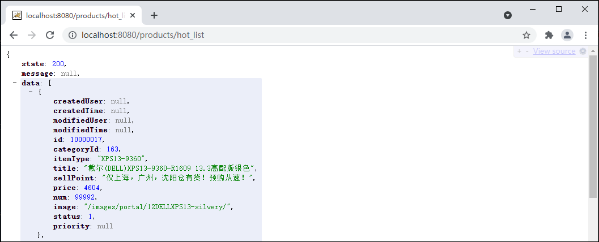
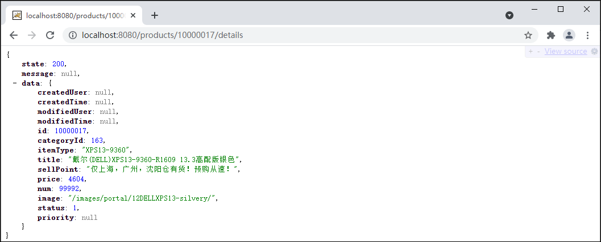

## 商品热销排行

### 1 商品-创建数据表

1.使用use命令先选中store数据库。

```mysql
USE store;
```

2.在store数据库中创建t_product数据表。

```mysql
CREATE TABLE t_product (
  id int(20) NOT NULL COMMENT '商品id',
  category_id int(20) DEFAULT NULL COMMENT '分类id',
  item_type varchar(100) DEFAULT NULL COMMENT '商品系列',
  title varchar(100) DEFAULT NULL COMMENT '商品标题',
  sell_point varchar(150) DEFAULT NULL COMMENT '商品卖点',
  price bigint(20) DEFAULT NULL COMMENT '商品单价',
  num int(10) DEFAULT NULL COMMENT '库存数量',
  image varchar(500) DEFAULT NULL COMMENT '图片路径',
  status int(1) DEFAULT '1' COMMENT '商品状态  1：上架   2：下架   3：删除',
  priority int(10) DEFAULT NULL COMMENT '显示优先级',
  created_time datetime DEFAULT NULL COMMENT '创建时间',
  modified_time datetime DEFAULT NULL COMMENT '最后修改时间',
  created_user varchar(50) DEFAULT NULL COMMENT '创建人',
  modified_user varchar(50) DEFAULT NULL COMMENT '最后修改人',
  PRIMARY KEY (id)
) ENGINE=InnoDB DEFAULT CHARSET=utf8;
```

### 2 商品-创建实体类

创建com.cy.store.entity.Product类，并继承自BaseEntity类。在类中声明与数据表中对应的属性。

```java
package com.cy.store.entity;

/** 商品数据的实体类 */
public class Product extends BaseEntity implements Serializable {
    private Integer id;
    private Integer categoryId;
    private String itemType;
    private String title;
    private String sellPoint;
    private Long price;
    private Integer num;
    private String image;
    private Integer status;
    private Integer priority;

    // Generate: Getter and Setter、Generate hashCode() and equals()、toString()
}
```

### 3 商品-热销排行-持久层

#### 3.1 规划需要执行的SQL语句

查询热销商品列表的SQL语句大致是。

```mysql
SELECT * FROM t_product WHERE status=1 ORDER BY priority DESC LIMIT 0,4
```

#### 3.2 接口与抽象方法

在com.cy.store.mapper包下创建ProductMapper接口并在接口中添加查询热销商品findHotList()的方法。

```mysql
package com.cy.store.mapper;
import com.cy.store.entity.Product;
import java.util.List;

/** 处理商品数据的持久层接口 */
public interface ProductMapper {
    /**
     * 查询热销商品的前四名
     * @return 热销商品前四名的集合
     */
    List<Product> findHotList();
}
```

#### 3.3 配置SQL映射

1.在main\resources\mapper文件夹下创建ProductMapper.xml文件，并在文件中配置findHotList()方法的映射。

```xml
<?xml version="1.0" encoding="UTF-8" ?>
<!DOCTYPE mapper
        PUBLIC "-//mybatis.org//DTD Mapper 3.0//EN"
        "http://mybatis.org/dtd/mybatis-3-mapper.dtd">
<mapper namespace="com.cy.store.mapper.ProductMapper">
    <resultMap id="ProductEntityMap" type="com.cy.store.entity.Product">
        <id column="id" property="id"/>
        <result column="category_id" property="categoryId"/>
        <result column="item_type" property="itemType"/>
        <result column="sell_point" property="sellPoint"/>
        <result column="created_user" property="createdUser"/>
        <result column="created_time" property="createdTime"/>
        <result column="modified_user" property="modifiedUser"/>
        <result column="modified_time" property="modifiedTime"/>
    </resultMap>

    <!-- 查询热销商品的前四名：List<Product> findHostList() -->
    <select id="findHotList" resultMap="ProductEntityMap">
        SELECT
            *
        FROM
            t_product
        WHERE
            status=1
        ORDER BY
            priority DESC
            LIMIT 0,4
    </select>
</mapper>
```

2.在com.cy.store.mapper包下创建ProductMapperTests测试类，并添加测试方法。

```java
package com.cy.store.mapper;
import com.cy.store.entity.Product;
import org.junit.Test;
import org.junit.runner.RunWith;
import org.springframework.beans.factory.annotation.Autowired;
import org.springframework.boot.test.context.SpringBootTest;
import org.springframework.test.context.junit4.SpringRunner;
import java.util.List;

@RunWith(SpringRunner.class)
@SpringBootTest
public class ProductMapperTests {
    @Autowired
    private ProductMapper productMapper;

    @Test
    public void findHotList() {
        List<Product> list = productMapper.findHotList();
        System.out.println("count=" + list.size());
        for (Product item : list) {
            System.out.println(item);
        }
    }
}
```

### 4 商品-热销排行-业务层

#### 4.1 规划异常

> **说明**：无异常。

#### 4.2 接口与抽象方法

创建com.cy.store.service.IProductService接口，并在接口中添加findHotList()方法。

```java
package com.cy.store.service;
import com.cy.store.entity.Product;
import java.util.List;

/** 处理商品数据的业务层接口 */
public interface IProductService {
    /**
     * 查询热销商品的前四名
     * @return 热销商品前四名的集合
     */
    List<Product> findHotList();
}
```

#### 4.3 实现抽象方法

1.创建com.cy.store.service.impl.ProductServiceImpl类，并添加@Service注解；在类中声明持久层对象以及实现接口中的方法。

```java
package com.cy.store.service.impl;
import com.cy.store.entity.Product;
import com.cy.store.mapper.ProductMapper;
import com.cy.store.service.IProductService;
import org.springframework.beans.factory.annotation.Autowired;
import org.springframework.stereotype.Service;
import java.util.List;

/** 处理商品数据的业务层实现类 */
@Service
public class ProductServiceImpl implements IProductService {
    @Autowired
    private ProductMapper productMapper;

    @Override
    public List<Product> findHotList() {
        List<Product> list = productMapper.findHotList();
        for (Product product : list) {
            product.setPriority(null);
            product.setCreatedUser(null);
            product.setCreatedTime(null);
            product.setModifiedUser(null);
            product.setModifiedTime(null);
        }
        return list;
    }
}
```

2.在com.cy.store.service包下创建测试类ProductServiceTests，并编写测试方法。

```java
package com.cy.store.service;
import com.cy.store.entity.Product;
import com.cy.store.service.ex.ServiceException;
import org.junit.Test;
import org.junit.runner.RunWith;
import org.springframework.beans.factory.annotation.Autowired;
import org.springframework.boot.test.context.SpringBootTest;
import org.springframework.test.context.junit4.SpringRunner;
import java.util.List;

@RunWith(SpringRunner.class)
@SpringBootTest
public class ProductServiceTests {
    @Autowired
    private IProductService productService;

    @Test
    public void findHotList() {
        try {
            List<Product> list = productService.findHotList();
            System.out.println("count=" + list.size());
            for (Product item : list) {
                System.out.println(item);
            }
        } catch (ServiceException e) {
            System.out.println(e.getClass().getSimpleName());
            System.out.println(e.getMessage());
        }
    }
}
```

### 5 商品-热销排行-控制器

#### 5.1 处理异常

> **说明**：无异常。

#### 5.2 设计请求

1.设计用户提交的请求，并设计响应的方式。

	请求路径：/products/hot_list
	请求参数：无
	请求类型：GET
	响应结果：JsonResult<List<Product>>
	是否拦截：否，需要将index.html和products/**添加到白名单

2.在LoginInterceptorConfigurer类中将index.html页面和products/**请求添加到白名单。

```java
patterns.add("/web/index.html");
patterns.add("/products/**");
```

#### 5.3 处理请求

1.创建com.cy.controller.ProductController类继承自BaseController类，类添加@RestController和@RequestMapping("products")注解，并在类中添加业务层对象。

```java
package com.cy.store.controller;
import com.cy.store.entity.Product;
import com.cy.store.service.IProductService;
import com.cy.store.util.JsonResult;
import org.springframework.beans.factory.annotation.Autowired;
import org.springframework.web.bind.annotation.RequestMapping;
import org.springframework.web.bind.annotation.RestController;
import java.util.List;

@RestController
@RequestMapping("products")
public class ProductController extends BaseController {
    @Autowired
    private IProductService productService;
}
```

2.在类中添加处理请求的getHotList()方法。

```java
@RequestMapping("hot_list")
public JsonResult<List<Product>> getHotList() {
    List<Product> data = productService.findHotList();
    return new JsonResult<List<Product>>(OK, data);
}
```

3.完成后启动项目，直接访问http://localhost:8080/products/hot_list进行测试。



### 6 商品-热销排行-前端页面

1.在index.html页面给“热销排行”列表的div标签设置id属性值。

```html
<div id="hot-list" class="panel-body panel-item">
	<!-- ... -->
</div>
```

2.在index.html页面中body标签内部的最后，添加展示热销排行商品的代码。

```javascript
<script type="text/javascript">
$(document).ready(function() {
    showHotList();
});

function showHotList() {
    $("#hot-list").empty();
    $.ajax({
        url: "/products/hot_list",
        type: "GET",
        dataType: "JSON",
        success: function(json) {
            let list = json.data;
            console.log("count=" + list.length);
            for (let i = 0; i < list.length; i++) {
                console.log(list[i].title);
                let html = '<div class="col-md-12">'
                  + '<div class="col-md-7 text-row-2"><a href="product.html?id=#{id}">#{title}</a></div>'
                  + '<div class="col-md-2">¥#{price}</div>'
                  + '<div class="col-md-3"></div>'
                + '</div>';

                html = html.replace(/#{id}/g, list[i].id);
                html = html.replace(/#{title}/g, list[i].title);
                html = html.replace(/#{price}/g, list[i].price);
                html = html.replace(/#{image}/g, list[i].image);

                $("#hot-list").append(html);
            }
        }
    });
}
</script>
```

3.完成后启动项目，直接访问http://localhost:8080/web/index.html进行测试。

## 显示商品详情

### 1 商品-显示商品详情-持久层

#### 1.1 规划需要执行的SQL语句

根据商品id显示商品详情的SQL语句大致是。

```mysql
SELECT * FROM t_product WHERE id=?
```

#### 1.2 接口与抽象方法

在ProductMapper接口中添加抽象方法。

```java
/**
 * 根据商品id查询商品详情
 * @param id 商品id
 * @return 匹配的商品详情，如果没有匹配的数据则返回null
 */
Product findById(Integer id);
```

#### 1.3 配置SQL映射

1.在ProductMapper.xml文件中配置findById(Integer id)方法的映射。

```xml
<!-- 根据商品id查询商品详情：Product findById(Integer id) -->
<select id="findById" resultMap="ProductEntityMap">
    SELECT
    	*
    FROM
    	t_product
    WHERE
    	id=#{id}
</select>
```

2.在ProductMapperTests测试类中添加测试方法。

```java
@Test
public void findById() {
    Integer id = 10000017;
    Product result = productMapper.findById(id);
    System.out.println(result);
}
```

### 2 商品-显示商品详情-业务层

#### 2.1 规划异常

如果商品数据不存在，应该抛出ProductNotFoundException，需要创建com.cy.store.service.ex.ProductNotFoundException异常。

```java
package com.cy.store.service.ex;

/** 商品数据不存在的异常 */
public class ProductNotFoundException extends ServiceException {
    // Override Methods...
}
```

#### 2.2 接口与抽象方法

在业务层IProductService接口中添加findById(Integer id)抽象方法。

```java
/**
 * 根据商品id查询商品详情
 * @param id 商品id
 * @return 匹配的商品详情，如果没有匹配的数据则返回null
 */
Product findById(Integer id);
```

#### 2.3 实现抽象方法

1.在ProductServiceImpl类中，实现接口中的findById(Integer id)抽象方法。

```java
@Override
public Product findById(Integer id) {
    // 根据参数id调用私有方法执行查询，获取商品数据
    Product product = productMapper.findById(id);
    // 判断查询结果是否为null
    if (product == null) {
        // 是：抛出ProductNotFoundException
        throw new ProductNotFoundException("尝试访问的商品数据不存在");
    }
    // 将查询结果中的部分属性设置为null
    product.setPriority(null);
    product.setCreatedUser(null);
    product.setCreatedTime(null);
    product.setModifiedUser(null);
    product.setModifiedTime(null);
    // 返回查询结果
    return product;
}
```

2.在ProductServiceTests测试类中编写测试方法。

```java
@Test
public void findById() {
    try {
        Integer id = 100000179;
        Product result = productService.findById(id);
        System.out.println(result);
    } catch (ServiceException e) {
        System.out.println(e.getClass().getSimpleName());
        System.out.println(e.getMessage());
    }
}
```

### 3 商品-显示商品详情-控制器

#### 3.1 处理异常

在BaseController类中的handleException()方法中添加处理ProductNotFoundException的异常。

```java
// ...
else if (e instanceof ProductNotFoundException) {
	result.setState(4006);
}
// ...
```

#### 3.2  设计请求

设计用户提交的请求，并设计响应的方式。

	请求路径：/products/{id}/details
	请求参数：@PathVariable("id") Integer id
	请求类型：GET
	响应结果：JsonResult<Product>

#### 3.3 处理请求

1.在ProductController类中添加处理请求的getById()方法。

```java
@GetMapping("{id}/details")
public JsonResult<Product> getById(@PathVariable("id") Integer id) {
    // 调用业务对象执行获取数据
    Product data = productService.findById(id);
    // 返回成功和数据
    return new JsonResult<Product>(OK, data);
}
```

2.完成后启动项目，直接访问http://localhost:8080/products/10000017/details进行测试。



### 4 商品-显示商品详情-前端页面

1.检查在product.html页面body标签内部的最后是否引入jquery-getUrlParam.js文件，如果引入无需重复引入。

```java
<script type="text/javascript" src="../js/jquery-getUrlParam.js"></script>
```

2.在product.html页面中body标签内部的最后添加获取当前商品详情的代码。

```javascript
<script type="text/javascript">
let id = $.getUrlParam("id");
console.log("id=" + id);
$(document).ready(function() {
    $.ajax({
        url: "/products/" + id + "/details",
        type: "GET",
        dataType: "JSON",
        success: function(json) {
            if (json.state == 200) {
                console.log("title=" + json.data.title);
                $("#product-title").html(json.data.title);
                $("#product-sell-point").html(json.data.sellPoint);
                $("#product-price").html(json.data.price);

                for (let i = 1; i <= 5; i++) {
                    $("#product-image-" + i + "-big").attr("src", ".." + json.data.image + i + "_big.png");
                    $("#product-image-" + i).attr("src", ".." + json.data.image + i + ".jpg");
                }
            } else if (json.state == 4006) { // 商品数据不存在的异常
                location.href = "index.html";
            } else {
                alert("获取商品信息失败！" + json.message);
            }
        }
    });
});
</script>
```

3.完成后启动项目，先访问http://localhost:8080/web/index.html页面，然后点击“热销排行”中的某个子项，将跳转到product.html商品详情页，观察页面是否加载的是当前的商品信息。

