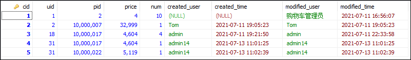
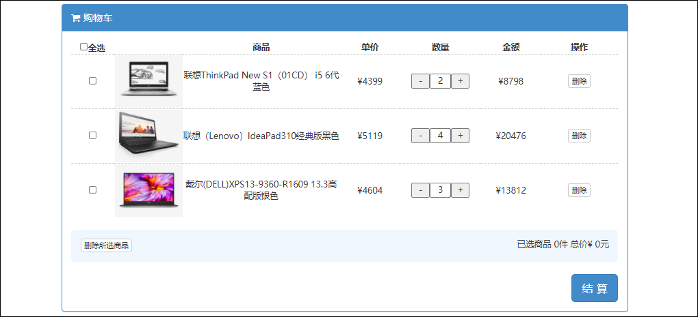

## 加入购物车

### 1 购物车-创建数据表

1.使用use命令先选中store数据库。

```mysql
USE store;
```

2.在store数据库中创建t_cart用户数据表。

```mysql
CREATE TABLE t_cart (
	cid INT AUTO_INCREMENT COMMENT '购物车数据id',
	uid INT NOT NULL COMMENT '用户id',
	pid INT NOT NULL COMMENT '商品id',
	price BIGINT COMMENT '加入时商品单价',
	num INT COMMENT '商品数量',
	created_user VARCHAR(20) COMMENT '创建人',
	created_time DATETIME COMMENT '创建时间',
	modified_user VARCHAR(20) COMMENT '修改人',
	modified_time DATETIME COMMENT '修改时间',
	PRIMARY KEY (cid)
) ENGINE=InnoDB DEFAULT CHARSET=utf8;
```

### 2 购物车-创建实体类

在com.cy.store.entity包下创建购物车的Cart实体类。

```java
package com.cy.store.entity;
import java.io.Serializable;

/** 购物车数据的实体类 */
public class Cart extends BaseEntity implements Serializable {
    private Integer cid;
    private Integer uid;
    private Integer pid;
    private Long price;
    private Integer num;

    // Generate: Getter and Setter、Generate hashCode() and equals()、toString()
}
```

### 3 购物车-添加购物车-持久层

#### 3.1 规划需要执行的SQL语句

向购物车表中插入商品数据的SQL语句大致是：

```mysql
insert into t_cart (除了cid以外的字段列表) values (匹配的值列表);
```

如果用户曾经将某个商品加入到购物车过，则点击“加入购物车”按钮只会对购物车中相同商品数量做递增操作。

```mysql
update t_cart set num=? where cid=?
```

关于判断“到底应该插入数据，还是修改数量”，可以通过“查询某用户是否已经添加某商品到购物车”来完成。如果查询到某结果，就表示该用户已经将该商品加入到购物车了，如果查询结果为null，则表示该用户没有添加过该商品。

```mysql
select * from t_cart where uid=? and pid=?
```

#### 3.2 接口与抽象方法

在com.cy.store.mapper包下创建CartMapper接口，并添加抽象相关的方法。

```java
package com.cy.store.mapper;
import com.cy.store.entity.Cart;
import org.apache.ibatis.annotations.Param;
import java.util.Date;

/** 处理购物车数据的持久层接口 */
public interface CartMapper {
    /**
     * 插入购物车数据
     * @param cart 购物车数据
     * @return 受影响的行数
     */
    Integer insert(Cart cart);

    /**
     * 修改购物车数据中商品的数量
     * @param cid 购物车数据的id
     * @param num 新的数量
     * @param modifiedUser 修改执行人
     * @param modifiedTime 修改时间
     * @return 受影响的行数
     */
    Integer updateNumByCid(
            @Param("cid") Integer cid,
            @Param("num") Integer num,
            @Param("modifiedUser") String modifiedUser,
            @Param("modifiedTime") Date modifiedTime);

    /**
     * 根据用户id和商品id查询购物车中的数据
     * @param uid 用户id
     * @param pid 商品id
     * @return 匹配的购物车数据，如果该用户的购物车中并没有该商品，则返回null
     */
    Cart findByUidAndPid(
            @Param("uid") Integer uid,
            @Param("pid") Integer pid);
}
```

#### 3.3 配置SQL映射

1.在resources.mapper文件夹下创建CartMapper.xml文件，并在文件中配置以上三个方法的映射。

```xml
<?xml version="1.0" encoding="UTF-8" ?>
<!DOCTYPE mapper
        PUBLIC "-//mybatis.org//DTD Mapper 3.0//EN"
        "http://mybatis.org/dtd/mybatis-3-mapper.dtd">
<mapper namespace="com.cy.store.mapper.CartMapper">
    <resultMap id="CartEntityMap" type="com.cy.store.entity.Cart">
        <id column="cid" property="cid"/>
        <result column="created_user" property="createdUser"/>
        <result column="created_time" property="createdTime"/>
        <result column="modified_user" property="modifiedUser"/>
        <result column="modified_time" property="modifiedTime"/>
    </resultMap>

    <!-- 插入购物车数据：Integer insert(Cart cart) -->
    <insert id="insert" useGeneratedKeys="true" keyProperty="cid">
        INSERT INTO t_cart (uid, pid, price, num, created_user, created_time, modified_user, modified_time)
        VALUES (#{uid}, #{pid}, #{price}, #{num}, #{createdUser}, #{createdTime}, #{modifiedUser}, #{modifiedTime})
    </insert>

    <!-- 修改购物车数据中商品的数量：
         Integer updateNumByCid(
            @Param("cid") Integer cid,
            @Param("num") Integer num,
            @Param("modifiedUser") String modifiedUser,
            @Param("modifiedTime") Date modifiedTime) -->
    <update id="updateNumByCid">
        UPDATE
            t_cart
        SET
            num=#{num},
            modified_user=#{modifiedUser},
            modified_time=#{modifiedTime}
        WHERE
            cid=#{cid}
    </update>

    <!-- 根据用户id和商品id查询购物车中的数据：
         Cart findByUidAndPid(
            @Param("uid") Integer uid,
            @Param("pid") Integer pid) -->
    <select id="findByUidAndPid" resultMap="CartEntityMap">
        SELECT
            *
        FROM
            t_cart
        WHERE
            uid=#{uid} AND pid=#{pid}
    </select>
</mapper>
```

2.在com.cy.store.mapper包下创建CartMapperTests测试类，并添加测试方法。

```java
package com.cy.store.mapper;
import com.cy.store.entity.Cart;
import com.cy.store.entity.Product;
import org.junit.Test;
import org.junit.runner.RunWith;
import org.springframework.beans.factory.annotation.Autowired;
import org.springframework.boot.test.context.SpringBootTest;
import org.springframework.test.context.junit4.SpringRunner;
import java.util.Date;
import java.util.List;

@RunWith(SpringRunner.class)
@SpringBootTest
public class CartMapperTests {
    @Autowired
    private CartMapper cartMapper;

    @Test
    public void insert() {
        Cart cart = new Cart();
        cart.setUid(1);
        cart.setPid(2);
        cart.setNum(3);
        cart.setPrice(4L);
        Integer rows = cartMapper.insert(cart);
        System.out.println("rows=" + rows);
    }

    @Test
    public void updateNumByCid() {
        Integer cid = 1;
        Integer num = 10;
        String modifiedUser = "购物车管理员";
        Date modifiedTime = new Date();
        Integer rows = cartMapper.updateNumByCid(cid, num, modifiedUser, modifiedTime);
        System.out.println("rows=" + rows);
    }

    @Test
    public void findByUidAndPid() {
        Integer uid = 1;
        Integer pid = 2;
        Cart result = cartMapper.findByUidAndPid(uid, pid);
        System.out.println(result);
    }
}
```

### 4 购物车-添加购物车-业务层

#### 4.1 规划异常

在插入数据时，可能抛出InsertException异常；在修改数据时，可能抛出UpdateException异常。如果不限制购物车中的记录的数量，则没有其它异常。

#### 4.2 接口与抽象方法

在com.cy.store.service包下创建ICartService接口，并添加抽象方法。

```java
package com.cy.store.service;

/** 处理商品数据的业务层接口 */
public interface ICartService {
    /**
     * 将商品添加到购物车
     * @param uid 当前登录用户的id
     * @param pid 商品的id
     * @param amount 增加的数量
     * @param username 当前登录的用户名
     */
    void addToCart(Integer uid, Integer pid, Integer amount, String username);
}
```

#### 4.3 实现抽象方法

1.创建com.cy.store.service.impl.CartServiceImpl类，并实现ICartService接口，并在类的定义前添加@Service注解。在类中声明CartMapper持久层对象和IProductService处理商品数据的业务对象，并都添加@Autowired注修饰。

```java
package com.cy.store.service.impl;
import com.cy.store.entity.Cart;
import com.cy.store.entity.Product;
import com.cy.store.mapper.CartMapper;
import com.cy.store.service.ICartService;
import com.cy.store.service.IProductService;
import com.cy.store.service.ex.InsertException;
import org.springframework.beans.factory.annotation.Autowired;
import org.springframework.stereotype.Service;
import java.util.Date;

/** 处理购物车数据的业务层实现类 */
@Service
public class CartServiceImpl implements ICartService {
    @Autowired
    private CartMapper cartMapper;
    @Autowired
    private IProductService productService;
}
```

2.在CartServiceImpl类中实现业务层ICartService接口中定义的抽象方法。

```java
@Override
public void addToCart(Integer uid, Integer pid, Integer amount, String username) {
    // 根据参数pid和uid查询购物车中的数据
    // 判断查询结果是否为null
    // 是：表示该用户并未将该商品添加到购物车
    // -- 创建Cart对象
    // -- 封装数据：uid,pid,amount
    // -- 调用productService.findById(pid)查询商品数据，得到商品价格
    // -- 封装数据：price
    // -- 封装数据：4个日志
    // -- 调用insert(cart)执行将数据插入到数据表中
    // 否：表示该用户的购物车中已有该商品
    // -- 从查询结果中获取购物车数据的id
    // -- 从查询结果中取出原数量，与参数amount相加，得到新的数量
    // -- 执行更新数量
}
```

3.addToCart(Integer uid, Integer pid, Integer amount, String username)方法的代码具体实现。

```java
@Override
public void addToCart(Integer uid, Integer pid, Integer amount, String username) {
    // 根据参数pid和uid查询购物车中的数据
    Cart result = cartMapper.findByUidAndPid(uid, pid);
    Integer cid = result.getCid();
    Date now = new Date();
    // 判断查询结果是否为null
    if (result == null) {
        // 是：表示该用户并未将该商品添加到购物车
        // 创建Cart对象
        Cart cart = new Cart();
        // 封装数据：uid,pid,amount
        cart.setUid(uid);
        cart.setPid(pid);
        cart.setNum(amount);
        // 调用productService.findById(pid)查询商品数据，得到商品价格
        Product product = productService.findById(pid);
        // 封装数据：price
        cart.setPrice(product.getPrice());
        // 封装数据：4个日志
        cart.setCreatedUser(username);
        cart.setCreatedTime(now);
        cart.setModifiedUser(username);
        cart.setModifiedTime(now);
        // 调用insert(cart)执行将数据插入到数据表中
        Integer rows = cartMapper.insert(cart);
        if (rows != 1) {
            throw new InsertException("插入商品数据时出现未知错误，请联系系统管理员");
        }
    } else {
        // 否：表示该用户的购物车中已有该商品
        // 从查询结果中获取购物车数据的id
        Integer cid = result.getCid();
        // 从查询结果中取出原数量，与参数amount相加，得到新的数量
        Integer num = result.getNum() + amount;
        // 执行更新数量
        Integer rows = cartMapper.updateNumByCid(cid, num, username, now);
        if (rows != 1) {
            throw new InsertException("修改商品数量时出现未知错误，请联系系统管理员");
        }
    }
}
```

4.在com.cy.store.service包下创建测试类CartServiceTests类，并编写测试方法。

```java
package com.cy.store.service;
import com.cy.store.entity.Product;
import com.cy.store.service.ex.ServiceException;
import org.junit.Test;
import org.junit.runner.RunWith;
import org.springframework.beans.factory.annotation.Autowired;
import org.springframework.boot.test.context.SpringBootTest;
import org.springframework.test.context.junit4.SpringRunner;
import java.util.List;

@RunWith(SpringRunner.class)
@SpringBootTest
public class CartServiceTests {
    @Autowired
    private ICartService cartService;

    @Test
    public void addToCart() {
        try {
            Integer uid = 2;
            Integer pid = 10000007;
            Integer amount = 1;
            String username = "Tom";
            cartService.addToCart(uid, pid, amount, username);
            System.out.println("OK.");
        } catch (ServiceException e) {
            System.out.println(e.getClass().getSimpleName());
            System.out.println(e.getMessage());
        }
    }
}
```

### 5 购物车-添加购物车-控制器

#### 5.1 处理异常

> **说明**：无异常。

#### 5.2 设计请求

设计用户提交的请求，并设计响应的方式。

	请求路径：/carts/add_to_cart
	请求参数：Integer pid, Integer amount, HttpSession session
	请求类型：POST
	响应结果：JsonResult<Void>

#### 5.3 处理请求

1.在com.cy.store.controller包下创建CartController类并继承自BaseController类，添加@RequestMapping("carts")和@RestController注解；在类中声明ICartService业务对象，并使用@Autowired注解修饰。

```java
package com.cy.store.controller;
import com.cy.store.service.ICartService;
import org.springframework.beans.factory.annotation.Autowired;
import org.springframework.web.bind.annotation.RequestMapping;
import org.springframework.web.bind.annotation.RestController;

@RestController
@RequestMapping("carts")
public class CartController extends BaseController {
    @Autowired
    private ICartService cartService;

}
```

2.在CartController类中添加处理请求的addToCart()方法。

```java
@RequestMapping("add_to_cart")
public JsonResult<Void> addToCart(Integer pid, Integer amount, HttpSession session) {
    // 从Session中获取uid和username
    Integer uid = getUidFromSession(session);
    String username = getUsernameFromSession(session);
    // 调用业务对象执行添加到购物车
    cartService.addToCart(uid, pid, amount, username);
    // 返回成功
    return new JsonResult<Void>(OK);
}
```

3.完成后启动项目，先登录再访问http://localhost:8080/carts/add_to_cart?pid=10000017&amount=3进行测试。

### 6 购物车-添加购物车-前端页面

1.在product.html页面中的body标签内的script标签里为“加入购物车”按钮添加点击事件。

```javascript
$("#btn-add-to-cart").click(function() {
    $.ajax({
        url: "/carts/add_to_cart",
        type: "POST",
        data: {
            "pid": id,
            "amount": $("#num").val()
        },
        dataType: "JSON",
        success: function(json) {
            if (json.state == 200) {
                alert("增加成功！");
            } else {
                alert("增加失败！" + json.message);
            }
        },
        error: function(xhr) {
            alert("您的登录信息已经过期，请重新登录！HTTP响应码：" + xhr.status);
            location.href = "login.html";
        }
    });
});
```

> $.ajax函数中参数data提交请参数的方式：
>
> ```
> // 1.适用于参数较多，且都在同一个表单中
> data: $("#form表单id属性值").serialize()
> // 2.仅适用于上传文件
> data: new FormData($("##form表单id属性值")[0])
> // 3.参数拼接形式提交
> data: "pid=10000005&amount=3"
> // 4.使用JSON格式提交参数
> data: {
>    	"pid": 10000005,
>    	"amount": 3
> }
> ```

2.完成后启动项目，先登录再访问http://localhost:8080/web/index.html页面进行测试。



## 显示购物车列表

### 1 购物车-显示列表-持久层

#### 1.1 规划需要执行的SQL语句

显示某用户的购物车列表数据的SQL语句大致是。

```mysql
SELECT
	cid,
	uid,
	pid,
	t_cart.price,
	t_cart.num,
	t_product.title,
	t_product.price AS realPrice,
	t_product.image
FROM
	t_cart
	LEFT JOIN t_product ON t_cart.pid = t_product.id 
WHERE
	uid = #{uid}
ORDER BY
	t_cart.created_time DESC
```

#### 1.2 接口与抽象方法

1.由于涉及多表关联查询，必然没有哪个实体类可以封装此次的查询结果，因此需要创建VO类。创建com.cy.store.vo.CartVO类。

```java
package com.cy.store.vo;
import java.io.Serializable;

/** 购物车数据的Value Object类 */
public class CartVO implements Serializable {
    private Integer cid;
    private Integer uid;
    private Integer pid;
    private Long price;
    private Integer num;
    private String title;
    private Long realPrice;
    private String image;
    
    // Generate: Getter and Setter、Generate hashCode() and equals()、toString()
}
```

2.在CartMapper接口中添加抽象方法。

```java
/**
 * 查询某用户的购物车数据
 * @param uid 用户id
 * @return 该用户的购物车数据的列表
 */
List<CartVO> findVOByUid(Integer uid);
```

#### 1.3 配置SQL映射

1.在CartMapper.xml文件中添加findVOByUid()方法的映射。

```xml
<!-- 查询某用户的购物车数据：List<CartVO> findVOByUid(Integer uid) -->
<select id="findVOByUid" resultType="com.cy.store.vo.CartVO">
    SELECT
        cid,
        uid,
        pid,
        t_cart.price,
        t_cart.num,
        t_product.title,
        t_product.price AS realPrice,
        t_product.image
    FROM
        t_cart
        LEFT JOIN t_product ON t_cart.pid = t_product.id 
    WHERE
        uid = #{uid}
    ORDER BY
        t_cart.created_time DESC
</select>
```

2.在CartMapperTests测试类中添加findVOByUid()方法的测试。

```java
@Test
public void findVOByUid() {
    List<CartVO> list = cartMapper.findVOByUid(31);
    System.out.println(list);
}
```

### 2 购物车-显示列表-业务层

#### 2.1 规划异常

> **说明**：无异常。

#### 2.2 接口与抽象方法

在ICartService接口中添加findVOByUid()抽象方法。

```java
/**
 * 查询某用户的购物车数据
 * @param uid 用户id
 * @return 该用户的购物车数据的列表
 */
List<CartVO> getVOByUid(Integer uid);
```

#### 2.3 实现抽象方法

1.在CartServiceImpl类中重写业务接口中的抽象方法。

```java
@Override
public List<CartVO> getVOByUid(Integer uid) {
    return cartMapper.findVOByUid(uid);
}
```

2.在CartServiceTests测试类中添加getVOByUid()测试方法。

```java
@Test
public void getVOByUid() {
    List<CartVO> list = cartService.getVOByUid(31);
    System.out.println("count=" + list.size());
    for (CartVO item : list) {
        System.out.println(item);
    }
}
```

### 3 购物车-显示列表-控制器

#### 3.1 处理异常

> **说明**：无异常。

#### 3.2 设计请求

设计用户提交的请求，并设计响应的方式。

	请求路径：/carts/
	请求参数：HttpSession session
	请求类型：GET
	响应结果：JsonResult<List<CartVO>>

#### 3.3 处理请求

1.在CartController类中编写处理请求的代码。

```java
@GetMapping({"", "/"})
public JsonResult<List<CartVO>> getVOByUid(HttpSession session) {
    // 从Session中获取uid
    Integer uid = getUidFromSession(session);
    // 调用业务对象执行查询数据
    List<CartVO> data = cartService.getVOByUid(uid);
    // 返回成功与数据
    return new JsonResult<List<CartVO>>(OK, data);
}
```

2.完成后启动项目，先登录再访问http://localhost:8080/carts请求进行测试。

### 4 购物车-显示列表-前端页面

1.将cart.html页面的head头标签内引入的cart.js文件注释掉。

```javascript
<!-- <script src="../js/cart.js" type="text/javascript" charset="utf-8"></script> -->
```

2.给form标签添加action="orderConfirm.html"属性、tbody标签添加id="cart-list"属性、结算按钮的类型改为type="button"值。如果以上属性值已经添加过无需重复添加。

3.在cart.html页面body标签内的script标签中编写展示购物车列表的代码。

```js
$(document).ready(function() {
    showCartList();
});

function showCartList() {
    $("#cart-list").empty();
    $.ajax({
        url: "/carts",
        type: "GET",
        dataType: "JSON",
        success: function(json) {
            let list = json.data;
            for (let i = 0; i < list.length; i++) {
                let tr = '<tr>'
                + '<td>'
                + 	'<input name="cids" value="#{cid}" type="checkbox" class="ckitem" />'
                + '</td>'
                + '<td></td>'
                + '<td>#{title}#{msg}</td>'
                + '<td>¥<span id="price-#{cid}">#{realPrice}</span></td>'
                + '<td>'
                + 	'<input type="button" value="-" class="num-btn" onclick="reduceNum(1)" />'
                + 	'<input id="num-#{cid}" type="text" size="2" readonly="readonly" class="num-text" value="#{num}">'
                + 	'<input class="num-btn" type="button" value="+" onclick="addNum(#{cid})" />'
                + '</td>'
                + '<td>¥<span id="total-price-#{cid}">#{totalPrice}</span></td>'
                + '<td>'
                + 	'<input type="button" onclick="delCartItem(this)" class="cart-del btn btn-default btn-xs" value="删除" />'
                + '</td>'
                + '</tr>';
                tr = tr.replace(/#{cid}/g, list[i].cid);
                tr = tr.replace(/#{title}/g, list[i].title);
                tr = tr.replace(/#{image}/g, list[i].image);
                tr = tr.replace(/#{realPrice}/g, list[i].realPrice);
                tr = tr.replace(/#{num}/g, list[i].num);
                tr = tr.replace(/#{totalPrice}/g, list[i].realPrice * list[i].num);

                if (list[i].realPrice < list[i].price) {
                    tr = tr.replace(/#{msg}/g, "比加入时降价" + (list[i].price - list[i].realPrice) + "元");
                } else {
                    tr = tr.replace(/#{msg}/g, "");
                }
                $("#cart-list").append(tr);
            }
        }
    });
}
```

4.完成后启动项目，先登录再访问http://localhost:8080/web/cart.html页面进行测试。



## 增加商品数量

### 1 购物车-增加商品数量-持久层

#### 1.1 规划需要执行的SQL语句

1.首先进行查询需要操作的购物车数据信息。

```mysql
SELECT * FROM t_cart WHERE cid=?
```

2.然后计算出新的商品数量值，如果满足更新条件则执行更新操作。此SQL语句无需重复开发。

```mysql
UPDATE t_cart SET num=?, modified_user=?, modified_time=? WHERE cid=?
```

#### 1.2 接口与抽象方法

在CartMapper接口中添加抽象方法。

```java
/**
 * 根据购物车数据id查询购物车数据详情
 * @param cid 购物车数据id
 * @return 匹配的购物车数据详情，如果没有匹配的数据则返回null
 */
Cart findByCid(Integer cid);
```

#### 1.3 配置SQL映射

1.在CartMapper文件中添加findByCid(Integer cid)方法的映射。

```xml
<!-- 根据购物车数据id查询购物车数据详情：Cart findByCid(Integer cid) -->
<select id="findByCid" resultMap="CartEntityMap">
    SELECT
   		*
    FROM
    	t_cart
    WHERE
    	cid = #{cid}
</select>
```

2.在CartMapperTests测试类中添加findByCid()测试方法。

```java
@Test
public void findByCid() {
	Integer cid = 6;
	Cart result = cartMapper.findByCid(cid);
	System.out.println(result);
}
```

### 2 购物车-增加商品数量-业务层

#### 2.1 规划异常

1.如果尝试访问的购物车数据不存在，则抛出CartNotFoundException异常。创建com.cy.store.service.ex.CartNotFoundException类。

```java
/** 购物车数据不存在的异常 */
public class CartNotFoundException extends ServiceException {
	// Override Methods...
}
```

2.如果尝试访问的数据并不是当前登录用户的数据，则抛出AccessDeniedException异常。此异常类无需再次创建。

3.最终执行更新操作时，可能会抛出UpdateException异常。此异常类无需再次创建。

#### 2.2 接口与抽象方法

在业务层ICartService接口中添加addNum()抽象方法。

```java
/**
 * 将购物车中某商品的数量加1
 * @param cid 购物车数量的id
 * @param uid 当前登录的用户的id
 * @param username 当前登录的用户名
 * @return 增加成功后新的数量
 */
Integer addNum(Integer cid, Integer uid, String username);
```

#### 2.3 实现抽象方法

1.在CartServiceImpl类中，实现接口中的抽象方法并规划业务逻辑。

```java
public Integer addNum(Integer cid, Integer uid, String username) {
	// 调用findByCid(cid)根据参数cid查询购物车数据
	// 判断查询结果是否为null
	// 是：抛出CartNotFoundException

	// 判断查询结果中的uid与参数uid是否不一致
	// 是：抛出AccessDeniedException

	// 可选：检查商品的数量是否大于多少(适用于增加数量)或小于多少(适用于减少数量)
	// 根据查询结果中的原数量增加1得到新的数量num

	// 创建当前时间对象，作为modifiedTime
	// 调用updateNumByCid(cid, num, modifiedUser, modifiedTime)执行修改数量
}
```

2.实现addNum()方法中的业务逻辑代码。

```java
@Override
public Integer addNum(Integer cid, Integer uid, String username) {
    // 调用findByCid(cid)根据参数cid查询购物车数据
    Cart result = cartMapper.findByCid(cid);
    // 判断查询结果是否为null
    if (result == null) {
        // 是：抛出CartNotFoundException
        throw new CartNotFoundException("尝试访问的购物车数据不存在");
    }

    // 判断查询结果中的uid与参数uid是否不一致
    if (!result.getUid().equals(uid)) {
        // 是：抛出AccessDeniedException
        throw new AccessDeniedException("非法访问");
    }

    // 可选：检查商品的数量是否大于多少(适用于增加数量)或小于多少(适用于减少数量)
    // 根据查询结果中的原数量增加1得到新的数量num
    Integer num = result.getNum() + 1;

    // 创建当前时间对象，作为modifiedTime
    Date now = new Date();
    // 调用updateNumByCid(cid, num, modifiedUser, modifiedTime)执行修改数量
    Integer rows = cartMapper.updateNumByCid(cid, num, username, now);
    if (rows != 1) {
        throw new InsertException("修改商品数量时出现未知错误，请联系系统管理员");
    }

    // 返回新的数量
    return num;
}
```

3.在CartServiceTests测试类中添加addNum()测试方法。

```java
@Test
public void addNum() {
    try {
        Integer cid = 6;
        Integer uid = 31;
        String username = "管理员";
        Integer num = cartService.addNum(cid, uid, username);
        System.out.println("OK. New num=" + num);
    } catch (ServiceException e) {
        System.out.println(e.getClass().getSimpleName());
        System.out.println(e.getMessage());
    }
}
```

### 3 购物车-增加商品数量-控制器

#### 3.1 处理异常

在BaseController类中添加CartNotFoundException异常类的统一管理。

```java
// ...
else if (e instanceof CartNotFoundException) {
    result.setState(4007);
}
// ...
```

#### 3.2 设计请求

设计用户提交的请求，并设计响应的方式。

	请求路径：/carts/{cid}/num/add
	请求参数：@PathVariable("cid") Integer cid, HttpSession session
	请求类型：POST
	响应结果：JsonResult<Integer>

#### 3.3 处理请求

1.在CartController类中添加处理请求的addNum()方法。

```java
@RequestMapping("{cid}/num/add")
public JsonResult<Integer> addNum(@PathVariable("cid") Integer cid, HttpSession session) {
    // 从Session中获取uid和username
    Integer uid = getUidFromSession(session);
    String username = getUsernameFromSession(session);
    // 调用业务对象执行增加数量
    Integer data = cartService.addNum(cid, uid, username);
    // 返回成功
    return new JsonResult<Integer>(OK, data);
}
```

2.完成后启动项目，先登录再访问http://localhost:8080/carts/6/num/add页面进行测试。


### 4 购物车-增加商品数量-前端页面

1.首先确定在showCartList()函数中动态拼接的增加购物车按钮是绑定了addNum()事件，如果已经添加无需重复添加。

```javascript
<input class="num-btn" type="button" value="+" onclick="addNum(#{cid})" />
```

2.在script标签中定义addNum()函数并编写增加购物车数量的逻辑代码。

```javascript
function addNum(cid) {
    $.ajax({
        url: "/carts/" + cid + "/num/add",
        type: "POST",
        dataType: "JSON",
        success: function(json) {
            if (json.state == 200) {
                // showCartList();
                $("#num-" + cid).val(json.data);
                let price = $("#price-" + cid).html();
                let totalPrice = price * json.data;
                $("#total-price-" + cid).html(totalPrice);
            } else {
                alert("增加商品数量失败！" + json.message);
            }
        },
        error: function(xhr) {
            alert("您的登录信息已经过期，请重新登录！HTTP响应码：" + xhr.status);
            location.href = "login.html";
        }
    });
}
```

3.完成后启动项目，先登录再访问http://localhost:8080/web/cart.html页面点击“+”按钮进行测试。

## 显示勾选的购物车数据

### 1 显示确认订单页-显示勾选的购物车数据-持久层

#### 1.1 规划需要执行的SQL语句

在“确认订单页”显示的商品信息，应来自前序页面（购物车列表）中勾选的数据，所以显示的信息其实是购物车中的数据。到底需要显示哪些取决于用户的勾选操作，当用户勾选了若干条购物车数据后，这些数据的id应传递到当前“确认订单页”中，该页面根据这些id获取需要显示的数据列表。

所以在持久层需要完成“根据若干个不确定的id值，查询购物车数据表，显示购物车中的数据信息”。则需要执行的SQL语句大致是。

```mysql
SELECT
	cid,
	uid,
	pid,
	t_cart.price,
	t_cart.num,
	t_product.title,
	t_product.price AS realPrice,
	t_product.image
FROM
	t_cart
	LEFT JOIN t_product ON t_cart.pid = t_product.id 
WHERE
	cid IN (?, ?, ?)
ORDER BY
	t_cart.created_time DESC	
```

#### 1.2 接口与抽象方法

在CartMapper接口中添加findVOByCids(Integer[] cids)方法。

```java
/**
 * 根据若干个购物车数据id查询详情的列表
 * @param cids 若干个购物车数据id
 * @return 匹配的购物车数据详情的列表
 */
List<CartVO> findVOByCids(Integer[] cids);
```

#### 1.3 配置SQL映射

1.在CartMapper.xml文件中添加SQL语句的映射配置。

```xml
<!-- 根据若干个购物车数据id查询详情的列表：List<CartVO> findVOByCids(Integer[] cids) -->
<select id="findVOByCids" resultType="com.cy.store.vo.CartVO">
    SELECT
        cid,
        uid,
        pid,
        t_cart.price,
        t_cart.num,
        t_product.title,
        t_product.price AS realPrice,
        t_product.image
    FROM
        t_cart
            LEFT JOIN t_product ON t_cart.pid = t_product.id
    WHERE
        cid IN (
            <foreach collection="array" item="cid" separator=",">
                #{cid}
            </foreach>
        )
    ORDER BY
        t_cart.created_time DESC
</select>
```

2.在CartMapperTests测试类中添加findVOByCids()测试方法。

```java
@Test
public void findVOByCids() {
    Integer[] cids = {1, 2, 6, 7, 8, 9, 10};
    List<CartVO> list = cartMapper.findVOByCids(cids);
    System.out.println("count=" + list.size());
    for (CartVO item : list) {
        System.out.println(item);
    }
}
```

### 2 显示确认订单页-显示勾选的购物车数据-业务层

#### 2.1 规划异常

> **说明**：无异常。

#### 2.2 接口与抽象方法

在ICartService接口中添加getVOByCids()抽象方法。

```java
/**
 * 根据若干个购物车数据id查询详情的列表
 * @param uid 当前登录的用户的id
 * @param cids 若干个购物车数据id
 * @return 匹配的购物车数据详情的列表
 */
List<CartVO> getVOByCids(Integer uid, Integer[] cids);
```

#### 2.3 实现抽象方法

1.在CartServiceImpl类中重写业务接口中的抽象方法。

```java
@Override
public List<CartVO> getVOByCids(Integer uid, Integer[] cids) {
    List<CartVO> list = cartMapper.findVOByCids(cids);
    /**
    for (CartVO cart : list) {
		if (!cart.getUid().equals(uid)) {
			list.remove(cart);
		}
	}
	*/
    Iterator<CartVO> it = list.iterator();
    while (it.hasNext()) {
        CartVO cart = it.next();
        if (!cart.getUid().equals(uid)) {
            it.remove();
        }
    }
    return list;
}
```

2.在CartServiceTests测试类中添加getVOByCids()测试方法。

```java
@Test
public void getVOByCids() {
    Integer[] cids = {1, 2, 6, 7, 8, 9, 10};
    Integer uid = 31;
    List<CartVO> list = cartService.getVOByCids(uid, cids);
    System.out.println("count=" + list.size());
    for (CartVO item : list) {
        System.out.println(item);
    }
}
```

### 3 显示确认订单页-显示勾选的购物车数据-控制器

#### 3.1 处理异常

**说明**：无异常。

#### 3.2 设计请求

设计用户提交的请求，并设计响应的方式。

	请求路径：/carts/list
	请求参数：Integer[] cids, HttpSession session
	请求类型：GET
	响应结果：JsonResult<List<CartVO>>

#### 3.3 处理请求

1.在CartController类中添加处理请求的getVOByCids()方法。

```java
@GetMapping("list")
public JsonResult<List<CartVO>> getVOByCids(Integer[] cids, HttpSession session) {
    // 从Session中获取uid
    Integer uid = getUidFromSession(session);
    // 调用业务对象执行查询数据
    List<CartVO> data = cartService.getVOByCids(uid, cids);
    // 返回成功与数据
    return new JsonResult<>(OK, data);
}
```

2.完成后启动项目，先登录再访问http://localhost:8080/carts/list?cids=7&cids=8&cids=13&cids=14&cids=17地址进行测试。

### 4 显示确认订单页-前端页面

#### 4.1 显示勾选的购物车数据-前端页面

1.在orderConfirm.html页面的head标签里注释掉引入外部的orderConfirm.js文件。

```javascript
<!-- <script src="../js/orderConfirm.js" type="text/javascript" charset="utf-8"></script> -->
```

2.在orderConfirm.html页面中检查必要控件的属性是否添加，如果已添加无需重复添加。

3.在orderConfirm.html页面中的body标签内的最后添加srcipt标签并在标签内部添加处理购物车“订单商品信息”列表展示的代码。

```javascript
<script type="text/javascript">
$(document).ready(function() {
    // showAddressList();
    showCartList();
});

function showCartList() {
    $("#cart-list").empty();
    $.ajax({
        url: "/carts/list",
        data: location.search.substr(1),
        type: "GET",
        dataType: "JSON",
        success: function(json) {
            let list = json.data;
            console.log("count=" + list.length);
            let allCount = 0;
            let allPrice = 0;
            for (let i = 0; i < list.length; i++) {
                console.log(list[i].title);
                let tr = '<tr>'
                + '<td></td>'
                + '<td><input type="hidden" name="cids" value="#{cid}" />#{title}</td>'
                + '<td>¥<span>#{realPrice}</span></td>'
                + '<td>#{num}</td>'
                + '<td>¥<span>#{totalPrice}</span></td>'
                + '</tr>';

                tr = tr.replace(/#{cid}/g, list[i].cid);
                tr = tr.replace(/#{image}/g, list[i].image);
                tr = tr.replace(/#{title}/g, list[i].title);
                tr = tr.replace(/#{realPrice}/g, list[i].realPrice);
                tr = tr.replace(/#{num}/g, list[i].num);
                tr = tr.replace(/#{totalPrice}/g, list[i].realPrice * list[i].num);

                $("#cart-list").append(tr);

                allCount += list[i].num;
                allPrice += list[i].realPrice * list[i].num;
            }
            $("#all-count").html(allCount);
            $("#all-price").html(allPrice);
        }
    });
}
</script>
```

4.完成后启动项目，先登录再访问http://localhost:8080/web/cart.html页面，勾选商品再点击“结算”按钮进行测试。

#### 4.2 显示选择收货地址-前端页面

1.在orderConfirm.html页面中的body标签内的srcipt标签中添加获取收货地址列表方法的定义。

```javascript
function showAddressList() {
    $("#address-list").empty();
    $.ajax({
        url: "/addresses",
        type: "GET",
        dataType: "JSON",
        success: function(json) {
            let list = json.data;
            console.log("count=" + list.length);
            for (let i = 0; i < list.length; i++) {
                console.log(list[i].name);
                let opt = '<option value="#{aid}">#{name} | #{tag} | #{province}#{city}#{area}#{address} | #{phone}</option>';

                opt = opt.replace(/#{aid}/g, list[i].aid);
                opt = opt.replace(/#{tag}/g, list[i].tag);
                opt = opt.replace("#{name}", list[i].name);
                opt = opt.replace("#{province}", list[i].provinceName);
                opt = opt.replace("#{city}", list[i].cityName);
                opt = opt.replace("#{area}", list[i].areaName);
                opt = opt.replace("#{address}", list[i].address);
                opt = opt.replace("#{phone}", list[i].phone);

                $("#address-list").append(opt);
            }
        }
    });
}
```

2.在orderConfirm.html页面中的body标签内的srcipt标签中添加展示收货地址列表方法的调用。

```javascript
<script type="text/javascript">
    $(document).ready(function() {
        showAddressList();
        showCartList();
    });
</script>
```

3.完成后启动项目，先登录再访问http://localhost:8080/web/orderConfirm.html页面进行测试。


