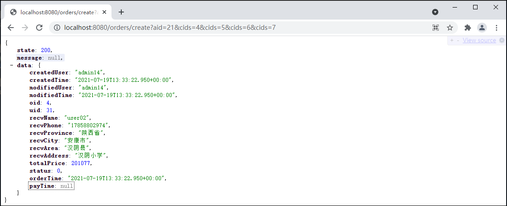
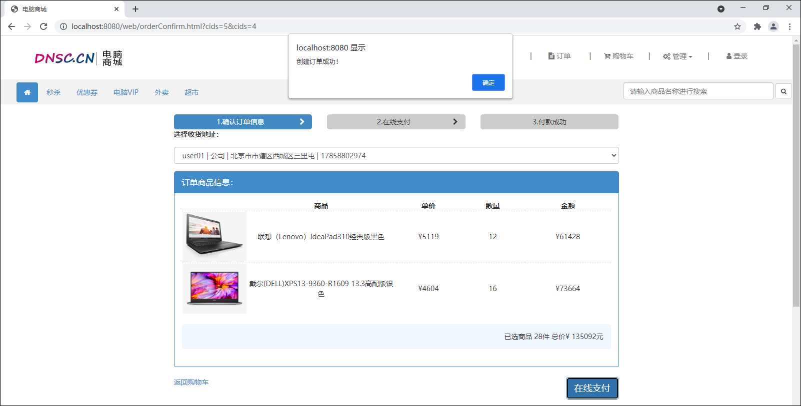

## 创建订单

### 1 订单-创建数据表

1.使用use命令先选中store数据库。

```mysql
USE store;
```

2.在store数据库中创建t_order和t_order_item数据表。

```mysql
CREATE TABLE t_order (
	oid INT AUTO_INCREMENT COMMENT '订单id',
	uid INT NOT NULL COMMENT '用户id',
	recv_name VARCHAR(20) NOT NULL COMMENT '收货人姓名',
	recv_phone VARCHAR(20) COMMENT '收货人电话',
	recv_province VARCHAR(15) COMMENT '收货人所在省',
	recv_city VARCHAR(15) COMMENT '收货人所在市',
	recv_area VARCHAR(15) COMMENT '收货人所在区',
	recv_address VARCHAR(50) COMMENT '收货详细地址',
	total_price BIGINT COMMENT '总价',
	status INT COMMENT '状态：0-未支付，1-已支付，2-已取消，3-已关闭，4-已完成',
	order_time DATETIME COMMENT '下单时间',
	pay_time DATETIME COMMENT '支付时间',
	created_user VARCHAR(20) COMMENT '创建人',
	created_time DATETIME COMMENT '创建时间',
	modified_user VARCHAR(20) COMMENT '修改人',
	modified_time DATETIME COMMENT '修改时间',
	PRIMARY KEY (oid)
) ENGINE=InnoDB DEFAULT CHARSET=utf8;

CREATE TABLE t_order_item (
	id INT AUTO_INCREMENT COMMENT '订单中的商品记录的id',
	oid INT NOT NULL COMMENT '所归属的订单的id',
	pid INT NOT NULL COMMENT '商品的id',
	title VARCHAR(100) NOT NULL COMMENT '商品标题',
	image VARCHAR(500) COMMENT '商品图片',
	price BIGINT COMMENT '商品价格',
	num INT COMMENT '购买数量',
	created_user VARCHAR(20) COMMENT '创建人',
	created_time DATETIME COMMENT '创建时间',
	modified_user VARCHAR(20) COMMENT '修改人',
	modified_time DATETIME COMMENT '修改时间',
	PRIMARY KEY (id)
) ENGINE=InnoDB DEFAULT CHARSET=utf8;
```

### 2 订单-创建实体类

1.在com.cy.store.entity包下创建Order实体类。

```java
package com.cy.store.entity;
import java.io.Serializable;
import java.util.Date;

/** 订单数据的实体类 */
public class Order extends BaseEntity implements Serializable {
    private Integer oid;
    private Integer uid;
    private String recvName;
    private String recvPhone;
    private String recvProvince;
    private String recvCity;
    private String recvArea;
    private String recvAddress;
    private Long totalPrice;
    private Integer status;
    private Date orderTime;
    private Date payTime;
	
	// Generate: Getter and Setter、Generate hashCode() and equals()、toString()
}    
```

2.在com.cy.store.entity包下创建OrderItem实体类。

```java
package com.cy.store.entity;
import java.io.Serializable;

/** 订单中的商品数据 */
public class OrderItem extends BaseEntity implements Serializable {
    private Integer id;
    private Integer oid;
    private Integer pid;
    private String title;
    private String image;
    private Long price;
    private Integer num;

	// Generate: Getter and Setter、Generate hashCode() and equals()、toString()
}    
```

### 3 订单-持久层

#### 3.1 规划需要执行的SQL语句

1.插入订单数据的SQL语句大致是。

```mysql
INSERT INTO t_order (
	uid,
	recv_name,
	recv_phone,
	recv_province,
	recv_city,
	recv_area,
	recv_address,
	total_price,
	status,
	order_time,
	pay_time,
	created_user,
	created_time,
	modified_user,
	modified_time 
)
VALUES (
	#对应字段的值列表
)
```

2.插入订单商品数据的SQL语句大致是。

```mysql
INSERT INTO t_order_item ( 
	oid, 
	pid, 
	title, 
	image, 
	price, 
	num, 
	created_user, 
	created_time, 
	modified_user, 
	modified_time 
)
VALUES ( 
	#对应字段的值列表
)
```

#### 3.2 接口与抽象方法

在com.cy.store.mapper包下创建OrderMapper接口并在接口中添加抽象方法。

```java
package com.cy.store.mapper;
import com.cy.store.entity.Order;
import com.cy.store.entity.OrderItem;

/** 处理订单及订单商品数据的持久层接口 */
public interface OrderMapper {
    /**
     * 插入订单数据
     * @param order 订单数据
     * @return 受影响的行数
     */
    Integer insertOrder(Order order);

    /**
     * 插入订单商品数据
     * @param orderItem 订单商品数据
     * @return 受影响的行数
     */
    Integer insertOrderItem(OrderItem orderItem);
}
```

#### 3.3 配置SQL映射

1.在main\resources\mapper文件夹下创建OrderMapper.xml文件，并添加抽象方法的映射。

```xml
<?xml version="1.0" encoding="UTF-8" ?>
<!DOCTYPE mapper
        PUBLIC "-//mybatis.org//DTD Mapper 3.0//EN"
        "http://mybatis.org/dtd/mybatis-3-mapper.dtd">
<mapper namespace="com.cy.store.mapper.OrderMapper">
    <!-- 插入订单数据：Integer insertOrder(Order order) -->
    <insert id="insertOrder" useGeneratedKeys="true" keyProperty="oid">
        INSERT INTO t_order (
            uid, recv_name, recv_phone, recv_province, recv_city, recv_area, recv_address,
            total_price,status, order_time, pay_time, created_user, created_time, modified_user,
            modified_time
        ) VALUES (
            #{uid}, #{recvName}, #{recvPhone}, #{recvProvince}, #{recvCity}, #{recvArea},
            #{recvAddress}, #{totalPrice}, #{status}, #{orderTime}, #{payTime}, #{createdUser},
            #{createdTime}, #{modifiedUser}, #{modifiedTime}
        )
    </insert>

    <!-- 插入订单商品数据：Integer insertOrderItem(OrderItem orderItem) -->
    <insert id="insertOrderItem" useGeneratedKeys="true" keyProperty="id">
        INSERT INTO t_order_item (
            oid, pid, title, image, price, num, created_user,
            created_time, modified_user, modified_time
        ) VALUES (
            #{oid}, #{pid}, #{title}, #{image}, #{price}, #{num}, #{createdUser},
            #{createdTime}, #{modifiedUser}, #{modifiedTime}
        )
    </insert>
</mapper>
```

2.在com.cy.store.mapper包下创建OrderMapperTests测试类，并添加测试方法。

```java
package com.cy.store.mapper;
import com.cy.store.entity.Order;
import com.cy.store.entity.OrderItem;
import org.junit.Test;
import org.junit.runner.RunWith;
import org.springframework.beans.factory.annotation.Autowired;
import org.springframework.boot.test.context.SpringBootTest;
import org.springframework.test.context.junit4.SpringRunner;

@RunWith(SpringRunner.class)
@SpringBootTest
public class OrderMapperTests {
    @Autowired
    private OrderMapper orderMapper;

    @Test
    public void insertOrder() {
        Order order = new Order();
        order.setUid(31);
        order.setRecvName("小王");
        Integer rows = orderMapper.insertOrder(order);
        System.out.println("rows=" + rows);
    }

    @Test
    public void insertOrderItem() {
        OrderItem orderItem = new OrderItem();
        orderItem.setOid(1);
        orderItem.setPid(2);
        orderItem.setTitle("高档铅笔");
        Integer rows = orderMapper.insertOrderItem(orderItem);
        System.out.println("rows=" + rows);
    }
}
```

### 4 订单-业务层

#### 4.1 规划异常

> **说明**：无异常。

#### 4.2 接口与抽象方法

1.由于处理过程中还需要涉及收货地址数据的处理，所以需要先在IAddressService接口中添加getByAid()方法。

```java
/**
 * 根据收货地址数据的id，查询收货地址详情
 * @param aid 收货地址id
 * @param uid 归属的用户id
 * @return 匹配的收货地址详情
 */
Address getByAid(Integer aid, Integer uid);
```

2.在AddressServiceImpl类中实现接口中的getByAid()抽象方法。

```java
@Override
public Address getByAid(Integer aid, Integer uid) {
    // 根据收货地址数据id，查询收货地址详情
    Address address = addressMapper.findByAid(aid);

    if (address == null) {
        throw new AddressNotFoundException("尝试访问的收货地址数据不存在");
    }
    if (!address.getUid().equals(uid)) {
        throw new AccessDeniedException("非法访问");
    }
    address.setProvinceCode(null);
    address.setCityCode(null);
    address.setAreaCode(null);
    address.setCreatedUser(null);
    address.setCreatedTime(null);
    address.setModifiedUser(null);
    address.setModifiedTime(null);
    return address;
}
```

3.在com.cy.store.service包下创建IOrderService业务层接口并添加抽象方法。

```java
package com.cy.store.service;
import com.cy.store.entity.Order;

/** 处理订单和订单数据的业务层接口 */
public interface IOrderService {
    /**
     * 创建订单
     * @param aid 收货地址的id
     * @param cids 即将购买的商品数据在购物车表中的id
     * @param uid 当前登录的用户的id
     * @param username 当前登录的用户名
     * @return 成功创建的订单数据
     */
    Order create(Integer aid, Integer[] cids, Integer uid, String username);
}
```

#### 4.3 实现抽象方法

1.在com.cy.store.service.impl包下创建OrderServiceImpl业务层实现类并实现IOrderService接口；在类定义之前添加@Service注解，在类中添加OrderMapper订单持久层对象、IAddressService处理收货地址对象、ICartService购物车数据对象，并都添加@Autowired注解进行修饰。

```java
package com.cy.store.service.impl;
import com.cy.store.entity.Address;
import com.cy.store.entity.Order;
import com.cy.store.entity.OrderItem;
import com.cy.store.mapper.OrderMapper;
import com.cy.store.service.IAddressService;
import com.cy.store.service.ICartService;
import com.cy.store.service.IOrderService;
import com.cy.store.service.ex.InsertException;
import com.cy.store.vo.CartVO;
import org.springframework.beans.factory.annotation.Autowired;
import org.springframework.stereotype.Service;
import org.springframework.transaction.annotation.Transactional;
import java.util.Date;
import java.util.List;

/** 处理订单和订单数据的业务层实现类 */
@Service
public class OrderServiceImpl implements IOrderService {
    @Autowired
    private OrderMapper orderMapper;
    @Autowired
    private IAddressService addressService;
    @Autowired
    private ICartService cartService;

	// ...
}
```

2.在OrderServiceImpl类中重写父接口中的create()抽象方法。

```java
@Transactional
@Override
public Order create(Integer aid, Integer[] cids, Integer uid, String username) {
    // 创建当前时间对象

    // 根据cids查询所勾选的购物车列表中的数据

    // 计算这些商品的总价

    // 创建订单数据对象
    // 补全数据：uid
    // 查询收货地址数据
    // 补全数据：收货地址相关的6项
    // 补全数据：totalPrice
    // 补全数据：status
    // 补全数据：下单时间
    // 补全数据：日志
    // 插入订单数据

    // 遍历carts，循环插入订单商品数据
    // 创建订单商品数据
    // 补全数据：oid(order.getOid())
    // 补全数据：pid, title, image, price, num
    // 补全数据：4项日志
    // 插入订单商品数据

    // 返回
}
```

3.OrderServiceImpl类中的create()方法具体逻辑代码实现见下。

```java
@Transactional
@Override
public Order create(Integer aid, Integer[] cids, Integer uid, String username) {
    // 创建当前时间对象
    Date now = new Date();

    // 根据cids查询所勾选的购物车列表中的数据
    List<CartVO> carts = cartService.getVOByCids(uid, cids);

    // 计算这些商品的总价
    long totalPrice = 0;
    for (CartVO cart : carts) {
        totalPrice += cart.getRealPrice() * cart.getNum();
    }

    // 创建订单数据对象
    Order order = new Order();
    // 补全数据：uid
    order.setUid(uid);
    // 查询收货地址数据
    Address address = addressService.getByAid(aid, uid);
    // 补全数据：收货地址相关的6项
    order.setRecvName(address.getName());
    order.setRecvPhone(address.getPhone());
    order.setRecvProvince(address.getProvinceName());
    order.setRecvCity(address.getCityName());
    order.setRecvArea(address.getAreaName());
    order.setRecvAddress(address.getAddress());
    // 补全数据：totalPrice
    order.setTotalPrice(totalPrice);
    // 补全数据：status
    order.setStatus(0);
    // 补全数据：下单时间
    order.setOrderTime(now);
    // 补全数据：日志
    order.setCreatedUser(username);
    order.setCreatedTime(now);
    order.setModifiedUser(username);
    order.setModifiedTime(now);
    // 插入订单数据
    Integer rows1 = orderMapper.insertOrder(order);
    if (rows1 != 1) {
        throw new InsertException("插入订单数据时出现未知错误，请联系系统管理员");
    }

    // 遍历carts，循环插入订单商品数据
    for (CartVO cart : carts) {
        // 创建订单商品数据
        OrderItem item = new OrderItem();
        // 补全数据：setOid(order.getOid())
        item.setOid(order.getOid());
        // 补全数据：pid, title, image, price, num
        item.setPid(cart.getPid());
        item.setTitle(cart.getTitle());
        item.setImage(cart.getImage());
        item.setPrice(cart.getRealPrice());
        item.setNum(cart.getNum());
        // 补全数据：4项日志
        item.setCreatedUser(username);
        item.setCreatedTime(now);
        item.setModifiedUser(username);
        item.setModifiedTime(now);
        // 插入订单商品数据
        Integer rows2 = orderMapper.insertOrderItem(item);
        if (rows2 != 1) {
            throw new InsertException("插入订单商品数据时出现未知错误，请联系系统管理员");
        }
    }

    // 返回
    return order;
}
```

4.在com.cy.store.service测试包下创建OrderServiceTests测试类，并添加create()方法进行功能测试。

```java
package com.cy.store.service;
import com.cy.store.entity.Order;
import com.cy.store.service.ex.ServiceException;
import org.junit.Test;
import org.junit.runner.RunWith;
import org.springframework.beans.factory.annotation.Autowired;
import org.springframework.boot.test.context.SpringBootTest;
import org.springframework.test.context.junit4.SpringRunner;

@RunWith(SpringRunner.class)
@SpringBootTest
public class OrderServiceTests {
    @Autowired
    private IOrderService orderService;

    @Test
    public void create() {
        try {
            Integer aid = 21;
            Integer[] cids = {4, 5, 6,7};
            Integer uid = 31;
            String username = "订单管理员";
            Order order = orderService.create(aid, cids, uid, username);
            System.out.println(order);
        } catch (ServiceException e) {
            System.out.println(e.getClass().getSimpleName());
            System.out.println(e.getMessage());
        }
    }
}
```

### 5 订单-控制器层

#### 5.1 处理异常

> **说明**：无异常。

#### 5.2 设计请求

设计用户提交的请求，并设计响应的方式。

	请求路径：/orders/create
	请求参数：Integer aid, Integer[] cids, HttpSession session
	请求类型：POST
	响应结果：JsonResult<Order>

#### 5.3 处理请求

1.在com.cy.store.controller包下创建OrderController类，并继承自BaseController类；并在类前添加@RequestMapping("orders")注解和@RestController注解；在类中声明IOrderService业务对象，然后添加@Autowired注解修饰；最后在类中添加处理请求的方法。

```java
package com.cy.store.controller;
import com.cy.store.entity.Order;
import com.cy.store.service.IOrderService;
import com.cy.store.util.JsonResult;
import org.springframework.beans.factory.annotation.Autowired;
import org.springframework.web.bind.annotation.RequestMapping;
import org.springframework.web.bind.annotation.RestController;
import javax.servlet.http.HttpSession;

@RestController
@RequestMapping("orders")
public class OrderController extends BaseController {
    @Autowired
    private IOrderService orderService;

    @RequestMapping("create")
    public JsonResult<Order> create(Integer aid, Integer[] cids, HttpSession session) {
        // 从Session中取出uid和username
        Integer uid = getUidFromSession(session);
        String username = getUsernameFromSession(session);
        // 调用业务对象执行业务
        Order data = orderService.create(aid, cids, uid, username);
        // 返回成功与数据
        return new JsonResult<Order>(OK, data);
    }
}
```

2.完成后启动项目，先登录再访问http://localhost:8080/orders/create?aid=21&cids=4&cids=5&cids=6&cids=7进行测试。



### 6 订单-前端页面

1.在orderConfirm.xml页面中的body标签内的script标签内添加“在线支付”按钮的点击时间。

```javascript
$("#btn-create-order").click(function() {
    $.ajax({
        url: "/orders/create",
        data: $("#form-create-order").serialize(),
        type: "POST",
        dataType: "JSON",
        success: function(json) {
            if (json.state == 200) {
                alert("创建订单成功！");
                console.log(json.data);
            } else {
                alert("创建订单失败！" + json.message);
            }
        },
        error: function(xhr) {
            alert("您的登录信息已经过期，请重新登录！HTTP响应码：" + xhr.status);
            location.href = "login.html";
        }
    });
});
```

2.完成后启动项目，先登录再访问http://localhost:8080/web/cart.html页面，勾选购车中的商品，再点击“结算”按钮，最后在订单确认页中点击“在线支付”按钮进行功能的测试。


