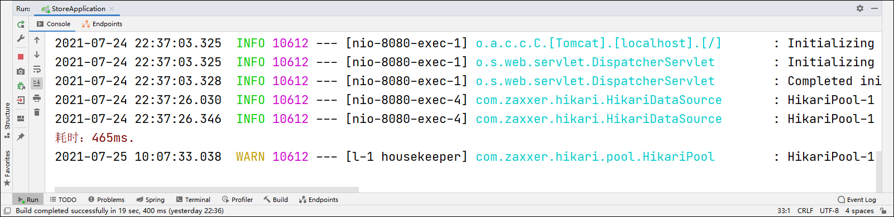

## AOP

### 1 Spring AOP

AOP：面向切面（Aspect）编程。AOP并不是Spring框架的特性，只是Spring很好的支持了AOP。

如果需要在处理每个业务时，都执行特定的代码，则可以假设在整个数据处理流程中存在某个切面，切面中可以定义某些方法，当处理流程执行到切面时，就会自动执行切面中的方法。最终实现的效果就是：只需要定义好切面方法，配置好切面的位置（连接点），在不需要修改原有数据处理流程的代码的基础之上，就可以使得若干个流程都执行相同的代码。

### 2 切面方法

1.切面方法的访问权限是public。

2.切面方法的返回值类型可以是void或Object，如果使用的注解是@Around时，必须使用Object作为返回值类型，并返回连接点方法的返回值；如果使用的注解是@Before或@After等其他注解时，则自行决定。

3.切面方法的名称可以自定义。

4.切面方法的参数列表中可以添加ProceedingJoinPoint接口类型的对象，该对象表示连接点，也可以理解调用切面所在位置对应的方法的对象，如果使用的注解是@Around时，必须添加该参数，反之则不是必须添加。

### 3 统计业务方法执行时长

1.在使用Spring AOP编程时，需要先在pom.xml文件中添加两个关于AOP的依赖aspectjweaver和aspectjtools。

```xml
<dependency>
    <groupId>org.aspectj</groupId>
    <artifactId>aspectjweaver</artifactId>
</dependency>
<dependency>
    <groupId>org.aspectj</groupId>
    <artifactId>aspectjtools</artifactId>
</dependency>
```

2.在com.cy.store.aop包下创建TimerAspect切面类，在类之前添加@Aspect和@Component注解修饰。

```java
package com.cy.store.aop;
import org.aspectj.lang.ProceedingJoinPoint;
import org.aspectj.lang.annotation.Around;
import org.aspectj.lang.annotation.Aspect;
import org.springframework.stereotype.Component;

@Aspect
@Component
public class TimerAspect {

}
```

3.在类中添加切面方法around(ProceedingJoinPoint pjp)。

```java
public Object around(ProceedingJoinPoint pjp) throws Throwable {
    // 记录起始时间
    long start = System.currentTimeMillis();
    // 执行连接点方法，即切面所在位置对应的方法。本项目中表示执行注册或执行登录等
    Object result = pjp.proceed();
    // 记录结束时间
    long end = System.currentTimeMillis();
    // 计算耗时
    System.err.println("耗时：" + (end - start) + "ms.");
    // 返回连接点方法的返回值
    return result;
}
```

4.最后需要在方法之前添加@Around注解，以配置连接点，即哪些方法需要应用该切面。

```java
@Around("execution(* com.cy.store.service.impl.*.*(..))")
```

5.启动项目，在前端浏览器访问任意一个功能模块进行功能的测试。



